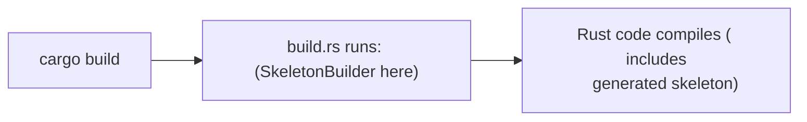

# Programmatic tooling:


## Introduction: 

Aside from standard Rust tooling for typical application level Rust. There is a pattern that is generally
found which is a combination of two ideas:
    1. Build pattern 
        + 
    2. Library first tooling 

These is very common when working with:
- eBPF tooling ( `libbpf-rs )
- Code generation ( `protobuf`, `bindgen` )
- Compilers / DSL's 
- aync runtimes

### 1. Build Pattern ( core concept )

This is the foundation. And it solves:

- Many configuration options 
- Optional parameters
- Order-sensitive setup

A normal construction becomes unreadable. 

```rust 
    build (a, b, c, d, e, f);
```

Builder Solution:

```rust 
    Builder::new()
      .option_a(x)
      .option_b(y)
      .enable_feature()
      .build();
```
- Rust tooling loves this above pattern, for the following :
    - No default arguments in the language
    - Strong typing encourages explicit config
    - Ownership/lifetimes benefit from staged construction 

- Allows Key properties:
    - Chainable methods 
    - Immutable -> mutable -> finalized object 
    - Often ends with `.build()`

### 2. System tooling pattern :

Traditionally development ecosystem uses/include external tools:
    - CLI programs
    - External to the project source

Ex: `proto`, `bpftool`, `gcc`, `clang`... These tools are generally used with scripts, Makefiles, or ad-hoc
pipelines.

## Rust System Model:

Rust approach is a flip: " what is the tooling is a library? "

So `bpftool gen skeleton` it transforms to `SkeletonBuilder::new().build();`

Embeds : Compilation Steps + Code Generation + Configuration + ..

=> This approach embeds build system steps as a part of Rust Code.

Examples: 
- eBPF:  `libbpf-rs::SkeletonBuilder`

- C bindings: `bindgen`

- ProtoBuf/gRPC: `prost-build`, `tonic-build`

- C++ interope: `cxx`

## What Systems prefer this:

1. Determinism:
    - Everything is versioned inside Cargo
    - reproducible
    - not dependent on system tools 

2. Integration with cargo's `build.rs`
    Rust already gives you a hook: `build.rs` runs before compilation. 
    This allows us to use Rust code instead of Makefile, shell scripts. 

3. Complex Configuration:

   Example In domains (XDP / SmartNIC ..): You may need:
    - feature flags
    - kernel version checks
    - custom clang args
    - per-target tuning
    - CLI tools struggle here.

4. Composability:
You can do:

```rust 
    if target == "arm" {
        builder.clang_arg("-mcpu=...");
    }
```
This is harder to express in CLI pipelines.


## Summarize:

- Instead of tools used for external processes, In Rust design the preferred way is "Tools are libraries"
- Rust tooling perferes:
    Builder-pattern APIs that embed toolchains directly into code instead of relying on external CLI tools.

- Key for :
    - Build orchestration
    - Tooling as code 
    - Systems integration patterns 

------------------

Example: 
How `SkeletonBuilder` in a build.rs, and relate it directly to what it replaces.

1. What `SkeletonBuilder` Actually Does:
    
    At High level : below is the Rust-embedded pipeline:

    `SkeletonBuilder::new().build_and_generate(...);`

    And it Replaces: 

    `clang → bpf object → bpftool gen skeleton → Rust bindings`

    Equivalent CLI pipeline ( What it replaces) ( traditionally with C/libbpf world)

    1. `clang --target bpf -c prog.bpf.c -o prog.bpf.o`
    2. `bpftool gen skeleton prog.bpf.o > prog.skel.h`

    Next : we include these generated header and manually mange integration.

2. Rust Approach to the above:

```rust 
    // build.rs
    SkeletonBuilder::new()
        .source("src/bpf/prog.bpf.c")
        .build_and_generate("src/bpf/prog.skel.rs")
        .unwrap();
```

This is literally doing:
    - Compile `src/bpf/prog.bpf.c`
    - Generate skeleton 
    - Emit Rust bindings 

3. What to run this above:
    cargo build life-cycle:
    

- As `build.rs` runs before compilation, it can generate code, and it integrates into dependency tracking.


4. Step-by-Step:

    - Step 1: First declare a builder here as:
    `let mybuilder = SkeletonBuilder::new();`
    This initializes "Configuration state", "path", "Compiler settings"

    - Step 2: Provide source 
    `.source("src/bpf/prog.bpf.c")` Tells which BPF program to compile. 

    - Step 3: Build + generate:
    `.build_and_generate("src/bpf/prog.skel.rs")` This triggers the pipeline:

    Internally: 
    * Compile with clang :
        - `clang -target bpf`
        - produce `.bpf.o`
    * load via libbpf:
        - parse ELF 
        - extract maps, programs 
    * Generate Skeleton:
        Rust Structure representing:
            - maps 
            - programs 
            - links 
    * Write Output:
        - emits `prog.skel.rs`

5. What do we get from the generated skeleton:
```rust 
pub struct ProgSkel<'a> {
    pub maps: ProgMaps<'a>,
    pub progs: ProgProgs<'a>,
}
```
and Helpers:
```rust 
impl ProgSkel {
    pub fn open() -> ...
    pub fn load() -> ...
    pub fn attach() -> ...
}
```
Instead of: 
    - manually calling libbpf APIs
    - dealing with raw pointers

You get:
    - typed Rust interface
    - safe-ish abstraction

In short: You Just Built a Mini Build System.

