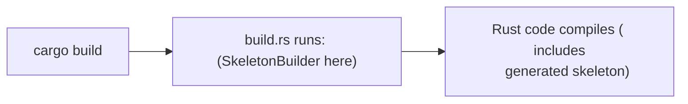

# Programmatic tooling:

## The "Why"
When building standard Rust applications, you usually stay within the "Cargo bubble" you write code, add a
dependency, and run it. However, when working with Systems Programming (eBPF, Compilers, or Hardware), you
hit a wall: The "External Tooling" Gap.

Traditionally, systems work requires a "sidecar" of external scripts, C-compilers, and CLI tools (like
`protoc` or `bpftool`) that live outside your Rust code. This creates a "disconnected" workflow where your
build can fail because a system tool is missing or the wrong version.

This document defines the Rust solution: 
    Moving away from external CLI and instead embedding the tools directly into Rust code as libraries.

The Mental Model We combine two core ideas to solve the "External Tooling" gap:

1. The Builder Pattern: A way to manage "exploding" configuration options safely.

2. Library-First Tooling: Turning a standalone program (like a compiler) into a crate your project can call
directly.

Together, these allow you to treat your Build Pipeline as Code, ensuring that anyone who clones your repo
can build it without installing dozens of global system dependencies.

A core architectural shift in the Rust ecosystem that many newcomers struggle to articulate: the transition
from "External Tooling" to "In-Process Library Tooling."

## Introduction: 

Beyond standard application level tooling, Rust ecosystem architecture frequently converges on a powerful
pattern: **The Library-First Builder Pattern.**

ie. Aside from standard Rust tooling for typical application level Rust. There is a pattern that is generally
found which is a combination of two ideas:

    1. Build pattern 
        + 
    2. Library first tooling 

This approach is the standard for:

- **eBPF tooling** ( `libbpf-rs` )
- **Code generation** ( `protobuf`, `bindgen` )
- **Compilers / DSL's** ( `inkwell`, `syn`.`quite`)
- **aync runtimes (`tokio`, `itertool`)

### 1. Build Pattern ( core concept )

Builder Pattern is the foundation of programmatic tooling. And it solves the *Telescoping Constructor*
problem where configurations become unreadable.

- Many configuration options 
- Optional parameters
- Order-sensitive setup

A normal construction becomes unreadable. 

** The problem **
```rust 
    build (a, b, c, d, e, f);

    build(true, false, Some("path"), 64, None, "debug"); // What do this parameters mean?
```

** The Solution **

Builder Solution:

example:

```rust 
    Builder::new()                          Builder::new()                    
      .option_a(x)                              .source_path("src/bpf/prog.c")
      .option_b(y)              example=>       .debug(true)                  
      .enable_feature()                         .buffer_size(64)              
      .build();                                 .enable_feature_x()           
                                                .build();                     
```

- Rust tooling loves this above pattern, for the following :
    - No default arguments in the language.
      Rust requires explicit values; builders allow "default" states to be handled internally.
    - Strong typing encourages explicit config
      Each method in the chain can enforce type-safe configuration.
    - Ownership/lifetimes benefit from staged construction.
      Builders can consume themselves (`self`) to transition from an "incomplete" configuration state to a
      "finalized" immutable object.

- Allows Key properties:
    - Chainable methods 
    - Immutable -> mutable -> finalized object 
    - Often ends with `.build()`

### 2. System tooling pattern :

Traditionally, development involves external CLI tools orchestrated by a Makefile or shell script.
    - CLI programs
    - External to the project source

Ex: `proto`, `bpftool`, `gcc`, `clang`... These tools are generally used with scripts, Makefiles, or ad-hoc
pipelines.

| Traditional CLI Flow | Rust Programmatic Flow |
| :--- | :--- |
| `protoc --rust_out=...` | `prost_build::Config::new().compile_protos(...)` |
| `bpftool gen skeleton ...` | `SkeletonBuilder::new().build_and_generate(...)` |
| `bindgen input.h -o out.rs` | `bindgen::Builder::default().header("input.h").generate()` |

### The "Tools as Libraries" Model
In Rust, we ask: **"What if the tool was just a crate?"**
By embedding the toolchain into a library, the build system steps become part of the compiled Rust code.

### 3. Why Systems Prefer This

1. **Determinism:** Tools are versioned in `Cargo.toml`. Your compiler, code generator, and app are pinned
   together.
2. **`build.rs` Integration:** Rust provides a native hook to run code before compilation. This replaces
   brittle Bash scripts with type-safe Rust logic.
3. **Complex Orchestration:** CLI tools struggle with logic. In a Builder, you can use native Rust control
   flow: ```rust if cfg!(target_arch = "aarch64") { builder.clang_arg("-mcpu=neoverse-n1"); } ```
4. **Error Handling:** Instead of a shell script failing silently or returning a non-zero exit code, you
   get a `Result<T, E>` that you can handle or propagate with `?`.


### 4. Deep Dive: `SkeletonBuilder` (eBPF)
To understand what this replaces, look at the eBPF workflow.

### Traditional C Workflow (Manual)
1.  **Compile:** `clang -target bpf -c prog.c -o prog.o`
2.  **Generate:** `bpftool gen skeleton prog.o > prog.skel.h`
3.  **Include:** Manually include headers and link against `libbpf`.

### The Rust Way (Automated)
```rust
// In build.rs
SkeletonBuilder::new()
    .source("src/bpf/prog.bpf.c")
    .build_and_generate("src/bpf/prog.skel.rs")
    .unwrap();
```

### What is happening under the hood?
1.  **Initialize:** `SkeletonBuilder::new()` sets up the configuration state (paths, compiler flags).
2.  **Compile:** It invokes an embedded or system `clang` to produce the BPF object.
3.  **Parse:** It uses `libbpf` to parse the ELF object and extract Maps and Programs.
4.  **Codegen:** It generates a Rust `struct` (the "Skeleton") representing those BPF objects.
5.  **Output:** It writes `prog.skel.rs`, which your main application can then `include!` or use as a module.

---

### 5. The Result: Type-Safe Systems
Instead of dealing with raw pointers and `void *` in C, the generated skeleton gives you:
```rust
pub struct ProgSkel<'a> {
    pub maps: ProgMaps<'a>,   // Specifically typed BPF maps
    pub progs: ProgProgs<'a>, // Specifically typed BPF programs
}

impl ProgSkel {
    pub fn load() -> Result<Self, Error> { ... }
    pub fn attach(&mut self) -> Result<(), Error> { ... }
}
```

**Summary:** You haven't just written code; you've built a **miniature, reproducible build system** tailored
specifically to your project's needs.

---
## Rust System Model:

Rust approach is a flip: " what is the tooling, is a library? "

So `bpftool gen skeleton` it transforms to `SkeletonBuilder::new().build();`

Embeds : Compilation Steps + Code Generation + Configuration + ..

=> This approach embeds build system steps as a part of Rust Code.

Examples: 
- eBPF:  `libbpf-rs::SkeletonBuilder`

- C bindings: `bindgen`

- ProtoBuf/gRPC: `prost-build`, `tonic-build`

- C++ interope: `cxx`

## What Systems prefer this:

1. Determinism:
    - Everything is versioned inside Cargo
    - reproducible
    - not dependent on system tools 

2. Integration with cargo's `build.rs`
    Rust already gives you a hook: `build.rs` runs before compilation. 
    This allows us to use Rust code instead of Makefile, shell scripts. 

3. Complex Configuration:

   Example In domains (XDP / SmartNIC ..): You may need:
    - feature flags
    - kernel version checks
    - custom clang args
    - per-target tuning
    - CLI tools struggle here.

4. Composability:
You can do:

```rust 
    if target == "arm" {
        builder.clang_arg("-mcpu=...");
    }
```
This is harder to express in CLI pipelines.


## Summarize:

- Instead of tools used for external processes, In Rust design the preferred way is "Tools are libraries"
- Rust tooling perferes:
    Builder-pattern APIs that embed toolchains directly into code instead of relying on external CLI tools.

- Key for :
    - Build orchestration
    - Tooling as code 
    - Systems integration patterns 

------------------

Example: 
How `SkeletonBuilder` in a build.rs, and relate it directly to what it replaces.

1. What `SkeletonBuilder` Actually Does:
    
    At High level : below is the Rust-embedded pipeline:

    `SkeletonBuilder::new().build_and_generate(...);`

    And it Replaces: 

    `clang → bpf object → bpftool gen skeleton → Rust bindings`

    Equivalent CLI pipeline ( What it replaces) ( traditionally with C/libbpf world)

    1. `clang --target bpf -c prog.bpf.c -o prog.bpf.o`
    2. `bpftool gen skeleton prog.bpf.o > prog.skel.h`

    Next : we include these generated header and manually mange integration.

2. Rust Approach to the above:

```rust 
    // build.rs
    SkeletonBuilder::new()
        .source("src/bpf/prog.bpf.c")
        .build_and_generate("src/bpf/prog.skel.rs")
        .unwrap();
```

This is literally doing:
    - Compile `src/bpf/prog.bpf.c`
    - Generate skeleton 
    - Emit Rust bindings 

3. What to run this above:
    cargo build life-cycle:
    

- As `build.rs` runs before compilation, it can generate code, and it integrates into dependency tracking.


4. Step-by-Step:

    - Step 1: First declare a builder here as:
    `let mybuilder = SkeletonBuilder::new();`
    This initializes "Configuration state", "path", "Compiler settings"

    - Step 2: Provide source 
    `.source("src/bpf/prog.bpf.c")` Tells which BPF program to compile. 

    - Step 3: Build + generate:
    `.build_and_generate("src/bpf/prog.skel.rs")` This triggers the pipeline:

    Internally: 
    * Compile with clang :
        - `clang -target bpf`
        - produce `.bpf.o`
    * load via libbpf:
        - parse ELF 
        - extract maps, programs 
    * Generate Skeleton:
        Rust Structure representing:
            - maps 
            - programs 
            - links 
    * Write Output:
        - emits `prog.skel.rs`

5. What do we get from the generated skeleton:
```rust 
pub struct ProgSkel<'a> {
    pub maps: ProgMaps<'a>,
    pub progs: ProgProgs<'a>,
}
```
and Helpers:
```rust 
impl ProgSkel {
    pub fn open() -> ...
    pub fn load() -> ...
    pub fn attach() -> ...
}
```
Instead of: 
    - manually calling libbpf APIs
    - dealing with raw pointers

You get:
    - typed Rust interface
    - safe-ish abstraction

In short: You Just Built a Mini Build System.

