# `io_uring`: High performance Asynchronous I/O framework.

**History**:

Traditionally Linux `read()`, `write()` calls are blocking, as of Linux kernel 2.6.x Asynchronous support
was introduced via `libaio` which came with its own long-standing architectural limitations. 
`libaio` was essentially a wrapper around a few specific system calls (`io_submit()`). 

**`libaio`**: 
---
- To understand `libaio` think of it as a **request-and-wait**. It relies on specific set of system calls to
  pass control back and forth between user-space application and the kernel.
  
- **Step 1:  **Context Setup** (`io_setup`)
  Before the program any I/O, you must initialize a **AIO Context**. ( This is a kernel side structure that
  tracks your active requests. ) You define a maximum number of "slots" ( Simultaneous Operations ) the
  context is supposed to handle. 
  ( NOTE: If we submit more number of requests then "slots" available program will block or fail )

- **Step 2: Preparing the Control Block** ( `iocb` )
  Instead of passing a buffer to a `read()` call, you must fill out a `struct iocb` (I/O control block).
  This structure acts as the `envelop` for your requests, containing:
  * The file descriptor ( file has to be opened with O_DIRECT flag to by pass kerenel paging cache).
  * The opcode ( Read or Write )
  * The pointer to your data buffer.
  * The offset in the file where the operation should start. 

- **Step 3: Submission** ( `io_submit` )
  You pass your array of `iocb` structure to the kernel using `io_submit` system call.
  * *The Happy Path*: If file is opened with `O_DIRECT` and the data is already aligned, the kernel hands
    the request to the disk controller and returns to your program immediately.

  * *The Blocking Path*: If the kernel needs to update file metadata ( like increasing the file size ) or if
    the file open was done without `O_DIRECT`, the system call will **hang** and wait for the disk befoew
    letting your code continue. 

- **Step 4: Execution**
  While the app continues running other logic, the kernel and the HW work together to move the data. 
  Because `libaio` is restricted to `O_DIRECT`, the kernel does not copy the data into its own cache; 
  it attempts to move it directly between the disk and your application's memory buffer.

- **Step 5: Results ** ( `io_getevents` )
  The kernel doesn't "interrupt" your code when the work is done. 
  Instead, your application must proactively check for completion using `io_getevents`.
  * App can "poll" ( check and return immediately )
  * App can "wait" ( Sleep the thread until at least N events are ready )
  * Once called, the kernel moves "Completion events" into your user-space array, telling you which `iocb`
    finished and if it succeeded.

**Limitations of `libaio`**:

1. Step 3, 5 are expensive for every call of `io_submit` or `io_getevents` CPU must perform "Context
  switch" from User-mode to kernel mode, With High performance environments ( like NVMe storage) The CPU
  spend more time switching than actually moving data.

2. `libaio` system calls in kernel are hard coded to interact with **VFS** layer for block devices. And
   lacks the plumbing to handle network sockets, pipes or character devices. 
   This limitation pushed developers building high-performance servers ( db, web servers ) to split their
   logic into two notification systems:
   - One for Disk: Use `libaio` ( with `io_getevents`)
   - One for Networking: Use `epoll` and `select`

This lead to the creation of `io_uring` designed to be *subsystem agnostic* and kernel developer made a
better way to do any syscall. 
=> In `io_uring` a `read()` from a file and a `recv()` from a socket look identical. They both go into same
ring buffer. 

**io_uring:**
---
- `io_uring`: is a high performance async I/O framework in the Linux kernel ( introduced in 5.1 ) that uses
  shared memory ring buffers to minimize system call overhead. 
  It enables faster data transfer by allowing applications to batch, submit, and track I/O requests (
  storage/network ) without constant, blocking kernel. 

Note: unlike `libaio` :  `io_uring` can 
- Key Aspects of `io_uring`:
    1. Architecture: 
    It consists of two ring buffers shared between user space and kernel space: the Submission Queue (SQ) 
    and the Completion Queue (CQ).
    2. Performance: 
    It reduces the need for frequent read()/write() system calls, offering much better performance and
    lower latency for disk I/O and networking.
    3. Features: 
    It supports advanced features like registered buffers, fixed files, and kernel-side polling (SQPOLL) 
    for extremely fast, low-latency applications.
    4. Security Concerns: 
    Because it operates differently from traditional system calls, it can create a "blind spot" for some
    security monitoring tools.

To understand why `io_uring` is a generational leap over `libaio`, you have to look at it as a 
**shared memory system** rather than a "*calling the kernel*" system. 
It replaces the expensive "ping-pong" of system calls with two circular buffers (rings) that both the
application and the kernel can see.

*`io_uring` life cycle:

- **Step 1: Setup** ( `io_uring_setup` ) 

  Instead of a simple context, you create two rings in a shared memory area:
  - **The Submission Queue (SQ)**: Where the application writes requests.
  - **The Completion Queue (CQ):** Where the kernel writes results.

  Because this memory is shared, the application can write to the SQ and the kernel can read from it 
  without copying the data between them.

- **Step 2: Preparing the Submission Queue Entry (SQE)**
  You "fill" a slot in the *SQ* with a **Submission Queue Entry** (SQE). 
  Unlike `libaio`, an SQE can be almost anything:
  - Read/Write: To a file (buffered or direct).
  - Network: `accept()`, `send()`, `recv()`.
  - Timeout: "Wait 5 seconds and then tell me."
  - Chaining: You can set a flag (`IOSQE_IO_LINK`) on an SQE that says: 
              "Don't start the next SQE until this one finishes successfully."
  
- **Step 3: Notification** ( `io_uring_enter` )
  Once you've placed your requests in the SQ, you tell the kernel, "Hey, there is work to do."
  - Standard Mode: You make one `io_uring_enter` syscall. Even if you submitted 100 requests, it's still
    just one syscall.
  - SQPOLL Mode (The "Magic" Mode): If enabled, a kernel thread constantly polls the SQ. You just write to
    memory and walk away. Zero system calls are made to submit the I/O. (zero syscalls for submission in
    SQPOLL mode, and we still need `io_uring_enter` to sleep/wait unless busy polling CQ)

- **Step 4: Execution (The "Non-Blocking" Guarantee)**
  This is where `io_uring` fixes the biggest flaw of `libaio`.
  * If the kernel sees that a "buffered read" would block (because the data isn't in RAM), it doesn't 
    freeze your thread.
  * It automatically hands the task to an internal pool of kernel workers.
  * Your application stays 100% responsive while the kernel handles the "slow" work in the background.

- **Step 5: Consume the completion Queue Entry (CQE)**
  When a task is done, the kernel writes a **Completion Queue Entry** (CQE) to the second ring.
  * The application simply checks the head of the CQ ring in memory.
  * Because the CQ is also shared memory, checking if an I/O is done is as fast as reading a variable in a
    while loop. No syscall is required to "harvest" the results unless you want to put your thread to sleep until something arrives.

In `libaio`, you spend a lot of "CPU tax" just crossing the border between your code and the kernel.
In `io_uring`, you and the kernel are basically working on a shared To-Do list, which eliminates almost 
all that administrative overhead.

- Key Features:

=> *One Loop to handle All*: You only need one `io_uring_wait_cqe` call to catch a finished database write,
and a new incoming web request  at the same time.

=> `io_uring` is "one-stop-shop" for almost all Linux system calls, and `libaio` is strictly for storage.

=> Networking: `io_uring` supports `accept()`/`connect()`/`send()`/ and `recv()`. 
   `libaio` cannot be used for network sockets.

=> Buffered I/O: `libaio` only works with `O_DIRECT` (unbuffered) files. 
   If you use it on a regular file, it silently falls back to synchronous behavior, blocking your thread.
   `io_uring` supports buffered I/O natively and asynchronously.

=> Stat & Control: You can now perform metadata operations like `statx`,`openat`, and `mkdir` asynchronously.

=> Efficiency and Zero-Syscall Mode: `io_uring` significantly reduces the "syscall tax" that became more
  expensive after Meltdown/Spectre mitigations.

=> Submission Queue Polling (SQPOLL): You can tell the kernel to create a dedicated thread to watch the 
   submission ring. 
   This allows your app to submit I/O by simply writing to memory, i.e zero system calls are required for
   the I/O path once it's running.

=> Advanced Request Handling: `io_uring` introduces logic that previously had to be managed manually in the
   application:
   * Request Linking (IOSQE_IO_LINK): You can chain operations together 
     (e.g., "Open this file, THEN read from it, THEN close it"). 
     The kernel will handle the entire chain and only notify you when it's done or if a link fails.

   * Multi-shot Operations: You can issue a single "multi-shot accept" or "multi-shot poll."
     The kernel will keep that request open and send a completion event every time a new connection arrives,
     rather than requiring you to re-submit the request every time

   * Fixed Files & Buffers: You can "register" file descriptors and memory buffers with the kernel ahead of
     time. This removes the overhead of the kernel having to map memory or look up file structures for 
     every single operation.

-----------------------------------------------------------------------------------------------------------

Ref: 1. https://hackmd.io/@YLowy/rJljf_4F9#io_uring 
     2. https://thenewstack.io/how-io_uring-and-ebpf-will-revolutionize-programming-in-linux/

# `io_uring` in Action:

## Earlier linux systems ( pre 2.6 kernel ) Classic IO system call:

For UDP's receive system call, it can be divided into 2 stages, 
    - wait for data and copy data to user space. 

Kernel offered the following blocking system calls to deal with file descriptors, be they storage files
or sockets:

```c 
size_t read(int fd, void *buf, size_t count);
size_t write(int fd, const void *buf, size_t count);
```

### Blocking System Call

1. **Blocking I/O model**
For UDP receive func, when user mode's task call a blocking system call, task will wait until kernel return ok.

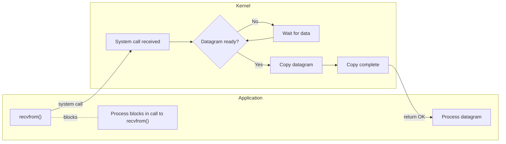

2. **Nonblocking I/O**
We can set `socket/fd` to non-blocking. 
When it is set non-blocking, `io-system` call will return immediately.

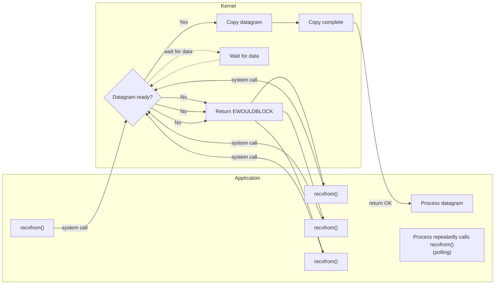

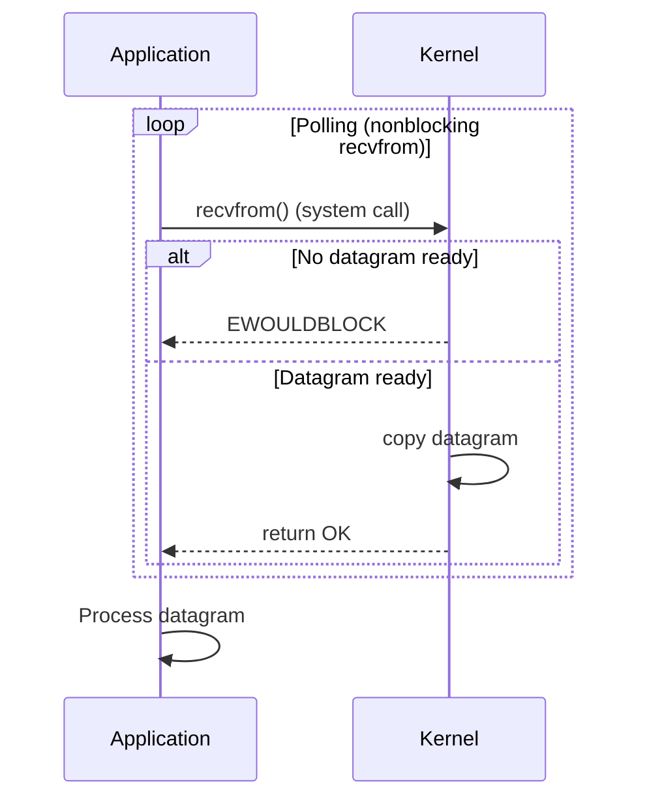
3. **I/O multiplexing**:
    I/O multiplexing allow a single task operator many file descriptors by specific system call 
    (Later in the article we cover  poll()/epoll()/select() latter).

    - Pros: deal with many fd in one task
    - Cons: two system call(select() + recv())

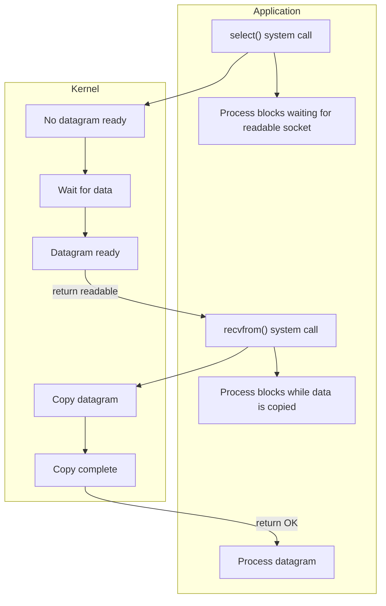

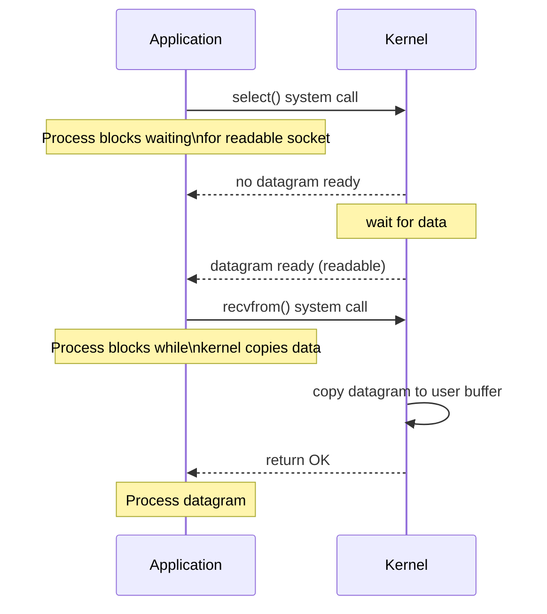

4. **Signal driven I/O**
   Do `recv()` only when signal handler be triggered.
   We need to consider buttom-half mechanism.

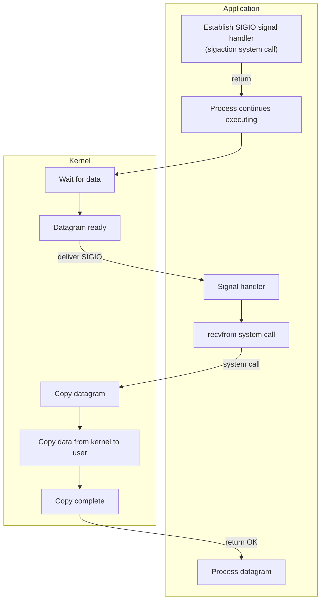
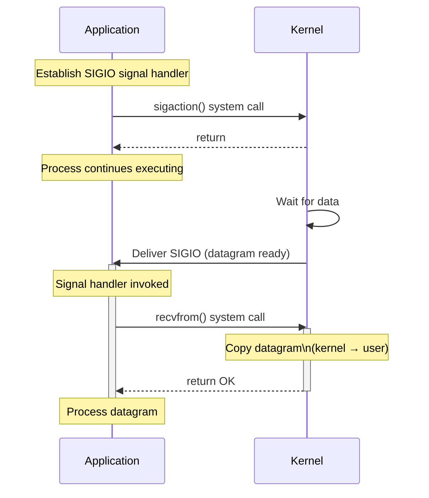

5. **Asynchronous I/O**
   Kernel notify user task when the data was ready and was copy to the special application buffer.

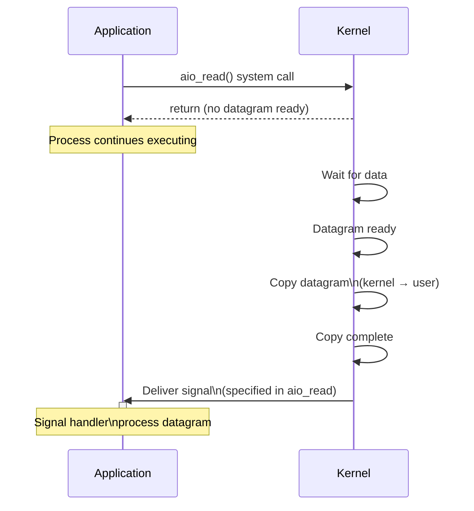

### Asynchronous I/O vs Non-blocking I/O:

> A synchronous I/O operation causes the requesting process to be blocked until that I/O operation
> completes.
> An asynchronous I/O operation does not cause the requesting process to be blocked.

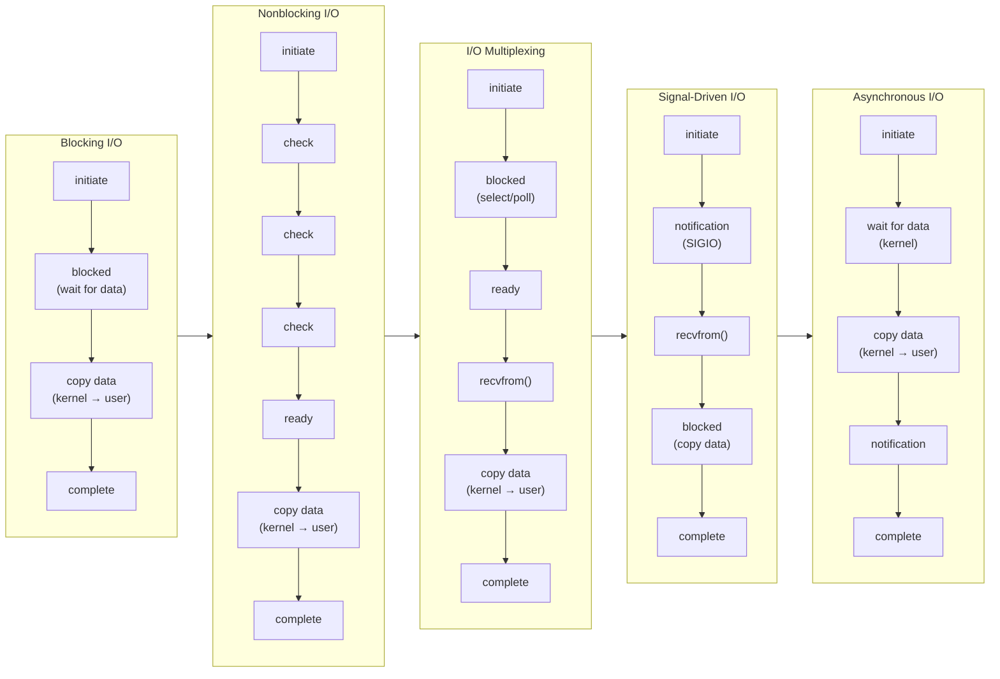

### `select` vs `poll` vs `epoll`

**`select()` :**

1. The caller passes a set of `fds`.
2. The caller has to reset the `fd` set per select call.
3. The complexity of the inner loop is `O(max_fd + 1)`.
   e.g. if the `fds` are `{1, 10, 1023}`, then the loop size is 1024 instead of 3

```c 
// Returns true if fd is ready for I/O.
bool is_ready(int fd);

struct fd_info {
    int fd;
    bool ready;
};

int select(set<fd_info> fds, int max_fd) {
    int ready_cnt = 0;
    while (ready_cnt == 0) {
        for (int i = 0; i < max_fd; i++) {
            if (is_ready(i)) {
                auto it = fds.find(i);
                it->ready = true;
                ready_cnt++;
            }
        }
    }
    return ready_cnt;
}
```

**poll()**

1. The caller no longer needs to reset the `fds` per call because poll will reset the ready flag of any
   unready `fds`.
2. The complexity of the inner loop is `O(n)` where 'n' is the number of `fds` to monitor. 
   If the `fds` are `{1, 10, 1023}`, then the complexity is `O(3)`.
3. In Linux code, both select and poll implementation are in `fs/select.c` file because they both use the
   same underlying kernel poll functions.

```c 
// Returns true if fd is ready for I/O.
bool is_ready(int fd);

struct fd_info {
    int fd;
    bool ready;
};

int poll(struct fd_info* fds, int nfds) {
    int ready_cnt = 0;
    while(ready_cnt == 0) {
        for (int i = 0; i < nfds; i++) {
            if (is_ready(fds[i])) {
                fds[i].ready = true;
                ready_cnt++;
            } else {
                fds[i].ready = false;
            }
        }
    }
    return ready_cnt;
}
```

**epoll()**

1. `epoll()` is not a single API but a group of 3 APIs ( `epoll_create()`,`epoll_add()` and `epoll_wait()`).
2. `epoll_create()` and `epoll_add()` are called to set up the epoll instance while `epoll_wait()` can be
   called in a loop to constantly wait on the fds added by `epoll_add()`.
3. The complexity of the inner loop is 'O(ready fds)'. 
   The worst case complexity is still 'O(n)' like poll. 
   However, in the case that the ready 'fds' are mostly much less than 'fds' to monitor, 
   epoll has better performance than poll. 
   In other words, even when two algorithms both have complexity 'O(n)', in reality, 'n=3' and 'n=10000' 
   may matter a lot.

> `add_monitor()` triggers an external thread to constantly monitor all_fds and add ready fds in it to
> ready_fds.

```c
// Start monitoring fds in `all_fds` and constantly adds ready ones to
// `ready_fds`.
void add_monitor(const vector<int>& all_fds, vector<int>& ready_fds);

struct fd_info {
    int fd;
    bool ready;
};

struct epoll_info {
    vector<int> all_fds;
    vector<int> ready_fds;
};

map<int, epoll_info> epoll_info_by_epoll_id;

// Create an epoll instance and return its id.
int epoll_create() {
    return epoll_info_by_epoll_fd.size();
}

// Add a fd to monitor to the epoll instance.
void epoll_add(int epoll_id, int fd) {
    epoll_info_by_epoll_id[epoll_id].push_back(fd);
}

// Wait until at least one fd is ready. Return number of ready fds.
// After the function returns, the first `ready_cnt` of `ready_fds` contain
// ready fds. The rest can be ignored.
int epoll_wait(int epoll_id, struct fd_info* ready_fds) {
    int ready_cnt = 0;

    struct epoll_info info = epoll_info_by_epoll_id[epoll_id];
    add_monitor(info.allfds, info.ready_fds);
    while (ready_cnt == 0) {
        ready_cnt = ready_fds.size();
        for (int i = 0; i < ready_cnt; i++) {
            ready_fds[i].fd = ready_fds[i];
            ready_fds[i].ready = true;
        }
    }
    return ready_cnt;
}
```

All 3 system calls are used for I/O multiplexing rather than non-blocking I/O. 
However, epoll will return the lsit of ready fd, so that the user task won't be blocked. 
In addition, epoll have a insignificance that only support network sockets and pipes.

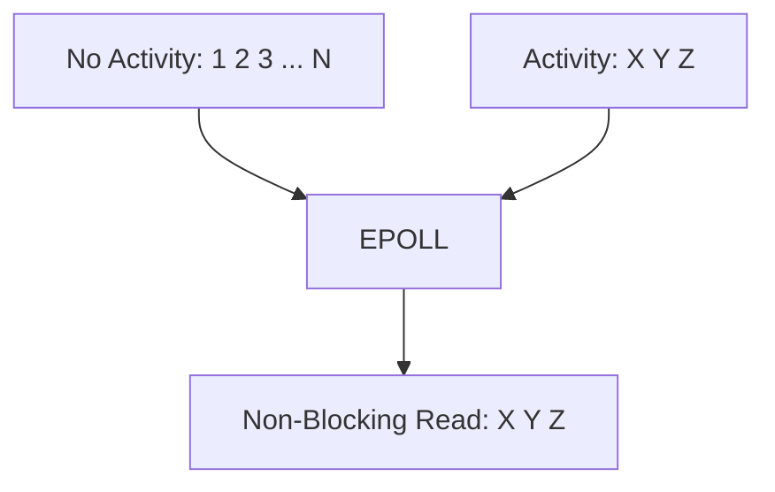

For Storage-IO, classically the blocking problem has been solved with thread pools: 
the main thread of execution dispatches the actual I/O to helper threads that will block and carry 
the operation on the main thread’s behalf. 

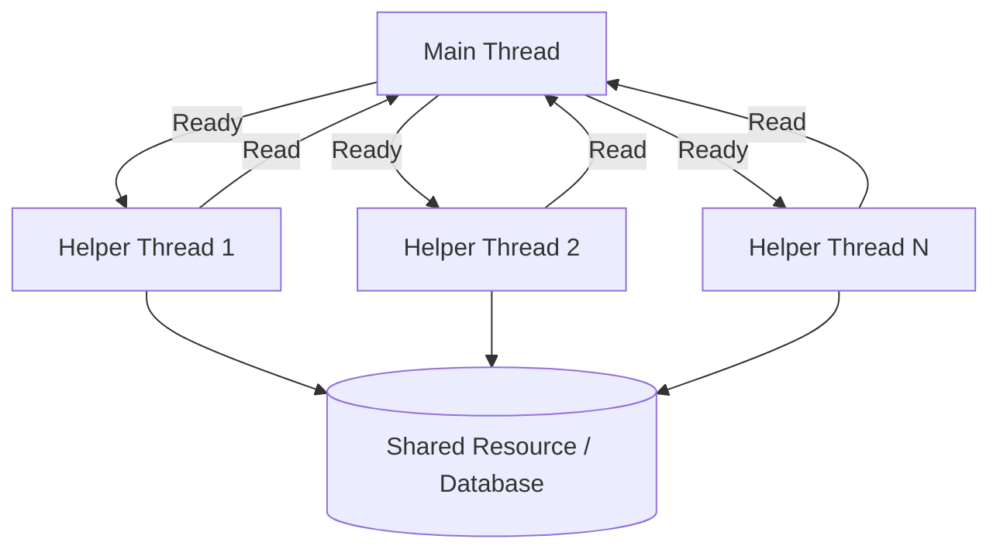

**Asynchronous I/O**

Kernel gained an Asynchronous I/O in Linux 2.6, but…

Mr. Torvald's mail

> Another blocking operation used by applications that want aio functionality is that of opening files that
> are not resident in memory. Using the thread based aio helper, add support for **IOCB_CMD_OPENAT**.
> So I think this is ridiculously ugly.

Linux AIO is indeed rigged with problems and limitations:

1. Linux-aio only works for 'O_DIRECT' files, rendering it virtually useless for normal, non-database
   applications.

2. The interface is not designed to be extensible. Although it is possible — we did extend it — every new 
   addition is complex.

3. Although the interface is technically non-blocking, there are many reasons that can lead it to blocking,
   often in ways that are impossible to predict.

This lead to `io_uring`.

**What is io_uring**

*io_uring* is the architecture of performance-oriented I/O systems. 
It’s a basic theory of operation is close to linux-aio (an interface to push work into the kernel, 
and another interface to retrieve completed work). But there is three different:

1. truly asynchronous
2. support multi-I/O interface
3. flexible and extensible

**Two main structure in io_uring**

Instances of those structures live in a shared memory single-producer-single-consumer ring buffer between
the kernel and the application.

1. submission queue entry (sqe)
2. completion queue entry (cqe)

In user space, a task wants to check whether work is ready or not, just looks at the cqe ring buffer and
consumes entries if they are ready. There is no need to go to the kernel to consume those entries
(`receive()` system call).

**How to use io_uring**

1. Define the descriptor structure for `io_uring` interface.

```c 
/* Describes what we need from a read */
struct read_descriptor {
    int fd;
    char *buf;
    unsigned long long pos;
    unsigned long long size;
    int result;
};
```

`dispatch_reads` will submit the reading request to *io_uring* by `liburing`. 
This is the only system call we need to do in 'io_uring'.

```c 
/*
 * given an array of struct read_descriptors, dispatch them in the
 * io_uring
 */
int
dispatch_reads(struct io_uring *ring, struct read_descriptor *descv, int nr_desc)
{
    int i;
    for (i = 0; i < nr_desc; i++) {
        struct io_uring_sqe *sqe;
        struct read_descriptor *desc = &descv[i];
        sqe = io_uring_get_sqe(ring);
        /* Each operation will have a special prep function */
        io_uring_prep_read(sqe, desc->fd, desc->buf, desc->size, desc->pos);
        /*
         * Whatever value we put here will be reflected when it is
         * ready. This is how we know which read we are talking about
         */
        io_uring_sqe_set_data(sqe, desc);
    }
    /* For all of the reads above, there will be only one system call! */
    return io_uring_submit(ring);
}
```
Then we can check which read's descriptor are ready and process them. 
Because it is using shared-memory interface, no system calls are needed to consume those events. 
The user just has to be careful to tell the io_uring interface that the events were consumed.

```c 
/*
 * Consume reads that are available and returns how many were consumed.
 * System calls issued: ZERO!
 */
unsigned
consume_reads(struct io_uring *ring)
{
    unsigned completed;
    unsigned head;
    struct io_uring_cqe *cqe;

    io_uring_for_each_cqe(ring, head, cqe) {
        completed++;
        /* Remember what we passed in io_uring_sqe_set_data?. It's here */
        struct read_descriptor *desc = (struct read_descriptor*)cqe->user_data;
        desc->result = cqe->res;
    }
    io_uring_cq_advance(ring, completed);
}
```

*io_uring* offers a plethora of advanced features for specialized use cases.

1. pre-registered File descriptor and Buffer registration
2. Poll ring: for very fast devices, the cost of processing interrupts is substantial. 
   *io_uring* allows the user to turn off those interrupts and consume all available events through polling.
3. Linked operations: allows the user to send two operations that are dependent on each other.
