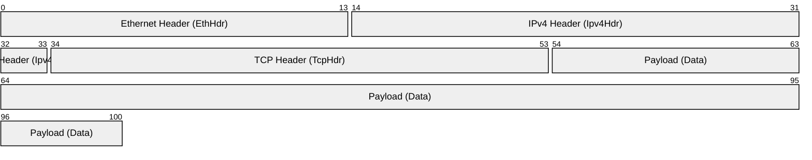
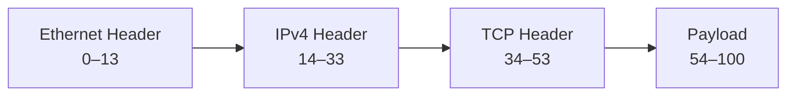

# XDP + `network_types`

To visualize how `network_types` maps onto a raw packet buffer in XDP, we can look at the packet as a 
linear array of bytes. Your code essentially "slides" structured templates over these bytes.

Diagram representing a standard **TCP over IPv4** packet as it appears in memory, and how your XDP program 
traverses it:



--- 



### The Memory Layout Breakdown

When your XDP program receives the packet, it sees a contiguous block of memory.
Here is how the `network_types` structs align with those offsets:

| Offset (Bytes) | Layer | `network_types` Struct | Purpose |
| --- | --- | --- | --- |
| `0` | **L2** | `EthHdr` | Contains MAC addresses and the `ether_type` (tells you if L3 is IPv4 or IPv6). |
| `14` | **L3** | `Ipv4Hdr` | Contains IP addresses and the `proto` field (tells you if L4 is TCP or UDP). |
| `34`* | **L4** | `TcpHdr` | Contains Source/Destination ports. |
| `54`+ | **Data** | `&[u8]` | The actual application data (HTTP, DNS, etc.). |

**Note: This assumes a standard 20-byte IPv4 header without options.*

---

### How to use this in your code logic

To "move" through these layers safely in Rust, you follow a **Check  Cast  Advance** pattern:

1. **Check:** Ensure `current_pointer + size_of::<Header>() <= data_end`.
2. **Cast:** `let header = current_pointer as *const Header;`
3. **Advance:** `let next_layer_pointer = current_pointer + Header::LEN;`

### Why this is "Zero-Copy"

In traditional networking, you might copy the `dest_port` into a new variable or deserialize the whole 
packet into a `struct`.

With `network_types` in XDP, you are simply telling the CPU: *"Treat the 2 bytes starting at memory address 
`X + 36` as a `u16`."* No data is moved; you are just viewing the existing wire data through a structured 
lens.

## Process **VLAN tagged** packets

VLAN Tagged packets, adds an extra offset layer to this process:

VLAN tagging is a common real-world scenario where the "linear" path gets a bit of a curveball. 
When a packet is VLAN-tagged, an extra 4 bytes are inserted between the Ethernet MAC addresses and the 
`EtherType` field.

If your XDP program doesn't check for this, it will misalign every subsequent layer (L3 and L4), 
essentially trying to read an IP address where it doesn't exist.

### The Memory Layout with VLAN (802.1Q)


### The "Adaptive Offset" Logic

To handle this, you need a dynamic offset. Using `network_types`, the logic looks like this:

1. **Read the initial Ethernet Header.**
2. **Check the `ether_type`.** * If it is `0x8100` (VLAN), you must increment your offset by 4 bytes and
   read the *next* 2 bytes to find the "real" protocol (e.g., IPv4).

   * If it is `0x0800`, proceed as normal.

---

### Rust Implementation with `network_types`

Here is how you handle this move from Layer 2 to Layer 3 while accounting for the "VLAN Jump":

```rust
use network_types::eth::{EthHdr, EtherType};
use network_types::ip::Ipv4Hdr;

// 1. Point to the start of the packet
let mut offset = EthHdr::LEN;

// 2. Initial safety check for L2
if data + offset > data_end {
    return xdp_action::XDP_PASS;
}

let eth = unsafe { &*(data as *const EthHdr) };
let mut proto = u16::from_be(eth.ether_type);

// 3. Handle VLAN Tagging (0x8100)
if proto == 0x8100 {
    // A VLAN tag is 4 bytes. We need to jump past it to find the real L3 type
    let vlan_offset = offset + 4;
    if data + vlan_offset > data_end {
        return xdp_action::XDP_PASS;
    }
    
    // The "real" ether_type is now at the end of the VLAN tag
    proto = unsafe { u16::from_be(*(data.add(offset + 2) as *const u16)) };
    offset = vlan_offset;
}

// 4. Move to Layer 3 (IPv4)
if proto == 0x0800 { // IPv4
    let ip_start = data + offset;
    if ip_start + Ipv4Hdr::LEN > data_end {
        return xdp_action::XDP_PASS;
    }
    let ip_hdr = unsafe { &*(ip_start as *const Ipv4Hdr) };
    // Now you have access to ip_hdr.src_addr, etc.
}

```

---

### Key Takeaways for your Program

* **The Verifier is your Shadow:** Every time you add to `offset`, you **must** perform a new comparison 
  against `data_end`. 
  The verifier doesn't "remember" that the packet was long enough 5 lines ago; it only cares about the
  current pointer arithmetic.

* **Endianness:** Notice the `u16::from_be()`. Since network data is Big-Endian and most CPUs (x86/ARM) 
  are Little-Endian, skipping this step will result in looking for Protocol `0x0008` instead of `0x0800`.

* **No Allocations:** Note that we are using references (`&*(...)`) or raw pointers. 
  We never call `Vec::new()` or `Box::new()`, keeping the XDP execution time in the nanoseconds range.


##  Process **IPv6** extension headers

IPv6 extension headers which often require a similar "looping" or "jumping" logic to find the L4 header:

Handling IPv6 is where the logic shifts from a simple "jump" to a potential "loop." 
Unlike IPv4, which stores most information in a fixed-size header, IPv6 uses **Extension Headers** (EH) 
for things like fragmentation, routing, and security.

In IPv6, the Layer 4 header (TCP/UDP) isn't always at a fixed offset. 
You have to follow a "Next Header" chain until you hit a protocol that isn't an extension.

### The IPv6 Packet Structure


---

### Step-by-Step Traversal with `network_types`

1. **L2 to L3:** Identify `EtherType::Ipv6` ().
2. **L3 Fixed Header:** Cast the first 40 bytes to `Ipv6Hdr`.
3. **The "Next Header" Chain:** Look at the `next_hdr` field.
* If `next_hdr` is TCP () or UDP (), you found L4.
* If `next_hdr` is an Extension (like Fragment or Routing), you must jump the size of that extension and 
  check the *next* `next_hdr`.


### Rust Logic for IPv6 Extension Walking

In eBPF, you cannot write an infinite loop. 
The verifier requires a **bounded loop** (usually a maximum of a few iterations) to ensure the program 
terminates.

```rust
use network_types::ip::{Ipv6Hdr, IpProto};

let mut offset = EthHdr::LEN;
let mut next_proto = IpProto::Ipv6Route; // Placeholder to start the logic

if data + offset + Ipv6Hdr::LEN > data_end {
    return xdp_action::XDP_PASS;
}

let ipv6 = unsafe { &*(data.add(offset) as *const Ipv6Hdr) };
let mut current_header = ipv6.next_hdr;
offset += Ipv6Hdr::LEN;

// We use a bounded loop to walk extension headers (e.g., max 5)
for _ in 0..5 {
    match current_header {
        IpProto::Tcp | IpProto::Udp => {
            // Success! Offset is now pointing at the start of L4
            break;
        }
        IpProto::Ipv6HopByHop | IpProto::Ipv6Route | IpProto::Ipv6Frag => {
            // Extension headers usually have a length field in the second byte
            if data + offset + 2 > data_end { break; }
            
            let ext_len = unsafe { *(data.add(offset + 1)) } as usize;
            let total_ext_len = (ext_len + 1) * 8; // IPv6 extensions are in 8-byte units
            
            // Peek at the NEXT header before jumping
            current_header = unsafe { *(data.add(offset)) as IpProto };
            offset += total_ext_len;

            if data + offset > data_end { return xdp_action::XDP_PASS; }
        }
        _ => break, // Unknown or unsupported protocol
    }
}

```
---

### Summary of Differences

| Feature | IPv4 Logic | IPv6 Logic |
| --- | --- | --- |
| **Header Size** | Usually 20 bytes (Fixed) | 40 bytes (Fixed) |
| **Options** | Inside the 20-60 byte range | Chains of separate Extension Headers |
| **Parsing** | Linear / Single Jump | Iterative / Walking the chain |
| **Complexity** | Low | Medium (Verifier limits apply) |

### Important Verifier Note

When walking headers like this, the verifier gets suspicious. 
If you use a variable `offset` to access memory, you must **re-verify** the bounds for every single access.
If you skip even one `data + offset > data_end` check, the program will fail to load with a 
"pointer arithmetic" error.


## Perform **Packet Mangling** (e.g., rewriting the Destination IP for a simple Load Balancer)

Packet mangling is the bread and butter of Load Balancers (LBs) and NAT (Network Address Translation). 
In XDP, this is incredibly fast because you are modifying the packet before it even reaches the kernel's
networking stack.

To perform a rewrite, you use the same `network_types` structs, but you cast them as **mutable pointers** 
(`*mut`).

### The Goal: A Simple Destination NAT (DNAT)

We want to take a packet destined for IP `A` and redirect it to IP `B` by rewriting the `dst_address` in 
the IPv4 header.

---

### Step-by-Step Mangling Path

1. **Locate the Header:** Navigate to the IPv4 header as we did before.
2. **Update the Data:** Change the destination address.
3. **Update the Checksum:** This is the "gotcha." If you change the IP address, the original checksum 
   becomes invalid. The hardware or kernel will drop the packet as "corrupt" unless you fix it.

#### Rust Implementation

```rust
use network_types::ip::Ipv4Hdr;

// 1. Locate the L3 header (standard offset)
let ip_start = data + EthHdr::LEN;
if ip_start + Ipv4Hdr::LEN > data_end {
    return xdp_action::XDP_PASS;
}

// 2. Cast as a MUTABLE reference
let ip_hdr = unsafe { &mut *(ip_start as *mut Ipv4Hdr) };

// Let's say we want to redirect everything to 10.0.0.1
let new_dst_ip: u32 = 0x0A000001; // 10.0.0.1 in hex

// 3. The Checksum Update (Incremental)
// Instead of re-calculating the whole packet, we use a math trick
// to update the checksum based on the difference between old and new IP.
let old_ip = ip_hdr.dst_addr;
ip_hdr.check = update_checksum(ip_hdr.check, old_ip, new_dst_ip);
ip_hdr.dst_addr = new_dst_ip;

return xdp_action::XDP_TX; // XDP_TX sends the packet back out the same interface

```

---

### The Checksum Challenge

Checksums in IPv4 are calculated using **1's Complement sum**. 
If you change any field in the header, the `check` field must be updated.

* **For IPv4:** You only need to update the `Ipv4Hdr` checksum.
* **For TCP/UDP:** These protocols have a "pseudo-header" checksum that includes the IP addresses. 
  If you change the IP, you **must also** update the TCP/UDP checksum, or the receiving application will
  reject the packet.

### Important XDP Actions for Mangling

| Action | Result | Use Case |
| --- | --- | --- |
| **`XDP_PASS`** | Send to OS stack | Local processing after rewrite. |
| **`XDP_TX`** | Hairpin back out | High-performance Load Balancing. |
| **`XDP_DROP`** | Delete packet | Security / Blackholing. |
| **`XDP_REDIRECT`** | Send to another NIC | Routing / High-speed switching. |

### Summary of the "Network Types" Advantage

By using `network_types`, you didn't have to manually calculate bit-offsets for the destination IP or the checksum field. You treated the packet like a standard Rust `struct`, modified it, and the underlying memory was updated instantly with **zero copies**.


## How to handle the **TCP/UDP Checksum update**, 

Updating TCP/UDP checksum is slightly more complex because it requires peering "deeper" into the Layer 4 
header:

Updating the Layer 4 (TCP/UDP) checksum is significantly more involved than the IPv4 header checksum. 
Because Layer 4 protocols use a **pseudo-header** for their checksum calculation, which includes the 
Source IP, Destination IP, Protocol, and Payload Length.

If you change the IP address in Layer 3, the Layer 4 checksum becomes "dishonest" and the receiving OS 
will drop the packet.

### The Pseudo-Header Concept

The checksum you see in a TCP header isn't just for the TCP data; it's a cryptographic-like "handshake" 
with the IP layer to ensure the packet wasn't misrouted.

---

### Step-by-Step L4 Mangling

To update the checksum efficiently in eBPF without re-scanning the whole packet (which the verifier might
block if the packet is too large), we use **incremental updates**.

1. **Calculate the Difference:** Find the difference between the `old_ip` and the `new_ip`.
2. **Apply to L3:** Update the `Ipv4Hdr` checksum.
3. **Apply to L4:** Update the `TcpHdr` (or `UdpHdr`) checksum using that same difference.

#### Rust Implementation with `network_types`

```rust
use network_types::ip::Ipv4Hdr;
use network_types::tcp::TcpHdr;

// -- Assume we already pointed ip_hdr and tcp_hdr to the right offsets --

let old_ip = ip_hdr.dst_addr;
let new_ip: u32 = 0x0A000001; // 10.0.0.1

// 1. Update L3 Checksum
ip_hdr.check = update_ipv4_checksum(ip_hdr.check, old_ip, new_ip);

// 2. Update L4 Checksum (TCP)
// Note: We use the same IP difference because the IP is part of the TCP pseudo-header
tcp_hdr.check = update_l4_checksum(tcp_hdr.check, old_ip, new_ip);

// 3. Finally, swap the address
ip_hdr.dst_addr = new_ip;

```

---

### Handling UDP vs. TCP

There is a tiny, annoying difference between the two:

* **TCP:** The checksum is mandatory. You must always update it.
* **UDP:** The checksum is optional ( means no checksum).
* *Critical Rule:* If a UDP checksum is , **do not** update it to a non-zero value, or you'll break the
  packet. If it's non-zero, you must update it.

---

### Summary of the XDP Pipeline

You have now traced the entire lifecycle of a high-performance packet manipulation:

| Phase | Operation | `network_types` Role |
| --- | --- | --- |
| **Ingress** | `data` pointer received | Starting line |
| **Parsing** | Offset jumps & Bounds checks | Provides the struct definitions |
| **Inspection** | Layer 2  3  4 | Provides field names (`ether_type`, `proto`) |
| **Mangling** | Mutable casting | Provides memory alignment for writes |
| **Egress** | `XDP_TX` or `XDP_PASS` | Finalizing the modified buffer |

### What's next?

You've got the theory and the "path" down. 
TODO :
how to use **eBPF Maps** (like `HashMap` or `LruMap`) to keep track of these translations, so your 
program can remember where to send "return" traffic (the start of a basic Statefull Load Balancer)

------------------------------

# Additional Notes
The `network_types` crate is the "go-to" for high-performance networking in Rust because it provides 
**POD (Plain Old Data)** types. 

These allow you to perform "zero-copy" parsing by simply casting a pointer to a raw memory buffer into a
structured layout.

In XDP, speed is king. Since your code runs directly in the kernel driver, you don't have the luxury of a
heap or slow parsing logic.

Step-by-step path of a packet through XDP and how to use `network_types` to climb the OSI layers.

---

## 1. The XDP Entry Point

When a packet hits your network card, the XDP program receives an `xdp_md` context. 

This contains two critical pointers: `data` (the start of the packet) and `data_end` (the safety boundary).

### Step 1: Layer 2 (Ethernet)

Every packet starts with an Ethernet header. 
To read it, you point a `EthHdr` struct at the start of your packet data.

1. **Check Bounds:** You must prove to the kernel verifier that you aren't reading past `data_end`.
2. **Cast:** Cast the `data` pointer to `*const EthHdr`.
3. **Identify Next Protocol:** Look at the `ether_type` to see if you should move to IPv4, IPv6, or ARP.

```rust
let ethhdr: *const EthHdr = data as *const EthHdr;
// Always verify: (ptr + size) <= data_end
if ethhdr.add(1) as usize > data_end {
    return xdp_action::XDP_ABORTED;
}

let ether_type = unsafe { (*ethhdr).ether_type };

```

---

## 2. Layer 3 (IP)

If the `ether_type` indicates IPv4 (), you move your pointer forward by the size of the Ethernet header to find the IP header.

1. **Offset:** Start at `data + EthHdr::LEN`.
2. **Cast:** Use `Ipv4Hdr` from the crate.
3. **Action:** This is where you usually perform **Filtering** (dropping specific IPs) or **Forwarding**.

> **Note on Endianness:** Network bytes are Big-Endian. `network_types` provides helpers, but always remember to use `u16::from_be()` or similar if you are comparing port numbers or IP segments manually.

---

## 3. Layer 4 (TCP/UDP/ICMP)

Now you need to know *what* the traffic is doing. You look at the `proto` field in the IPv4 header.

* **TCP ():** Move the pointer by the IP header length (careful: IP headers can have variable lengths, though `Ipv4Hdr::LEN` is the standard 20 bytes).
* **UDP ():** Move the pointer and cast to `UdpHdr`.

### Step 3: Extracting Ports

Once you cast to `TcpHdr`, you can access `dest_port` or `source_port`. This is the point where you make "Load Balancing" or "Firewall" decisions.

---

## The "Zero-Copy" Summary Table

| Layer | `network_types` Struct | Offset from Start | Key Fields to Inspect |
| --- | --- | --- | --- |
| **L2** | `EthHdr` | `0` | `ether_type` |
| **L3** | `Ipv4Hdr` | `EthHdr::LEN` | `src_address`, `proto` |
| **L4** | `TcpHdr` / `UdpHdr` | `EthHdr::LEN + Ipv4Hdr::LEN` | `dest_port` |

---

## Is your understanding correct?

**Yes.** Your premise that it allows interpreting raw bytes as structured headers without allocation is exactly why it is used in eBPF.

**One subtle correction:** While you said "without parsing overhead," keep in mind that in eBPF, you still have **verification overhead**. The "overhead" isn't CPU cycles spent moving data; it's the code you have to write to prove to the kernel that you aren't reading out of bounds. Every time you move from L2 to L3, you must perform a `len` check, or the kernel will refuse to load your program.

### Example of the "Jump":

```rust
// Moving from L2 to L3
let ipv4_start = data + EthHdr::LEN; 
if ipv4_start + Ipv4Hdr::LEN > data_end {
    return xdp_action::XDP_PASS; // Not enough data for an IP header
}
let ip_hdr = ipv4_start as *const Ipv4Hdr;

```

Would you like me to provide a complete, minimal Rust example of an XDP program that drops traffic based on a specific port using these types?
