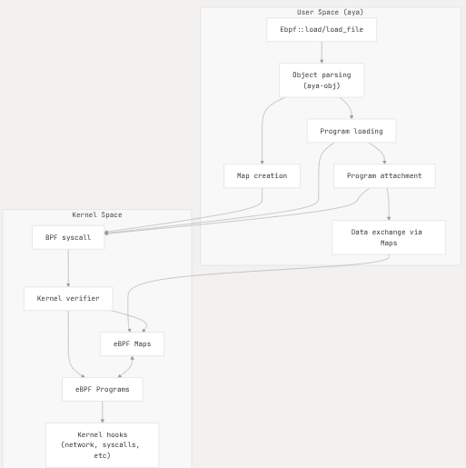
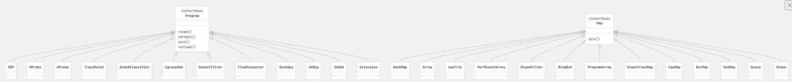
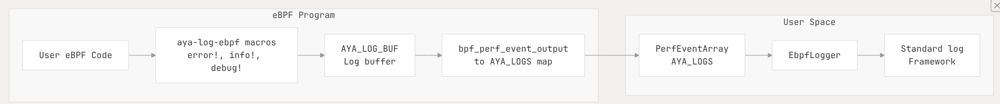
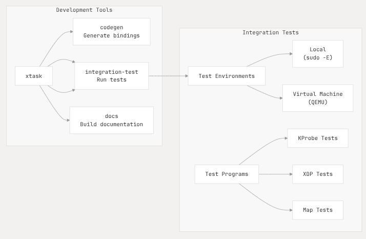

# Aya:


## What is Aya:

Aya is a Rust library for developing `eBPF` based programs for Linux kernel. 

It facilitates the development of `eBPF` programs with its family of crates `aya_xyz`. 
Its totally independent of many standard `eBPF` related libraries such as `libbpf`, `BCC` and is implemented
entirely in Rust, using only `libc` crate to execute system calls (`bpf()`).

Key Features:

1. **BPF Type Format (BTF) support**:
    Transparently enabled when supported by the Target kernel, allowing eBPF programs compiled against one
    kernel version to run on different kernel versions without recompilation. 

2. **Function calls and global data support**: 
    Enables `eBPF` programs to make function calls and use global variables with initializers. 

3. **Async support**:
    Compatible with Async executor `tokio` and `async_std` ( `smol`)

4. **Self-Contained:**
    No dependency on kernel headers or C tool-chains, this makes deployment easier and builds faster.

Reference: `README.md`, `aya/README.md`

### Project Architecture: 

Aya consists of several interconnected components organized into 3 main groups:


Sources: `Cargo.toml`, `aya/Cargo.toml`, `aya-obj/Cargo.toml`, `aya-log/Cargo.toml`, `aya-tool/Cargo.toml`

#### User Space Components:

- `aya` : The Core library providing the *main API* for:
    - Loading, 
    - Manipulating 
    - Managing `eBPF` programs

- `aya-obj` : Library for parsing `eBPF` object files with support for `BTF` and relocations.

- `aya-log` : A logging framework for `eBPF` programs running in the kernel 

#### `eBPF` Components: 

- `ebpf/aya-ebpf` : Runtime library for writing `eBPF` programs in Rust. 

- `ebpf/aya-ebpf-bindings` : Rust bindings for kernel types  used in eBPF programs. 

- `ebpf/aya-log-ebpf` : Library for logging from `eBPF` programs

#### Infrastructure Components:

- `xtask` : Build and development tools for Aya project.

- `test` : Framework for testing Aya functionality.


### `eBPF` Program LifeCycle:

The diagram shows how an `eBPF` programs flows from loading to executing:



1. User loads an `eBPF` program using `Ebpf()::load` or `Ebpf::load_file`

2. The object is parsed by `aya-obj` to extract:
    - maps
    - programs 
    - `BTF` information 

3. Maps are created and programs are loaded via `BPF` system call `bpf()`

4. Programs are attached to kernel hooks ( ex: kprob, network driver, tracepoints.. ) 

5. Data exchange occurs between user-space and kernel-space via `maps`

Source :
    `aya/Cargo.toml:19-31`, `aya-obj/Cargo.toml:19-25`, `README.md:76-96`

### Supported Program and Map Type:

Aya supports a rich variety of program types and map structures:



For detailed information about:

- Different Program Types check 

- Map Types and data structures 

Sources: `README.md:76-96`, `aya/README.md:74-92`


### Logging System:

Aya provides a logging system for `eBPF` programs that allows log messages to be sent from kernel-space to
user-space. 

 

For more details on Logging systems refer to 

Sources:  `aya-log/Cargo.toml:1-33`,`aya-log-common/Cargo.toml:1-23`,`aya-log-ebpf-macros/Cargo.toml:1-25`,
`aya-log-parser/Cargo.toml:1-24`

### Development and Testing:

Aya includes development, testing and Code generation:

 

For more info on development and testing :  

Sources: `xtask/Cargo.toml:1-33`, `test/integration-test/Cargo.toml:1-50`

### Usage Example:

Below example demonstrates how to use Aya to load and attach an eBPF program:

```rust 
use std::fs::File;
use aya::Ebpf;
use aya::programs::{Cgroups, Cgroups, CgroupSkbAttachTyps, CgroupAttachMode} 

// Load the BPF Code:
let mut ebpf = Ebpf::load_file("ebpf.o");

//get the ingress_filter` program compiled into `ebpf.o`.
let ingress: &mut CgroupSkb = ebpf.program_mut("ingress_filter")?.try_into()?;

// load the program into the kernel
ingress.load()?;

// attach the program to the root cgroup. `ingress_filter` will be called for all
// incoming packets.
let cgroup = File::open("/sys/fs/cgroup/unified")?;
ingress.attach(cgroup, CgroupSkbAttachType::Ingress, CgroupAttachMode::AllowOverride)?;
```

For more detailed API documentation, see 

Sources: `README.md:76-96`, `aya/README.md:74-92`


