# 2.1 eBPF Loading and Management:


## - References and Scope

```text
Related Source files:
	aya-obj/README.md
	aya-obj/src/btf/btf.rs
	aya-obj/src/btf/info.rs
	aya-obj/src/btf/relocation.rs
	aya-obj/src/btf/types.rs
	aya-obj/src/lib.rs
	aya-obj/src/maps.rs
	aya-obj/src/obj.rs
	aya-obj/src/relocation.rs
	aya/src/bpf.rs
	aya/src/lib.rs
	aya/src/maps/mod.rs
	aya/src/programs/extension.rs
	aya/src/programs/lirc_mode2.rs
	aya/src/programs/mod.rs
	aya/src/sys/bpf.rs
	aya/src/util.rs
```

Scope:
    - Details on how Aya loads, initializes and manages eBPF programs and maps.
    - Workflow diagrams starting from Parsing eBPF obj files to Loading them into the kernel and creating
      Rust abstractions for interacting with the loaded resources.
      For additional Info refer to [eBPF Program Types](./03-Aya-Program-Types.md).

## - Overview of Loading (eBPF) :

The `eBPF` loading and management system is responsible for:
    1. Parsing **eBPF** object files (ELF format which contains `eBPF` bytecode)
    2. Handling **BTF** (BPF Type Format) information.
    3. Init maps defined in the program.
    4. Loading **eBPF** progs into the kernel
    5. Providing APIs to interact with loaded programs and maps

 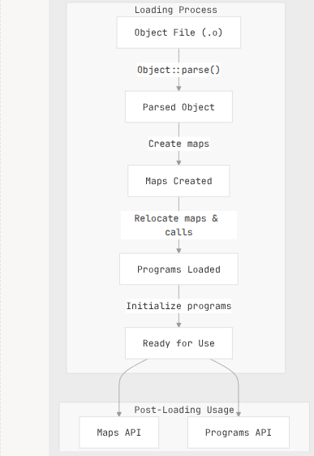

```text 
Related Source files:
    - Loading eBPF from File  : aya/src/bpf.rs:356-362
    - Main loading process    : aya/src/bpf.rs:380-702 
    - Object parsing          : aya-obj/src/obj.rs:457-462
```

## - Core Components of Loading System:

The **eBPF** loading system consists of several key components that work together:

 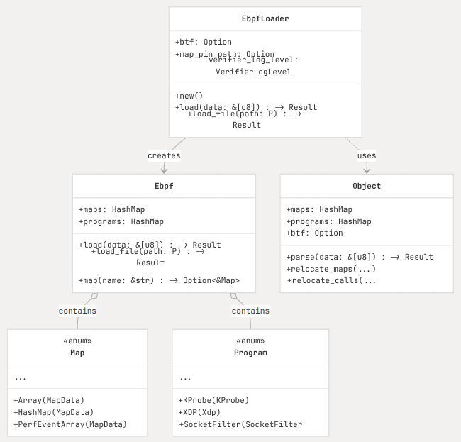

```text 
Related Source files:
    - EbpfLoader definition     : aya/src/bpf.rs:119-168
    - Ebpf struct definition    : aya/src/bpf.rs:850-855
    - Map enum definition       : aya/src/maps/mod.rs:274-319
    - Program enum definition   : aya/src/programs/mod.rs:276-329
    - Object struct definition  : aya-obj/src/obj.rs:138-163
```

## - Loading Workflow:

Loading eBPF involves several steps from parsing the object files to creating usable program and map
instances.

#### 1. **Entry Points**

Aya provides 2 main entry points for loading **eBPF** programs

    1. **Simple Loading**: Basic loading with default options

        `Ebpf::load_file()` or `Ebpf::load()` 

    2. **Configurable Loading**: For additional control over loading process:
        ```rust 
            // Simple loading
            let bpf = Ebpf::load_file("program.o")?;
            
            // Configurable loading
            let bpf = EbpfLoader::new()
                .btf(Btf::from_sys_fs().ok().as_ref())
                    .map_pin_path("/sys/fs/bpf/my-program")
                        .load_file("program.o")?;
        ```

#### 2. **Object Parsing**: 

While loading Aya performs parsing of the object file :

 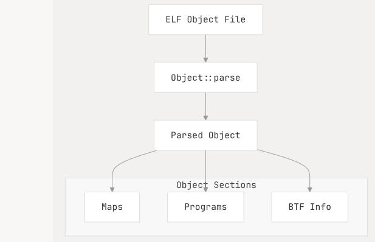
    Object file is parsed using `object::parse()` this steps extracts:
        * Map definitions
        * Program code and meta-data
        * BTF information ( if available )
        * License and Other meta-data 


```text 
Related sources:
    - Object Parsing        : aya-obj/src/obj.rs:457-475
    - Calling Object::parse : aya/src/bpf.rs:390
```

#### 3. **BTF Processing and Map Creation**

Aya processes BTF information and creates maps : 

  
    
    Steps:
    1. Loading BTF information into the kernel if available.
    2. Create map instances for each map defined in the object.
    3. Handling pinned maps according to pinning configuration.

```text 
    - BTF processing                : aya/src/bpf.rs:393-452
    - Map creation                  : aya/src/bpf.rs:456-502
    - Map creation implementation   : aya/src/maps/mod.rs:555-596
```

#### 4. **Relocation Processing**:  ( If BTF is available )

Aya performs relocation to ensure the maps and function calls work correctly.

 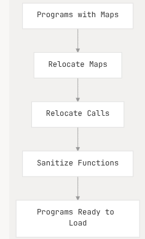

Map and call relocations ensure:
    - References to maps in the program code point to the correct map file descriptors
    - Function calls between eBPF programs are properly linked

```text 
Reference Src:
    - Relocations       : aya/src/bpf.rs:510-516
    - Map relocation    : aya-obj/src/relocation.rs:112-122
    - Call relocation   : aya-obj/src/relocation.rs:253-262
```

#### 5. **Program Loading and Construction**:

Finally Aya creates program objects for each program in the object file.

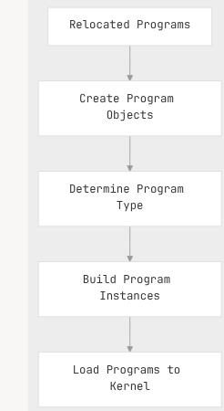

Program instances are created based on their section type ( **XDP**, **KProbe**, **socket filter**...) and
prepare for loading into the kernel. 

```text 
Reference Src:
    - Program creation                  : aya/src/bpf.rs:518-694
    - Program loading implementation    :aya/src/programs/mod.rs:625-716
```

## - `EbpfLoader` struct

The `EbpfLoader` provides a builder-style API for configuring the loading process.

### - Key Features and options 

| Feature	| Method	| Description|
| :---      | :---      | :---       |
|BTF Support	|btf()	|Sets the BTF info to use for relocations|
|Map Pinning	|map_pin_path()	|Sets the base directory for pinned maps|
|Global Variables	|set_global()	|Sets the value of a global variable|
|Map Configuration	|set_max_entries()	|Overrides the max entries value for maps|
|Extension Programs	|extension()	|Treats programs as extension programs|
|Verifier Logging	|verifier_log_level()	|Sets the kernel verifier log level|
|Unsupported Maps	|allow_unsupported_maps()	|Allows loading programs with unsupported maps|

 

```text 
Reference Src:
    - EbpfLoader configuration methods  :aya/src/bpf.rs:155-344
    - load_file method                  :aya/src/bpf.rs356-362 
    - load method                       :aya/src/bpf.rs:380-702
```

## - Feature Detection (Kernel)

Aya automatically detects kernel features to ensure compatibility:

 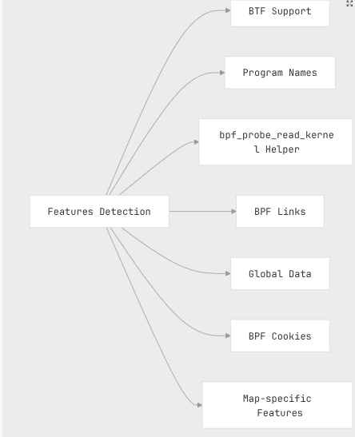

The detected features influence how programs are loaded and what capabilities are available.

```text 
Reference Srcs:
    - Features struct definition        : aya-obj/src/obj.rs:40-51
    - Feature detection implementation  : aya/src/bpf.rs:61-96
```

## - `Ebpf` Interface

After loading, the `Ebpf` struct provides access to loaded programs and maps:

 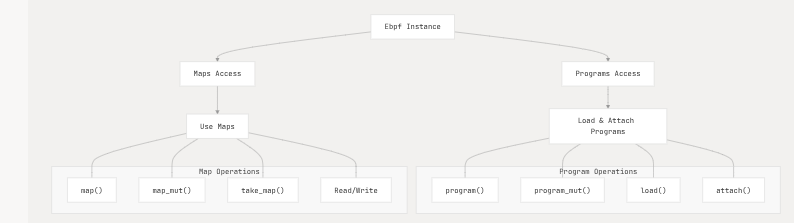 

```text 
Reference Srcs:
    - Map access methods    : aya/src/bpf.rs:919-942
    - Program methods       : aya/src/programs/mod.rs:431-496
```

## - Program Loading Details:

Following are the steps Aya performs when loading a program:

 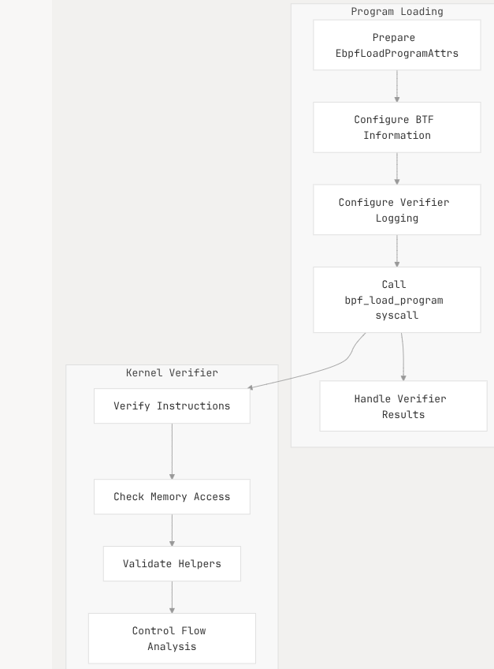

The program loading process involves setting up the correct program attributes, configuring BTF information,
and handling the kernel verifier's results.

```text 

```
Reference Srcs:
    - Program loading implementation    : aya/src/programs/mod.rs:625-715
    - BPF program loading syscall       : aya/src/sys/bpf.rs:141-200


## - Map Creation Details 

Map creation involves:
 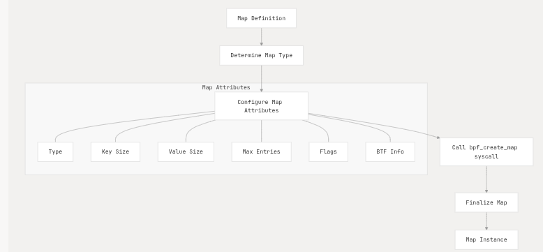

```text 
Reference Sources:
    - Map creation implementation   :aya/src/maps/mod.rs:555-596
    - BPF map creation syscall      :aya/src/sys/bpf.rs:45-104
```

## - Program and Map Lifecycle:

The lifecycle of eBPF programs and maps in Aya:

 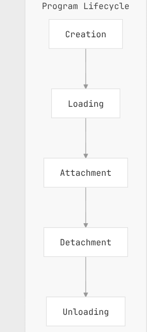
 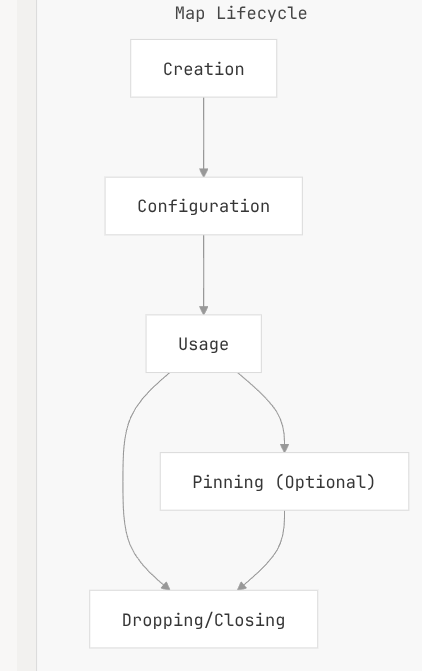

## - System Architecture

The overall system architecture of Aya's eBPF loading and management:

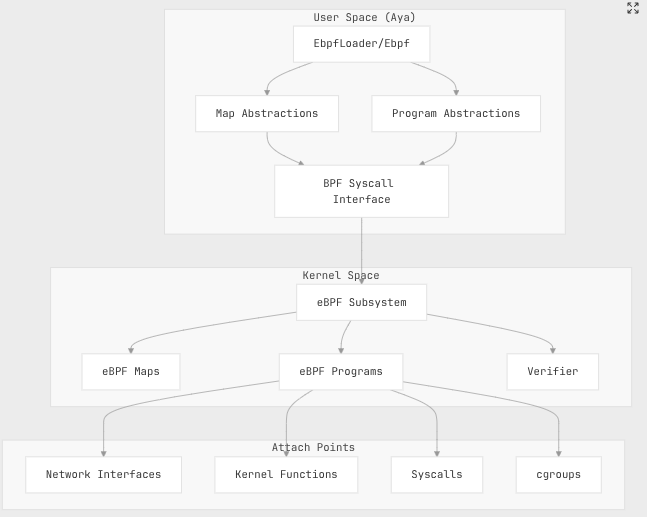

```text 
Reference Sources:
    - Overall loading and management    :aya/src/bpf.rs
    - Syscall interface                 :aya/src/sys/bpf.rs
    - Program abstractions              :aya/src/programs/mod.rs
    - Map abstractions                  :aya/src/maps/mod.rs

```

Sum Up:

Aya's `eBPF` loading and management system provides a robust, type-safe API for working with `eBPF` programs
in Rust. 

It handles the complexities of parsing object files, managing `BTF` information, creating maps, and loading 
programs into the kernel. 

The builder-style API of `EbpfLoader` allows for flexible configuration, while the `Ebpf` struct provides 
convenient access to loaded resources.


