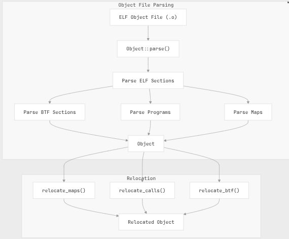
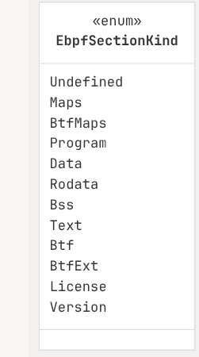
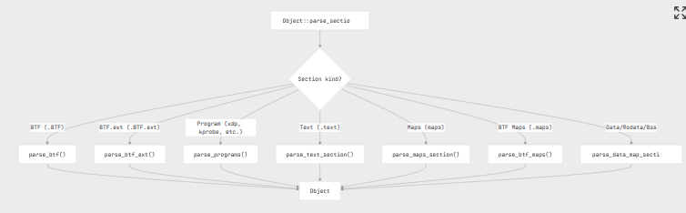
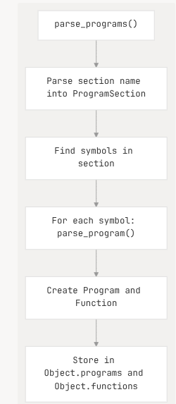
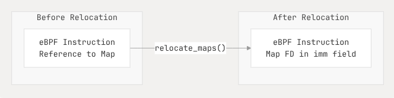
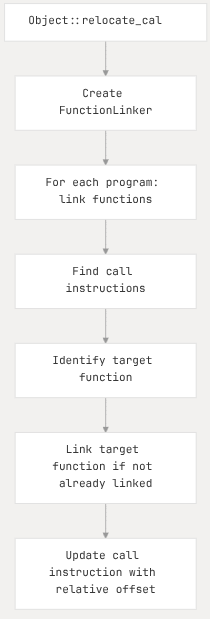
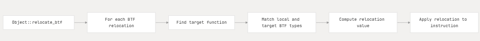
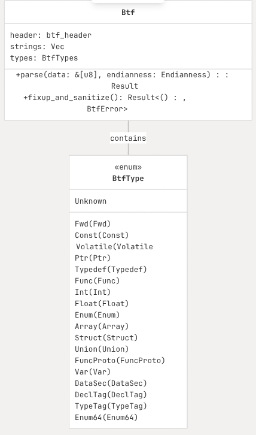
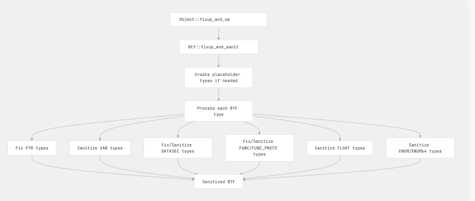
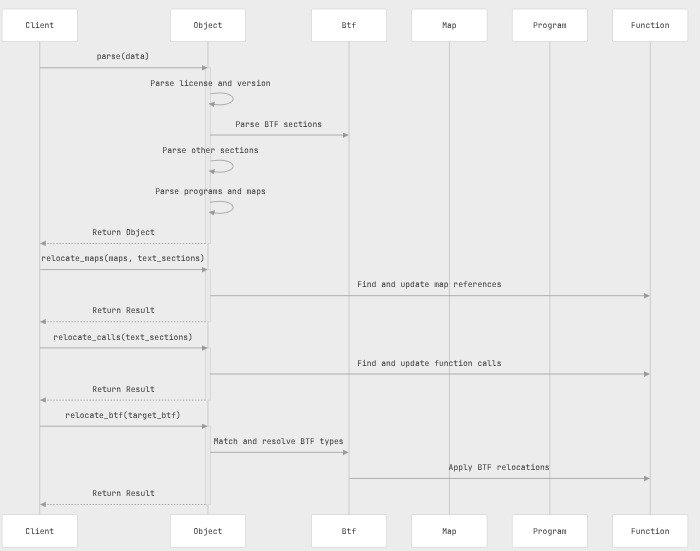

# 2.2 Object File Parsing and Relocation

## - References and Scope

```text
    aya-obj/README.md
    aya-obj/src/btf/btf.rs
    aya-obj/src/btf/info.rs
    aya-obj/src/btf/relocation.rs
    aya-obj/src/btf/types.rs
    aya-obj/src/lib.rs
    aya-obj/src/maps.rs
    aya-obj/src/obj.rs
    aya-obj/src/relocation.rs
    netlify.toml
    rustfmt.toml
    test/integration-test/src/tests/relocations.rs
    xtask/src/main.rs
```
Scope:
    - Explains how Aya parses eBPF object files and handles relocations. 
    - How Aya process for extracting programs, maps, and BTF (BPF Type Format) information from compiled eBPF
object files,
    - How Aya performs of relocations to prepare programs for loading into the kernel.
    
## - Overview of File Parsing and Relocation:

The object file parsing and relocation system is responsible for:

1. Parsing eBPF ELF object files produced by LLVM
2. Extracting programs, maps, and BTF information
3. Handling various types of relocations including map references and function calls
4. Sanitizing and fixing up BTF information for kernel compatibility

 


```text    
Reference Sources: 
    - aya-obj/src/obj.rs:456-528
    - aya-obj/src/relocation.rs:110-181
```

## Object File Structure:

An `eBPF` object file is an ELF file with special sections containing eBPF programs, maps, and BTF info. 
Aya parses these sections to create an in-memory representation of the object.

 

```text 
Reference Sources: 
    - aya-obj/src/obj.rs:137-163
    - aya-obj/src/obj.rs:166-185
    - aya-obj/src/maps.rs:134-248
```

## ELF Section Types:

The eBPF object file contains various sections that Aya processes. Each section has a specific purpose:

|Section Type	| Description	| Example Names |
| :--- | :--- | :--- |
|Program	|Contains eBPF programs	|xdp, kprobe, tracepoint|
|Maps	|Legacy map definitions	|maps|
|BTF Maps	|BTF-based map definitions	|.maps|
|Data	|Global variables	|.data, .rodata, .bss|
|Text	|Function code	|.text|
|BTF	|BPF Type Format data	|.BTF|
|BTF Ext	|BTF extensions	|.BTF.ext|
|License	|Program license	|license|
|Version	|Kernel version	|version|

The sections are categorized using the `EbpfSectionKind` enum:

 

 ```text 
Reference Sources: 
    - aya-obj/src/obj.rs:1019-1045
    - aya-obj/src/obj.rs:1047-1073
 ```

## - Parsing Process

The parsing process starts with the `Object::parse` method, which takes binary data from an ELF file and 
creates an Object instance. 

This process involves several steps:
   1. Parse the ELF header
   2. Extract license and kernel version information
   3. Parse BTF and BTF.ext sections first (if present)
   4. Parse other sections (maps, programs, etc.)

### Section Parsing:

Each Section type is handled differently <S-D-;>

 

```text 
Refexten Sources: 
    - aya-obj/src/obj.rs:842-892
    - aya-obj/src/obj.rs:456-528
```

### Program Section Parsing :

Program sections contain eBPF programs that can be loaded and attached to various kernel hooks. 
Aya parses these sections based on their names, which follow a specific format (ex: xdp/my_program or 
kprobe/my_kprobe).

The parsing process creates Program and Function objects and stores them in the Object:

 

```text 
Reference Sources:
    - aya-obj/src/obj.rs:612-639
    - aya-obj/src/obj.rs:641-676
```

## - Relocation Process:
After parsing, Aya performs relocations to resolve references within the eBPF programs.

There are three main types of relocations:
1. Map Relocations: 
    Replace references to maps with their actual file descriptors

2. Call Relocations: 
    Resolve function calls to their correct addresses

3. BTF Relocations: 
    Apply BTF-based relocations for kernel compatibility

### Map Relocations
    Map relocations replace references to maps in the program code with their file descriptors:

 

The map relocation process occurs in `Object::relocate_maps()` and involves:
1. Finding map references in the program code
2. Replacing them with the appropriate file descriptors
3. Handling different types of map references (BPF_PSEUDO_MAP_FD, BPF_PSEUDO_MAP_VALUE)

```text 
Reference Sources:
    - aya-obj/src/relocation.rs:112-144
    - aya-obj/src/relocation.rs:184-275                   
```
### Call Relocation:

Call relocations resolve function calls within the eBPF programs:

 

Call Relocation process:

1. Identifies call instructions in the program
2. Resolves the target function address
3. Updates the call instruction with the correct relative offset
4. Links in any required functions from other sections

```text 
Reference Sources: 
    - aya-obj/src/relocation.rs:147-181
    - aya-obj/src/relocation.rs:302-353
```

### BTF Relocations:

BTF relocations are more complex and involve resolving BTF-based references to match the target kernel's 
data structures:

 

This is particularly important for programs that need to access kernel data structures, as it allows 
programs compiled against one kernel version to work with different kernel versions.

```text 
Reference Sources: 
    - aya-obj/src/btf/relocation.rs:222-265
    - aya-obj/src/btf/relocation.rs:298-398
```

## - BTF Support

BTF (BPF Type Format) is a debugging info format that allows eBPF programs to work across different kernel 
versions by providing type information instead of hard-coded struct offsets.

### BTF Structure

The BTF data consists of:
  * A header
  * Type information
  * String data

 

```text 
Ref Sources: 
    - aya-obj/src/btf/relocation.rs:222-265
    - aya-obj/src/btf/relocation.rs:298-398
```
### BTF Fixup and Sanitization

Before BTF data can be loaded into the kernel, it needs to be fixed up & sanitized to ensure compatibility. 

This process:
  * Adjusts BTF type offsets and sizes
  * Replaces unsupported types with compatible alternatives
  * Fixes naming and other issues that could cause kernel verifier failures

 

 ```text 
Sources: 
    - aya-obj/src/btf/btf.rs:474-720
    - aya-obj/src/btf/btf.rs:729-751
 ```

## - Example: Complete Parsing and Relocation Flow:

The below sequence diagram shows the complete flow of parsing an eBPF object file and performing relocations:
 
 

```text 
Sources: 
    - aya-obj/src/obj.rs:456-528
    - aya-obj/src/relocation.rs:110-181
    - aya-obj/src/btf/relocation.rs:220-266
```

## - Common Relocation Issues:


Relocations can fail for several reasons:

| Error Type	|Description	|Possible Causes|
| :--- | :-- | :-- |
|UnknownSymbol	        |Symbol not found in symbol table	             |Missing symbol definitions |
|SectionNotFound	    |Section referenced by symbol not found	         |Invalid section references |
|UnknownFunction	    |Function target not found	                     |Incorrect function calls |
|InvalidRelocationOffset|Invalid offset in relocation	                 |Corrupted relocation data |
|ConflictingCandidates	|Multiple conflicting BTF type matches	         |Ambiguous type definitions |
|InvalidAccessString	|Invalid BTF access string	                     |Malformed BTF data |

```text 
Sources: 
    - aya-obj/src/relocation.rs:39-88
    - aya-obj/src/btf/relocation.rs:27-146
```

## - Integration with Aya Core 

The object parsing and relocation system is a core part of the Aya eBPF library. 
When users load eBPF programs using `Ebpf::load` or `Ebpf::load_file`, the library:

1. Parses the object file
2. Extracts maps and programs
3. Creates map file descriptors
4. Performs relocations
5. Loads the programs into the kernel

This allows Aya users to work with eBPF programs without needing to understand the complexities of object 
parsing and relocation.

```text 
Sources: 
    - aya-obj/src/lib.rs:16-28
    - aya-obj/src/obj.rs:137-163
```
