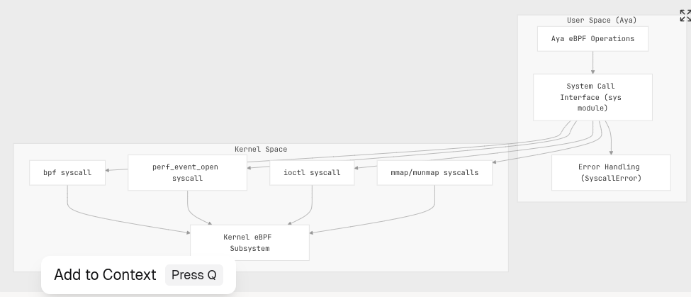
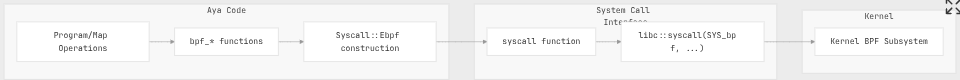
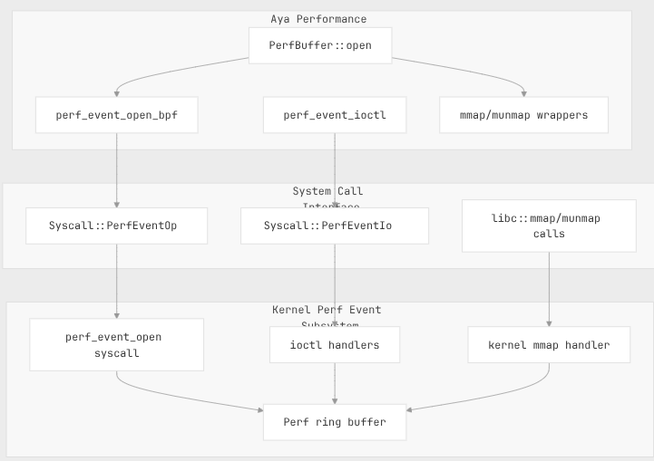
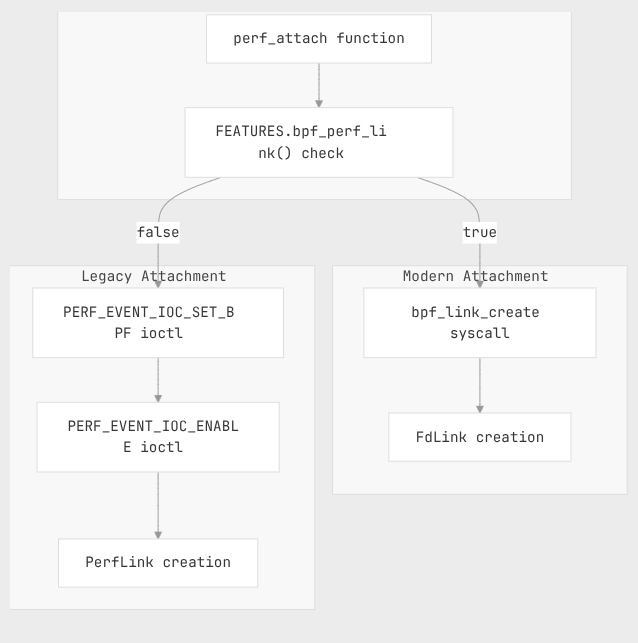
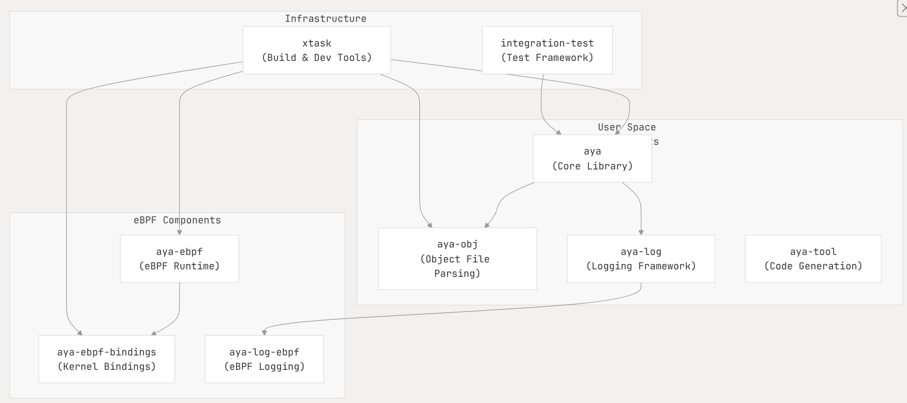
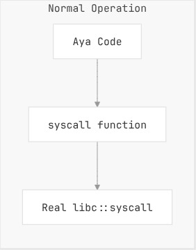

# 2.3 System Call Interface:

```text
	- aya/src/maps/perf/perf_buffer.rs
	- aya/src/programs/perf_attach.rs
	- aya/src/sys/fake.rs
	- aya/src/sys/mod.rs
	- aya/src/sys/perf_event.rs
```

## - Scope:
  * How Aya interfaces with Linux kernel through system calls to implement eBPF functionality.
  * Aya's system call abstraction layer and how it provides type-safe wrappers around low-level system
    calls required for eBPF operations.

  For more on how eBPF progs get loaded and managed refer to 
  - [Ebpf Loading and Management](./02-1-eBPF-Loading-and-Management.md)
  For details on object parsing refer to 
  - [Object File Parsing and Relocation](./02-2-ObjectFileParsing-and-Relocation.md)

## - Overview How Aya interacts with Linux kernel:

Aya requires several system calls to interact with Linux kernel's eBPF sub-system:

  1. `bpf()` system call: Main interface to perform:
    - Loading programs 
    - Create Maps 
    - Other eBPF operations 
  2. `perf_evet_open()` syscall: Used to create performance monitoring events.
  3. `ioctl` syscall: Used to configure performance events and attach eBPF programs.
  4. `mmap/munmap` syscalls: Used for memory-mapped access to performance event buffers.

System call interface provides a safe, Rust-friendlt abstraction over these calls while handling errors
appropriately.

 

```text 
Sources:
    - aya/src/sys/mod.rs:1-151
```

## - Syscall abstraction:

Aya defines an enum called `Syscall` that represents the different types of system calls that can be made. 
This provides a type-safe way to interact with the kernel.

```text 
Sources: 
    - aya/src/sys/mod.rs:26-64
    - aya/src/sys/mod.rs:97-151
```

The core of the system call interface is the syscall function, which takes a `Syscall` enum and dispatches 
to the appropriate system call:

   `fn syscall(call: Syscall<'_>) -> SysResult`
    
This function returns a `SysResult` type, which is a `Result<i64, (i64, io::Error)>`, capturing both the 
return code and any error that occurred.

```text 
Sources: 
    - aya/src/sys/mod.rs:97-151
```

## - BPF System Call:
    
The BPF system call is the primary interface for interacting with the eBPF subsystem in the Linux kernel. 
Aya wraps this syscall with type-safe functions that handle the details of constructing the appropriate 
`bpf_attr` structure and making the syscall.

When Aya needs to make a BPF syscall, it constructs a `Syscall::Ebpf` variant with the appropriate command 
and attributes, then calls the syscall function.

 

```text 
Sources: 
    - aya/src/sys/mod.rs:36-42
    - aya/src/sys/mod.rs:97-151
```

## - Performance Event System Calls

Aya uses performance events for various purposes, particularly for the `PerfEventArray` map type which 
allows data transfer from eBPF programs to user space. 

This involves several system calls:

1. `perf_event_open` : Creates a file descriptor for a performance event
2. `ioctl` with specific commands : Configures and controls performance events
3. `mmap` : Maps the perf buffer into user space memory for efficient data access




```text 
Sources: 
    - aya/src/sys/perf_event.rs:18-147
    - aya/src/maps/perf/perf_buffer.rs:86-126
```
### Performance Event Opening:

Aya provides several specialized functions for opening different types of performance events:

  1. `perf_event_open_bpf`: Opens a performance event for BPF program output
  2. `perf_event_open_probe`: Opens a kprobe or uprobe performance event
  3. `perf_event_open_trace_point`: Opens a tracepoint performance event

These functions configure the appropriate `perf_event_attr` structure and call the `perf_event_sys` func,
which in turn calls the syscall function with a `Syscall::PerfEventOpen` variant.

```text 
Sources: 
    - aya/src/sys/perf_event.rs:18-147
```

### Performance Event control 

After opening a performance event, Aya uses the `perf_event_ioctl` function to configure and control it. 
This function takes a file descriptor and a `PerfEventIoctlRequest` enum, which can be one of:

  * `PerfEventIoctlRequest::Enable`: Enables the performance event
  * `PerfEventIoctlRequest::Disable`: Disables the performance event
  * `PerfEventIoctlRequest::SetBpf`: Attaches a BPF program to the performance event

```text 
Sources: 
    - aya/src/sys/perf_event.rs:106-118
    - aya/src/programs/perf_attach.rs:118-137
```

### Performance Buffer Memory mapping 

Aya uses the `mmap` sys call to map the performance event buffer into user space memory, allowing efficient
access to the data produced by BPF programs. 
The `PerfBuffer` structure encapsulates this mapping and provides methods for reading events from the buffer.

 

 
 ```text 
Sources: 
    - aya/src/maps/perf/perf_buffer.rs:86-126
    - aya/src/maps/perf/perf_buffer.rs:139-251
    - aya/src/sys/mod.rs:154-186
 ```
## - Program Attachment through System calls

One key use of system calls in Aya is to attach eBPF programs to various kernel hooks. 
For performance events, this is done using the `perf_attach` and related funs, which use `ioctl` syscalls 
to attach the program and then enable the event.

There are two main attachment methods:
  1. Using the `bpf_link_create` syscall (modern method, available in newer kernels)
  2. Using the ioctl syscall with the **PERF_EVENT_IOC_SET_BPF** and **PERF_EVENT_IOC_ENABLE** cmds 
     (legacy method)
  3. Aya automatically selects the appropriate method based on the kernel features available.

 

```text 
Sources: 
    - aya/src/programs/perf_attach.rs:84-108
    - aya/src/programs/perf_attach.rs:118-137
```

## - Testing and Mocking

The system call interface in Aya is designed to be testable by allowing the real system calls to be replaced
with mock implementations during testing. This is implemented in the fake module.




```text 
Sources: 
    - aya/src/sys/mod.rs:97-151
    - aya/src/sys/fake.rs:1-21
```

## Global Statistics Tracking:

Aya provides a function called enable_stats that enables global statistics tracking for eBPF programs. 
This function uses the BPF system call with the `BPF_ENABLE_STATS` command to enable tracking of statistics 
like run time and run count for eBPF programs.

    `enable_stats(stats_type: Stats) -> Result<OwnedFd, SyscallError>` 

When the returned file descriptor is dropped, statistics tracking is automatically disabled.

```text 
Sources: 
    - aya/src/sys/mod.rs:189-237
```

## Summary

The system call interface in Aya provides a clean, type-safe abstraction over the low-level system calls
needed to interact with the Linux kernel's eBPF subsystem. 
By encapsulating the details of these system calls, Aya makes it easier for users to work with eBPF without
having to worry about the complexities of system call arguments and error handling.

The main components of this interface are:
  1. The Syscall enum, which represents the different types of system calls
  2. The syscall function, which dispatches to the appropriate system call
  3. Type-safe wrappers for specific operations like opening performance events
  4. Memory mapping functions for working with performance buffers
  5. Error handling through the SyscallError type

This interface is also designed to be testable, with provisions for mocking system calls during tests.


