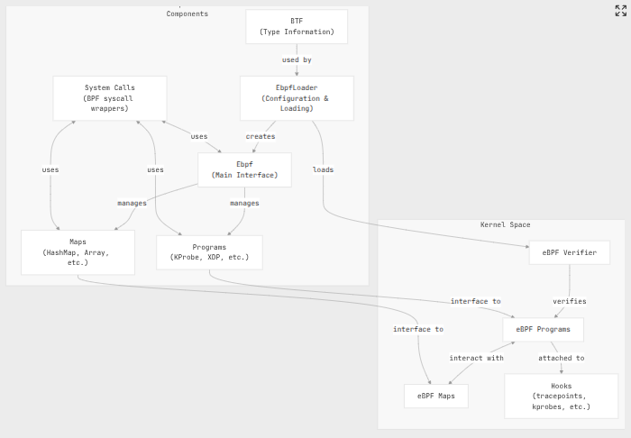
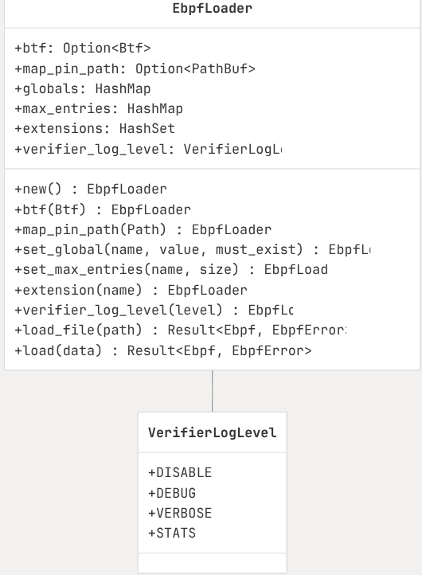
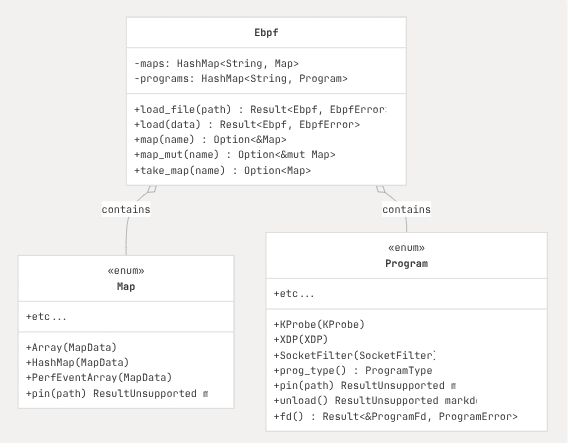
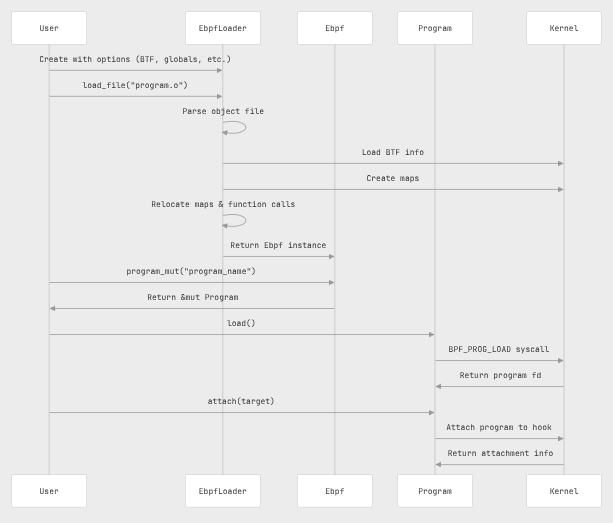
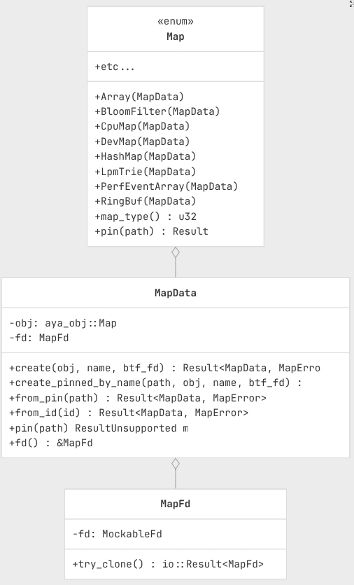
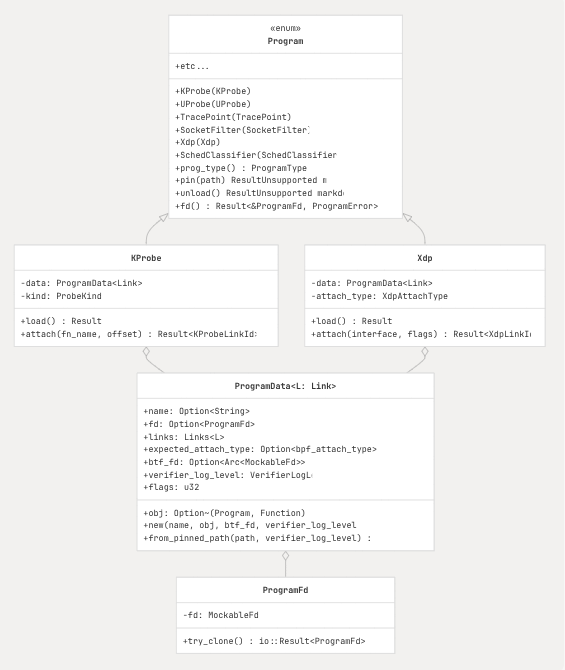
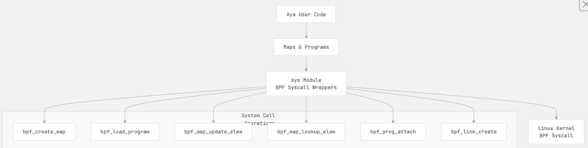
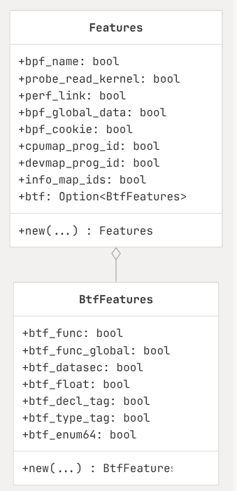
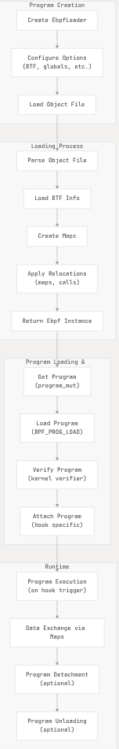

#  2 Aya Core Components:


## Core Components
Relevant source files :
```text 
    Cargo.toml
    aya-log-common/Cargo.toml
    aya-log-ebpf-macros/Cargo.toml
    aya-log-parser/Cargo.toml
    aya-log/Cargo.toml
    aya-obj/Cargo.toml
    aya-tool/Cargo.toml
    aya/Cargo.toml
    aya/src/bpf.rs
    aya/src/lib.rs
    aya/src/maps/mod.rs
    aya/src/programs/extension.rs
    aya/src/programs/lirc_mode2.rs
    aya/src/programs/mod.rs
    aya/src/sys/bpf.rs
    aya/src/util.rs
    test/integration-test/Cargo.toml
    xtask/Cargo.toml
    xtask/public-api/aya-ebpf-bindings.txt
    xtask/public-api/aya-ebpf.txt
    xtask/public-api/aya-log-common.txt
    xtask/public-api/aya-log-parser.txt
    xtask/public-api/aya-obj.txt
    xtask/public-api/aya.txt
```

Core Components are the fundamental building blocks that enable **loading**, **managing** and
**interacting** with `eBPF` progs and `Maps`. It covers the primary structure and interfaces that form Aya's
architecture.

## Architecture Overview:

Core designed to provide a clean, type-sage interface to working with `eBPF` programs.
The main component work together to handle the loading, verification, attachment and data exchange processes
required for `eBPF` programs.



Sources:
`aya/src/bpf.rs:1-134`, 
`aya/src/maps/mod.rs:1-60`, 
`aya/src/programs/mod.rs:1-39`,
`aya/src/sys/bpf.rs:1-45`

While the core functionality is centered on the `aya` and `ebpf/ebpf`(ebpf/aya-ebpf) crates the framework is
composed of several crates that work together:

- `aya`: The main user-space library for loading, managing and interacting with `eBPF` programs in the Linux 
  kernel. This crate has all the modules  for loading, parsing, maps and interacting with kernel eBPF
  programs:
    - `aya::programs`: Contains structs and methods for all the different eBPF program types (Kprobe, Xdp,
      Tracepoint )and for loading and attaching them to kernel hook points.
    - `aya::maps`: Contains types and methods for interacting with the various BPF map types (ex: HashMap,
      Array, PerfEventArray, RingBuf ..)

- `ays-ebpf`: This crate is used for writing kernel-space `eBPF` programs that run in the kernels VM. This
  crate provides necessary context and primitives with a `#!no_std` environment (i.e no std library)

- `aya-tools`: A command line tool for generating Rust bindings to kernel types using `bpftool`, which is
  crucial for CO-RE `eBPF` programs.

Aya uses 'netlink' for communicate with the kernel but this are abstracted for user for writing the eBPF
programs.( since XDP often requires using Netlink to configure  the network stack, ex: to create a qdisc or
load XDP program into network interface ), the `aya` crate handles these netlink interactions within its 
`programs::tc`, `programs::xdp` modules using functions to manage the network interface setup without the
user needing to manually construct Netlink messages. ( it often integrates with other Rust based Netlink
crates )

The `aya` crate also has `aya::sys` module which is "low-level" core that contains a collection of wrappers
and constants for exchanging the actual `bpf()` **system call** and other related system calls using the
Rust standard library Foreign Function Interface (FFI) via the `libc` crate.

==> some features like netlink communications and other functionalities and logic required for eBPF programs
are encapsulated within the `aya` user-space crate's module structure (ex: `aya::Ebpf, aya::programs,
aya::maps, aya::sys` ...)

### Key Components:

#### - `EbpfLoader` :

`EbpfLoader` : Is a builder-style API for configuring and loading `eBPF` programs.
It provides a flexible way to customize the loading process, apply relocations and setup BTF (BTF Type
format) information.

| KeyFeatures | image  |
| :--- | :--- |
|- Configure BTF information <br>- Set values for global variables<br>- Define map pinning paths<br>- Control verifier log level<br>- Configure map properties like max entries<br>- Mark programs as extensions | |

Sources:
    `aya/src/bpf.rs:119-362`, `aya/src/bpf.rs:134-146`

#### - `Ebpf`

The `Ebpf` struct is the main entry point for working with `eBPF` programs and maps. After loading, it
provides access to: 

* `eBPF` maps for data exchange
* `eBPF` programs for attaching to hooks



Sources:
`aya/src/bpf.rs:848-943`, `aya/src/maps/mod.rs:275-378`,`aya/src/programs/mod.rs:275-496`

#### - Program loading and attachment process:

Figure below show the attachment process :



Sources:
`aya/src/bpf.rs:379-703`,`aya/src/programs/mod.rs:624-716`,`aya/src/sys/bpf.rs:141-201`

#### - Map Subsustem

Maps are kernel data structures used for data exchange between user space and `eBPF` programs. Aya provides
a rich type-safe interface to different map types.

`Map enum` is a key component that provides a safe interface to the different map types. 

When using maps, you typically retrieve them from the `Ebpf` instance and convert them to a typed version:



Sources:
`aya/src/maps/mod.rs:1-60`,`aya/src/maps/mod.rs:275-319`,`aya/src/maps/mod.rs:548-760`

#### - Program SubSystem

Programs are the `eBPF` code that runs in the kernel.

Aya supports a wide variety of program types that can be attached to different hooks in the kernel.



- Each program type has specific methods for attachment to the appropriate hook point.
    * Retrieve a program from  `Ebpf` instance. 
    * Load it into the kernel.
    * Attach to the desired Hook.

Sources:
`aya/src/programs/mod.rs:275-496`,`aya/src/programs/mod.rs:499-567`

#### - System Interface:

Aya communication with the kernel using system calls, mainly the `bpf()` system call with different values.
The `sys` module provides a clean interface to this system calls:



Key system calls:
| system calls  |  |
|:--- | :--- | 
| `bpf_create_map` |Creates a new map in the kernel|
| `bpf_load_program` |Loads a program into the kernel (goes through the verifier)|
| `bpf_map_update_elem`|Updates a value in a map|
| `bpf_map_lookup_elem`|Looks up a value in a map|
| `bpf_prog_attach`|Attaches a program to a hook (legacy method)}|
| `bpf_link_create`|Creates a link between a program and a hook (newer method)|

Sources:
`aya/src/sys/bpf.rs:45-200`,`aya/src/sys/bpf.rs:395-509`

#### - Feature Detection

Aya automatically detects kernel features at runtime to determine which capabilities are available. 
This allows programs to adapt to the capabilities of the kernel they're running on.



Aya detects these above features as in figure when first loaded and it uses this information to :
    * Enable or disable certain functionalities
    * Choose the appropriate syscall methods
    * Set up the correct relocations for BTF

Sources:
`aya/src/bpf.rs:61-96`,`aya/src/bpf.rs:93-96`,`aya/src/util.rs:20-212`

#### - eBPF Program Lifecycle

Life cycle of `eBPF` program to from loading to execution:



Sources:
`aya/src/bpf.rs:379-703`,`aya/src/programs/mod.rs:587-716`,`aya/src/sys/bpf.rs:141-201`

The core components of Aya sub-system provide a comprehensive framework to work with `eBPF` programs with
focus on type safety, ergonomics, and performance.

 The main structures (Ebpf, EbpfLoader) and subsystems (Programs and Maps) work together to provide a clean
 API for loading, attaching, and interacting with eBPF programs. The system interface layer handles the 
 low-level communication with the kernel through system calls, abstracting away the complexities of the 
 BPF syscall.

Understanding these core components provides the foundation for working with the more specialized parts of
the Aya library, such as specific program types and map implementation


