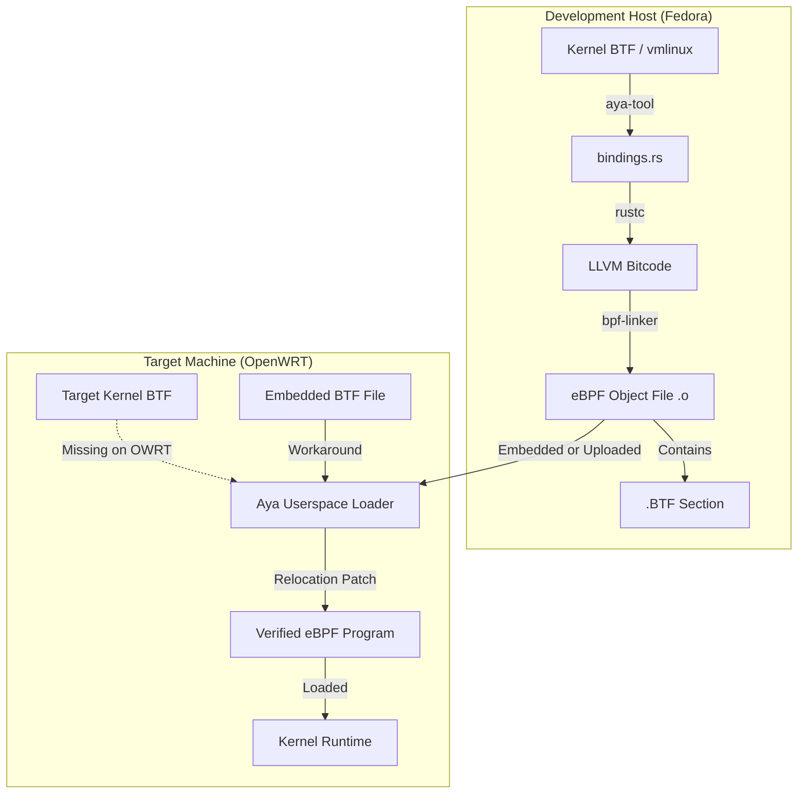
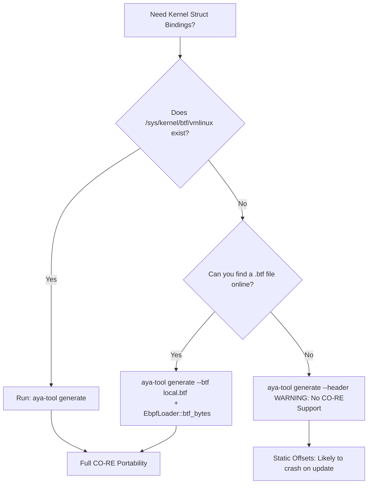

# aya-tool:

In order to build eBPF programs with Aya you need to co-ordinate between Rust toolchain's, LLVM/Clang for
C-Parsing and the kernel's BTF information. 


## Introduction 

### 1. BTF: **BPF Type Format** this is the magic sauce that makes modern eBPF programs portable. 
( its evolved to beat the frustration of programmers working with eBPF programs on different kernel
versions, crashes, failure to load ... issues) 

Historically, eBPF programs were hardcoded to the specific memory offsets of the kernel they were compiled 
on. If a kernel update moved a field in `struct task_struct` by even 4 bytes, the eBPF program would read 
the wrong data and be rejected by the verifier.

**BTF**: It's compact metadata format (about 100x smaller than DWARF debug info) that describes the data 
types used by the kernel.

* **Introspection:** It tells the eBPF loader exactly where fields are located in the current running kernel.

* **CO-RE (Compile Once – Run Everywhere):** By using BTF, the loader can "relocate" (adjust) the offsets 
in your eBPF bytecode at load time to match the host kernel

Aya being a pure rust eBPF framework integrates BTF deeply to provide CO-RE experience without the needing
the Clang/LLVM toolchains at runtime. 
I.E Aya handles BTF relocation in **pure Rust**. While other frameworks might shell out `libbtf` ( written
in C). Aya performs this heavy lifting by itself.

#### Components of Aya for BTF handling: 
- **`aya` (Userspace crate):** 
    Its the main crate used to load eBPF programs. 
    It contains a BTF parser that reads `/sys/kernel/btf/vmlinux` to understand the host kernel's layout.

- **`bpf-linker`:** 
  A specialized linker for eBPF. It takes the LLVM bitcode generated by `rustc` and emits an ELF file 
  containing the necessary BTF sections.

- **`aya-tool` / `aya-gen`:** 
    Tools used to generate Rust structures from kernel BTF. 
    Instead of manually writing `struct task_struct`, you tell Aya to "look at the kernel" and generate a
    Rust-compatible version for you.

- `aya-tool` : generates bindings for data types ( structs, enums,  unions ). 
  In eBPF programs we cannot call "normal" kernel functions directly like we would in standard *C* or *Rust*
  programs, We are restricted to a specific list of **BPF Helpers** and **Kfuncs** 

#### Aya Program Flow: How it Handles BTF

Lifecycle of an Aya program with BTF involves 3 main stages: **Generation**, **Linking**, and **Loading**.


- Step A: Development (aya-tool)

You use `aya-tool` to generate Rust bindings. It reads the BTF info from your current kernel and creates a 
`bindings.rs` file. This ensures your Rust code matches the kernel's ABI.

```bash
# Example command to generate bindings for a specific kernel struct
aya-tool generate task_struct > src/vmlinux.rs

```

- Step B: Compilation (bpf-linker)

When you run `cargo xtask build-ebpf`, the `bpf-linker` is invoked. 
It performs a crucial task: **preserving debug symbols**. 
It ensures the resulting `.o` file has a `.BTF` section that describes every `struct` your program uses.

- Step C: Loading (The "Magic" Moment)

When your userspace Rust app calls `Ebpf::load_file()`, the following happens:

1. **Parse Host BTF:** Aya reads the host kernel’s BTF (usually at `/sys/kernel/btf/vmlinux`).
2. **Match Offsets:** Aya looks at your compiled eBPF bytecode. 
   If your code tries to read `task->pid`, Aya checks the host BTF to see where `pid` is located on *this*# aya-tool:

In order to build eBPF programs with Aya you need to co-ordinate between Rust toolchain's, LLVM/Clang for
C-Parsing and the kernel's BTF information. 


## Introduction 

### 1. BTF: **BPF Type Format** this is the magic sauce that makes modern eBPF programs portable. 
( its evolved to beat the frustration of programmers working with eBPF programs on different kernel
versions, crashes, failure to load ... issues) 

Historically, eBPF programs were hardcoded to the specific memory offsets of the kernel they were compiled 
on. If a kernel update moved a field in `struct task_struct` by even 4 bytes, the eBPF program would read 
the wrong data and be rejected by the verifier.

**BTF**: It's compact metadata format (about 100x smaller than DWARF debug info) that describes the data 
types used by the kernel.

* **Introspection:** It tells the eBPF loader exactly where fields are located in the current running kernel.

* **CO-RE (Compile Once – Run Everywhere):** By using BTF, the loader can "relocate" (adjust) the offsets 
in your eBPF bytecode at load time to match the host kernel

Aya being a pure rust eBPF framework integrates BTF deeply to provide CO-RE experience without the needing
the Clang/LLVM toolchains at runtime. 
I.E Aya handles BTF relocation in **pure Rust**. While other frameworks might shell out `libbtf` ( written
in C). Aya performs this heavy lifting by itself.

#### Components of Aya for BTF handling: 
- **`aya` (Userspace crate):** 
    Its the main crate used to load eBPF programs. 
    It contains a BTF parser that reads `/sys/kernel/btf/vmlinux` to understand the host kernel's layout.

- **`bpf-linker`:** 
  A specialized linker for eBPF. It takes the LLVM bitcode generated by `rustc` and emits an ELF file 
  containing the necessary BTF sections.

- **`aya-tool` / `aya-gen`:** 
    Tools used to generate Rust structures from kernel BTF. 
    Instead of manually writing `struct task_struct`, you tell Aya to "look at the kernel" and generate a
    Rust-compatible version for you.

- `aya-tool` : generates bindings for data types ( structs, enums,  unions ). 
  In eBPF programs we cannot call "normal" kernel functions directly like we would in standard *C* or *Rust*
  programs, We are restricted to a specific list of **BPF Helpers** and **Kfuncs** 

#### Aya Program Flow: How it Handles BTF

Lifecycle of an Aya program with BTF involves 3 main stages: **Generation**, **Linking**, and **Loading**.



- Step A: Development (aya-tool)

You use `aya-tool` to generate Rust bindings. It reads the BTF info from your current kernel and creates a 
`bindings.rs` file. This ensures your Rust code matches the kernel's ABI.

```bash
# Example command to generate bindings for a specific kernel struct
aya-tool generate task_struct > src/vmlinux.rs

```

- Step B: Compilation (bpf-linker)

When you run `cargo xtask build-ebpf`, the `bpf-linker` is invoked. 
It performs a crucial task: **preserving debug symbols**. 
It ensures the resulting `.o` file has a `.BTF` section that describes every `struct` your program uses.

- Step C: Loading (The "Magic" Moment)

When your userspace Rust app calls `Ebpf::load_file()`, the following happens:

1. **Parse Host BTF:** Aya reads the host kernel’s BTF (usually at `/sys/kernel/btf/vmlinux`).
2. **Match Offsets:** Aya looks at your compiled eBPF bytecode. 
   If your code tries to read `task->pid`, Aya checks the host BTF to see where `pid` is located on *this* 
   specific kernel.
3. **Relocation:** Aya patches the bytecode on the fly, updating the instruction offsets before sending the 
   program to the kernel verifier.

- Typical Loading Code

```rust
use aya::{Ebpf, Btf};

// Aya automatically attempts to load BTF from /sys/kernel/btf/vmlinux
let mut bpf = Ebpf::load_file("ebpf_program.o")?; 

```

NOTE: on 1619: OWRT and Yocto both have `#CONFIG_DEBUG_INFO_BTF is not set` But running with `RUST_LOG=deug`
we can see the below:
```text
# RUST_LOG=debug ./ping-drop-musl
[2024-11-07T04:28:51Z DEBUG aya::bpf] BPF Feature Detection: Features {
        bpf_name: true,
        bpf_probe_read_kernel: true,
        bpf_perf_link: false,
        bpf_global_data: true,
        bpf_cookie: false,
        cpumap_prog_id: true,
        devmap_prog_id: true,
        btf: Some(
            BtfFeatures {
                btf_func: true,
                btf_func_global: true,
                btf_datasec: true,
                btf_datasec_zero: false,
                btf_float: false,
                btf_decl_tag: false,
                btf_type_tag: false,
                btf_enum64: false,
            },
        ),
    }
[2024-11-07T04:28:51Z DEBUG aya_obj::btf::btf] changing FUNC memcpy linkage to BTF_FUNC_STATIC
[2024-11-07T04:28:51Z DEBUG aya_obj::btf::btf] changing FUNC memmove linkage to BTF_FUNC_STATIC
[2024-11-07T04:28:51Z DEBUG aya_obj::btf::btf] changing FUNC memset linkage to BTF_FUNC_STATIC
[2024-11-07T04:28:51Z DEBUG aya_obj::btf::btf] changing FUNC memcmp linkage to BTF_FUNC_STATIC
[2024-11-07T04:28:51Z DEBUG aya_obj::btf::btf] [DATASEC] .rodata: fixup size to 67
[2024-11-07T04:28:51Z DEBUG aya_obj::btf::btf] [DATASEC] .rodata: VAR AYA_LOG_LEVEL: fixup offset 66
[2024-11-07T04:28:51Z DEBUG aya_obj::btf::btf] [DATASEC] maps: fixup size to 56
[2024-11-07T04:28:51Z DEBUG aya_obj::btf::btf] [DATASEC] maps: VAR BLOCKLIST: fixup offset 0
[2024-11-07T04:28:51Z DEBUG aya_obj::btf::btf] [DATASEC] maps: VAR AYA_LOGS: fixup offset 28
[2024-11-07T04:28:51Z DEBUG aya_obj::relocation] relocating map by section index 6, kind Rodata at in3
[2024-11-07T04:28:51Z DEBUG aya_obj::relocation] relocating map by section index 6, kind Rodata at in3
[2024-11-07T04:28:51Z DEBUG aya_obj::relocation] relocating map by section index 6, kind Rodata at in3
[2024-11-07T04:28:51Z DEBUG aya_obj::relocation] relocating map by symbol index Some(21), kind Maps a3
[2024-11-07T04:28:51Z DEBUG aya_obj::relocation] relocating map by section index 6, kind Rodata at in3
[2024-11-07T04:28:51Z DEBUG aya_obj::relocation] relocating map by section index 6, kind Rodata at in3
[2024-11-07T04:28:51Z DEBUG aya_obj::relocation] relocating map by section index 6, kind Rodata at in3
[2024-11-07T04:28:51Z DEBUG aya_obj::relocation] relocating map by symbol index Some(19), kind Maps a3
[2024-11-07T04:28:51Z DEBUG aya_obj::relocation] relocating map by section index 6, kind Rodata at in3
[2024-11-07T04:28:51Z DEBUG aya_obj::relocation] relocating map by section index 6, kind Rodata at in3
[2024-11-07T04:28:51Z DEBUG aya_obj::relocation] relocating program `ping_drop` function `ping_drop` 6
[2024-11-07T04:28:51Z DEBUG aya_obj::relocation] finished relocating program `ping_drop` function `pi`
Waiting for Ctrl-C...
[2024-11-07T04:28:51Z INFO  ping_drop] SRC: 192.168.88.72, PROTO: 17, LEN: 64, ACTION: 2

```

# TODO: 
This probing shows that `btf_func: true` probably because `CONFIG_BPF_SYSCALL` in kernel includes the logic
to handle *BTF* even if the kernel doesn't ship with the data `/sys/kernel/btf/vmlinux`, This requires
further checking if Aya opens the ELF file and reads the .BTF section generated by the host  (fedrora), this
since it cannot verify misusing kernel structs, a test can be designed to use a struct that missmatches
between host and the target. 

- Other way to detect from user-space runtime:
You can check if your program is running in this "blind" mode by checking the result of `Btf::from_sys_fs()`
in your userspace code:

```rust 
use aya::Btf;

match Btf::from_sys_fs() {
    Ok(_) => println!("Full CO-RE support enabled."),
    Err(_) => println!("Warning: Kernel BTF missing. Running in non-portable mode."),
}
```
Cross building `my_printk` and running on OWRT with kernel 5.1 the log is as below 
```bash 
OWRT# RUST_LOG=debug ./my_printk_musl
Warning: Kernel BTF missing. Running in non-portable mode.
[DEBUG aya::bpf] BPF Feature Detection: Features {
        bpf_name: true,
        bpf_probe_read_kernel: true,
        bpf_perf_link: false,
        bpf_global_data: true,
        bpf_cookie: false,
        cpumap_prog_id: true,
        devmap_prog_id: true,
        btf: Some(
            BtfFeatures {
                btf_func: true,
                btf_func_global: true,
                btf_datasec: true,
                btf_datasec_zero: false,
                btf_float: false,
                btf_decl_tag: false,
                btf_type_tag: false,
                btf_enum64: false,
            },
        ),
    }
[DEBUG aya_obj::btf::btf] changing FUNC memcpy linkage to BTF_FUNC_STATIC
[DEBUG aya_obj::btf::btf] changing FUNC memmove linkage to BTF_FUNC_STATIC
[DEBUG aya_obj::btf::btf] changing FUNC memset linkage to BTF_FUNC_STATIC
[DEBUG aya_obj::btf::btf] changing FUNC memcmp linkage to BTF_FUNC_STATIC
[DEBUG aya_obj::btf::btf] [DATASEC] .rodata: fixup size to 36
[DEBUG aya_obj::btf::btf] [DATASEC] .rodata: VAR AYA_LOG_LEVEL: fixup offset 35
[DEBUG aya_obj::btf::btf] [DATASEC] license: fixup size to 13
[DEBUG aya_obj::btf::btf] [DATASEC] license: VAR LICENSE: fixup offset 0
[DEBUG aya_obj::btf::btf] [DATASEC] maps: fixup size to 28
[DEBUG aya_obj::btf::btf] [DATASEC] maps: VAR AYA_LOGS: fixup offset 0
[DEBUG aya_obj::relocation] relocating map by section index 6, kind Rodata at insn 52 in section 3
[DEBUG aya_obj::relocation] relocating map by section index 6, kind Rodata at insn 101 in section 3
[DEBUG aya_obj::relocation] relocating map by symbol index Some(17), kind Maps at insn 65 in section 3
[DEBUG aya_obj::relocation] relocating map by section index 6, kind Rodata at insn 152 in section 3
[DEBUG aya_obj::relocation] relocating map by section index 6, kind Rodata at insn 186 in section 3
[DEBUG aya_obj::relocation] relocating program `my_printk` function `my_printk` size 399
[DEBUG aya_obj::relocation] relocating call to callee address 0x120 in section 2 (relocation) at inst6
[DEBUG aya_obj::relocation] callee is `memset`
[DEBUG aya_obj::relocation] linked function `memset` at instruction 399
[DEBUG aya_obj::relocation] relocating program `my_printk` function `memset` size 8
[DEBUG aya_obj::relocation] finished relocating program `my_printk` function `memset`
[DEBUG aya_obj::relocation] callee `memset` is at ins 399, 372 from current instruction 26
[DEBUG aya_obj::relocation] relocating call to callee address 0x0 in section 2 (relocation) at instru0
[DEBUG aya_obj::relocation] callee is `memcpy`
[DEBUG aya_obj::relocation] linked function `memcpy` at instruction 407
[DEBUG aya_obj::relocation] relocating program `my_printk` function `memcpy` size 11
[DEBUG aya_obj::relocation] finished relocating program `my_printk` function `memcpy`
[DEBUG aya_obj::relocation] callee `memcpy` is at ins 407, 36 from current instruction 370
[DEBUG aya_obj::relocation] finished relocating program `my_printk` function `my_printk`
Waiting for Ctrl-C...
....
```
From the above log:
- Userspace sysa "Warning kernel BTF missing .. running in non-portable mode" as `/sys/kernel/btf/vmlinux`
  is missing.  ( as with the kernel config is not generated )

- Kernel probing:  `btf: Some(BtfFeatures { btf_func: true, ... })`
  This tells OWRT kernel (5.1) has the ability to use `BTF` (the engine), but it doesn't have the vmlinux 
  database (the map). 
  Aya sees this and realizes: "I can't translate kernel offsets, but I CAN still use BTF for the internal 
  plumbing of the program itself."

- The "Fixups" (Aya's Internal Housekeeping):
  From the above console log: we see
  ```text 
  [DEBUG aya_obj::btf::btf] [DATASEC] .rodata: fixup size to 36
  [DEBUG aya_obj::btf::btf] [DATASEC] maps: VAR AYA_LOG_LEVEL: fixup offset 35
  ```
  This is Aya using the Program BTF (the metadata you compiled into your Rust code). 
  Even without the kernel's help, Aya is:
  1. Sizing the data: It sees your .rodata needs 36 bytes.
  2. Locating Variables: It finds exactly where your AYA_LOG_LEVEL is sitting so it can change your log 
     level on the fly before the program starts.

- The Library Linker ( Rust magic ):
  ```bash 
  [DEBUG aya_obj::relocation] callee is `memset`
  [DEBUG aya_obj::relocation] linked function `memset` at instruction 399
  ```
  This is a "hidden" benefit of Aya. 
  In standard `C` `eBPF`, you often have to manually include headers or write your own memory functions. 
  Because you are using Rust, the compiler inserted calls to standard functions like `memset` and `memcpy`.
  Since `eBPF` doesn't have "Shared Libraries" (.so files), **Aya acts as a static linker at runtime**.
  1. Aya found the `memset` implementation in your ELF file.
  2. It physically appended it to your `my_printk` program.
  3. It recalculated the jump addresses so that when your code calls memset, it jumps to the new location at
     instruction 399.

Note: Its important to note that program `my_printk` is **Running in non-portable mode** since if we ever
tried to read a kernel struct ( like `task_struct->pid`) the compiler would have used the offset from the
build host systems kernel ( In my case Fedora kernel)
=> On a BTF kernel: Aya would see the missing `vmlinx` compare the Host system that was built(fedora) offset
to the OWRT offset and fix it. 
=> On OWRT: Aya can not do that, It just crossed its fingers and sends the fedora's offsets to the kernel. 

Back to `aya-tool`
------------------


### Where do function "bindings come from"?

Instead of generating with `aya-tool` Aya provides functions through the `aya-ebpf` crate. 

- **BPF Helpers** : These are stable functions provided by the kernel, 
  Example: `bpf_get_current_task`, `bpf_probe_read_kernel` 
  Aya already has this mapped for you in `aya_ebpf::helpers`

- **KFuncs**: These are newer, more flexible functions ( like `bpf_obj_new`). Aya handles these via specific
  macros and imports, but they aren't generated by `aya-tool`

### aya-tool is not about generating signature for any kernel function:

Generally when we write **kprobe** or **uprobe** you dont need a binding for the function you are probing,
but we generally only care about the arguments that are passed to this functions.
And Arguments are generally passed in *registers* you use the `ctx.arg(n)` helpers:

Example:

```rust 
#[kprobe]
pub fn my_probe(ctx: KProbeContext) -> u32 {
    // You don't need a binding for the function 'do_sys_open'
    // You just read its first argument (the filename pointer)
    let filename_ptr: *const c_char = ctx.arg(0).ok_or(0u32)?;
    // ...
}
```

### what `aya-tool` does:

- It's useful if a function argument is a complex **struct pointer**.

Ex: if you probe a function that takes `struct path *`, you use `aya-tool` to generate the `path` struct
binding so you can actually read the data inside that pointer. 

- To keep your program lean and your compile times faster, you should not just dump the entire kernel's
  type history into your project, and `aya-tool` helps in effectively to get exactly what you need. 


- A list of all helper functions are available at docs.rs:
https://docs.rs/aya-ebpf/latest/aya_ebpf/helpers/index.html

---

## Installation usage of `aya-tool`:


### Install required packages:
- Step A:

Install the LLVM suite and `libelf`. These are required to parse kernel BTF and link the eBPF bytecode.


```bash
# Ubuntu / Debian
sudo apt update
sudo apt install clang llvm libclang-dev libelf-dev bpftool

# Fedora
sudo dnf install clang llvm-devel elfutils-libelf-devel bpftool
```

- Step B: Rust toolchain:
```bash
# Install stable and nightly
rustup install stable
rustup toolchain install nightly --component rust-src

# Install the specialized eBPF linker and project generator
cargo install bpf-linker
cargo install cargo-generate

```
Install supporting target for cross building. Also install musl toolchain if looking for CO-RE.

- Step C: **Aya-Tool**

Install the tool used to generate the kernel bindings.

```bash
cargo install --git https://github.com/aya-rs/aya -- aya-tool

```

### Setting up Environment Paths

If you receive "command not found" or "libclang not found" errors, you must verify your environment variables.

| Variable | Purpose | Typical Path |
| --- | --- | --- |
| **`PATH`** | Ensures `cargo`, `clang`, and `aya-tool` are executable. | `~/.cargo/bin` |
| **`LIBCLANG_PATH`** | Tells `bindgen` where the Clang shared library lives. | `/usr/lib/llvm-14/lib` |

**Add these to your `~/.bashrc` or `~/.zshrc`:**

```bash
# Ensure Cargo binaries are available
export PATH=$PATH:$HOME/.cargo/bin

# Help bindgen find libclang (adjust version number as needed)
export LIBCLANG_PATH=$(llvm-config --libdir)

```

We can also use `xtask` script that automates the `aya-tool` generation if you dont waht to have to remember
the flags.

## How to use `aya-tool`

### 1. Generating Focused Bindings

The `task_struct` is one of the largest structures in the kernel. 
If you only need a few fields, you can tell `aya-tool` to focus. 
However, `aya-tool` will automatically pull in any dependencies (child structs) that `task_struct` requires
to be valid Rust code.

Run this to generate the file inside your project:

```bash
# Run from your project root
aya-tool generate task_struct > ./my-project-ebpf/src/bindings.rs

```

### 2. Integrating into your eBPF Code

Once you have `bindings.rs`, you need to tell Rust it exists. 
In your `my-project-ebpf/src/main.rs`, add the module declaration:

```rust
#![no_std]
#![no_main]

mod bindings; // Import the generated file
use bindings::task_struct;
use aya_ebpf::helpers::bpf_get_current_task;

// ... inside your probe function
let task_addr = unsafe { bpf_get_current_task() };
if task_addr == 0 {
    return Err(1);
}
let task = unsafe { &*(task_addr as *const task_struct) };

// Now you can access fields with CO-RE safety!
let tgid = task.tgid; 

```

---

### 3. The "Pro" Workflow: Automating with `xtask`

Instead of running `aya-tool` manually every time you change environments, you can add it to your
`xtask/src/codegen.rs` (if using the standard Aya template). This ensures that anyone who clones your repo 
can build it immediately.

A typical `codegen` task looks like this:

1. It looks for the `vmlinux` BTF file on the host.
2. It calls the `aya-gen` library (the engine behind `aya-tool`).
3. It writes the `.rs` file directly into your `ebpf` source folder.

### 4. Avoiding "Bloat" with Field Trimming

If your `bindings.rs` is so large it's slowing down your IDE or compiler, you can use the 
`--additional-derives` flag or manually edit the file. 

However, the best way to handle this in Aya is often to create a "local" slimmed-down version of the 
struct and use the `#[aya_ebpf::macros::btf_reloc]` attribute (if you are on a very recent version of Aya),
which tells the loader: "I know this struct isn't the full kernel one, just find the fields that match by 
name."

---

### Comparison: Manual Structs vs. `aya-tool`

| Feature | Manual Definition | `aya-tool` (BTF) |
| --- | --- | --- |
| **Effort** | High (must copy C headers) | Low (automatic) |
| **Correctness** | Error-prone (easy to miss padding) | 100% accurate to host kernel |
| **Portability** | Fails if kernel fields move | **CO-RE** (relocates at load time) |
| **Maintenance** | Brittle | Robust |

## Automate `aya-tool`:

To automate binding generation, you don't need to call the `aya-tool` binary.
Instead, you can use the `aya-tool` **library** directly inside your `xtask` binary.

This is the "pro" way of doing things: it makes your project self-contained. 
Anyone who clones your repo only needs `cargo` to regenerate the bindings.

### 1. Update `xtask/Cargo.toml`

First, add `aya-tool` as a dependency to your `xtask` crate. 
We use the git version to ensure compatibility with the latest Aya features.

```toml
[dependencies]
# ... other dependencies like clap or anyhow
aya-tool = { git = "https://github.com/aya-rs/aya", branch = "main" }
anyhow = "1.0"

```

### 2. Create `xtask/src/codegen.rs`

Create a new file to house the generation logic. 
This script reads the `BTF` from your host and writes a Rust file directly into your eBPF crate.

```rust
use aya_tool::generate::InputFile;
use std::{fs::File, io::Write, path::PathBuf};

pub fn generate() -> anyhow::Result<()> {
    // 1. Define where the generated file should go
    let dir = PathBuf::from("my-project-ebpf/src");
    
    // 2. Define which kernel structures you want to "bind"
    // For your specific projects, we include the common ones:
    let names = vec![
        "ethhdr",                // For XDP
        "iphdr",                 // For XDP
        "task_struct",           // For Kprobes
        "trace_event_raw_sched_process_exec" // For Tracepoints
    ];

    // 3. Use the aya-tool library to generate the code
    // It reads /sys/kernel/btf/vmlinux by default
    let bindings = aya_tool::generate(
        InputFile::Btf(PathBuf::from("/sys/kernel/btf/vmlinux")),
        &names,
        &[], // Additional headers (usually empty for BTF)
    )?;

    // 4. Write it to disk
    let mut out = File::create(dir.join("bindings.rs"))?;
    write!(out, "{}\n", bindings)?;
    
    println!("Successfully generated bindings in {:?}", dir.join("bindings.rs"));
    Ok(())
}

```

### 3. Register the Command in `xtask/src/main.rs`

Now, hook this function into your `xtask` command-line interface so you can run it via `cargo`.

```rust
mod codegen;

// Assuming you use a simple match on arguments
fn main() -> anyhow::Result<()> {
    let args: Vec<String> = std::env::args().collect();
    let command = args.get(1).map(|s| s.as_str());

    match command {
        Some("codegen") => codegen::generate()?,
        Some("build-ebpf") => { /* your existing build logic */ },
        _ => println!("Usage: cargo xtask <codegen|build-ebpf>"),
    }

    Ok(())
}

```

---

### How the Workflow Changes

Now, instead of remembering complex `aya-tool` flags, your workflow becomes:

1. **Modify:** Add a new struct name to the `names` list in `codegen.rs`.
2. **Generate:** Run `cargo xtask codegen`.
3. **Use:** Import the new types in your eBPF code:
```rust
mod bindings;
use bindings::task_struct;

```

### Why this is better for your OpenWRT/yocto,  aarch64 setup with missing BTF files:

#### Approch 1:
Since your target machine (OpenWRT/yocto) lacks the `vmlinux` file, you must generate these bindings on your 
**Fedora host** where the file *does* exist. 
By putting this in `xtask`, you ensure that the bindings are always generated using the same logic every 
time you cross-compile for your aarch64 target.

##### 1. The Ultimate `xtask` Automation Script

This script does three things:

1. **Detection:** Checks if you are building for the host or a specific target.
2. **Codegen:** Uses `aya-tool` as a library to generate `bindings.rs`.
3. **BTF Sourcing:** If building for OpenWRT, it can point to a local `.btf` file instead of `/sys`.

```rust
// xtask/src/codegen.rs
use aya_tool::generate::InputFile;
use std::{fs, path::PathBuf};

pub fn generate() -> anyhow::Result<()> {
    let ebpf_src = PathBuf::from("my-project-ebpf/src");
    
    // 1. Choose your BTF source
    // On Fedora (Host): /sys/kernel/btf/vmlinux
    // On OpenWRT (Target): A local .btf file you downloaded for that kernel
    let btf_path = if std::path::Path::new("/sys/kernel/btf/vmlinux").exists() {
        PathBuf::from("/sys/kernel/btf/vmlinux")
    } else {
        // Fallback to a cached BTF file for your OpenWRT version
        PathBuf::from("btf_cache/aarch64_5.5.btf")
    };

    let structs = vec!["task_struct", "ethhdr", "iphdr"];

    // 2. Generate the Rust code
    let bindings = aya_tool::generate(
        InputFile::Btf(btf_path),
        &structs,
        &[], // No extra C headers needed if using BTF
    )?;

    // 3. Save to the eBPF crate
    fs::write(ebpf_src.join("bindings.rs"), bindings)?;
    
    Ok(())
}

```

---

##### 2. Loading with "Remote BTF" on OpenWRT

To make your binary truly portable on your **5.5.x OpenWRT** box, you need to update your userspace `main.rs`. Instead of letting Aya fail to find the BTF, you **embed** the correct BTF for that specific kernel inside your binary.

```rust
// my-project/src/main.rs
use aya::{Btf, EbpfLoader, Endianness};

fn main() -> anyhow::Result<()> {
    // Include the BTF file for your OpenWRT kernel at compile time
    let btf_data = include_bytes!("../btf_cache/aarch64_5.5.btf");
    let btf = Btf::parse(btf_data, Endianness::default())?;

    let mut loader = EbpfLoader::new();
    
    // MAGIC STEP: Tell Aya to use this BTF for relocations 
    // because /sys/kernel/btf/vmlinux is missing!
    let mut bpf = loader
        .btf(Some(&btf)) 
        .load_file("my_program.o")?;

    // ... rest of your code
    Ok(())
}

```

---

##### 3. Comparison of Workflows

| Method | Where BTF comes from | Best For... |
| --- | --- | --- |
| **Standard** | `/sys/kernel/btf/vmlinux` | Ubuntu/Fedora/Debian (Desktop/Server) |
| **Manual** | `aya-tool` CLI | Quick prototypes |
| **Automated `xtask**` | Library call in Rust | CI/CD and Team projects |
| **Embedded BTF** | `include_bytes!` | **OpenWRT / Embedded** (No `/sys/kernel/btf/vmlinux`) |

##### Final Summary of your Setup

1. **Cross-Build on Fedora:** Your `xtask` runs and generates `bindings.rs` using your host's BTF.
2. **Relocation Intelligence:** You embed a small `.btf` file for the OpenWRT kernel into your Rust binary.
3. **Execution on OpenWRT:** When `EbpfLoader` runs, it sees the embedded BTF, matches your Fedora-compiled 
   offsets to the OpenWRT kernel offsets, and **patches the bytecode on the fly**.

This turns your "non-portable" printk into a **fully CO-RE compatible** tool that will work even if 
OpenWRT's `task_struct` changes in a future update.

#### Approach 2: 

`aya-tool` comes with the option to feed Headers and this can be useful while handling missing btf file/

```text 
$ ~/.cargo/bin/aya-tool generate --help
Generate Rust bindings to Kernel types using bpftool

Usage: aya-tool generate [OPTIONS] [NAMES]... [-- <BINDGEN_ARGS>...]

Arguments:
  [NAMES]...          
  [BINDGEN_ARGS]...   

Options:
      --btf <BTF>        [default: /sys/kernel/btf/vmlinux]
      --header <HEADER>   
  -h, --help             Print help 
```

This is the "Legacy" fallback mode of `aya-tool`. 
While BTF is the modern, preferred way, the `--header` option exists specifically for situations where you 
don't have a `vmlinux` file but *do* have the C source code (headers) for the kernel you are targeting.


##### 1. How the `--header` option works

When you use `--header`, `aya-tool` stops acting as a BTF parser and starts acting as a wrapper for 
`bindgen`. 
It internally creates a small C file that `#include`s your headers, parses them using `libclang`, and then 
converts the C definitions into Rust.

**The Command:**

```bash
# Example: Generating task_struct from local kernel headers instead of BTF
aya-tool generate --header /path/to/linux/include/linux/sched.h task_struct > bindings.rs

```

##### 2. Can it handle a missing BTF file?

**Yes, but with a major catch: You lose CO-RE.**

| Feature | Using `--btf` | Using `--header` |
| --- | --- | --- |
| **Data Source** | `/sys/kernel/btf/vmlinux` | `.h` files (Kernel Headers) |
| **Portability** | **High (CO-RE)**. Relocations are enabled. | **Low (Static)**. Offsets are hardcoded. |
| **Setup** | Needs `CONFIG_DEBUG_INFO_BTF`. | Needs the `linux-headers` package installed. |
| **Targeting** | Works on any kernel with BTF. | Must build specifically for the *exact* target headers. |

##### 3. The "Header Hell" Problem

Using `--header` for complex kernel types like `task_struct` is notoriously difficult. 
Kernel headers are highly interdependent. 
If you just point to `sched.h`, it will likely fail because it can't find `types.h`, `list.h`, etc.

To make it work, you usually have to provide the include paths to `aya-tool` so it can pass them to the underlying compiler:

```bash
aya-tool generate --header /usr/src/linux-headers-$(uname -r)/include/linux/sched.h task_struct \
  -- -I/usr/src/linux-headers-$(uname -r)/include \
     -I/usr/src/linux-headers-$(uname -r)/arch/arm64/include

```

##### 4. Recommendation for your OpenWRT (5.x) setup

Since your OpenWRT kernel lacks the `vmlinux` file, you have two choices for getting `task_struct`:

1. **The Header Path (Hard):** 
   Find the exact kernel headers used to build your OpenWRT image, install them on your Fedora host, and 
   use `--header`. This is brittle and painful to set up.

2. **The BTFHub Path (Easy/Better):** 
   Even if your kernel doesn't *ship* with BTF, someone has likely generated a BTF file for it. 
   You can download a 5.5-aarch64 `.btf` file from a project like **BTFHub** and use it with the `--btf` flag:

```bash
# Use a "remote" BTF file to generate bindings for your specific kernel
aya-tool generate --btf ./openwrt_5.5_aarch64.btf task_struct > bindings.rs

```
**This is the winner** because it still gives you a Rust-friendly structure but uses the precise offsets of 
that specific kernel version.

---
##### Summary

The `--header` option is a **static fallback**. Use it if you are dealing with a custom out-of-tree kernel 
module that has no BTF, but for standard kernel types on OpenWRT, stick to the `--btf` flag combined with a 
downloaded `.btf` file from the web. 
   specific kernel.
3. **Relocation:** Aya patches the bytecode on the fly, updating the instruction offsets before sending the 
   program to the kernel verifier.

- Typical Loading Code

```rust
use aya::{Ebpf, Btf};

// Aya automatically attempts to load BTF from /sys/kernel/btf/vmlinux
let mut bpf = Ebpf::load_file("ebpf_program.o")?; 

```

NOTE: on 1619: OWRT and Yocto both have `#CONFIG_DEBUG_INFO_BTF is not set` But running with `RUST_LOG=deug`
we can see the below:
```text
# RUST_LOG=debug ./ping-drop-musl
[2024-11-07T04:28:51Z DEBUG aya::bpf] BPF Feature Detection: Features {
        bpf_name: true,
        bpf_probe_read_kernel: true,
        bpf_perf_link: false,
        bpf_global_data: true,
        bpf_cookie: false,
        cpumap_prog_id: true,
        devmap_prog_id: true,
        btf: Some(
            BtfFeatures {
                btf_func: true,
                btf_func_global: true,
                btf_datasec: true,
                btf_datasec_zero: false,
                btf_float: false,
                btf_decl_tag: false,
                btf_type_tag: false,
                btf_enum64: false,
            },
        ),
    }
[2024-11-07T04:28:51Z DEBUG aya_obj::btf::btf] changing FUNC memcpy linkage to BTF_FUNC_STATIC
[2024-11-07T04:28:51Z DEBUG aya_obj::btf::btf] changing FUNC memmove linkage to BTF_FUNC_STATIC
[2024-11-07T04:28:51Z DEBUG aya_obj::btf::btf] changing FUNC memset linkage to BTF_FUNC_STATIC
[2024-11-07T04:28:51Z DEBUG aya_obj::btf::btf] changing FUNC memcmp linkage to BTF_FUNC_STATIC
[2024-11-07T04:28:51Z DEBUG aya_obj::btf::btf] [DATASEC] .rodata: fixup size to 67
[2024-11-07T04:28:51Z DEBUG aya_obj::btf::btf] [DATASEC] .rodata: VAR AYA_LOG_LEVEL: fixup offset 66
[2024-11-07T04:28:51Z DEBUG aya_obj::btf::btf] [DATASEC] maps: fixup size to 56
[2024-11-07T04:28:51Z DEBUG aya_obj::btf::btf] [DATASEC] maps: VAR BLOCKLIST: fixup offset 0
[2024-11-07T04:28:51Z DEBUG aya_obj::btf::btf] [DATASEC] maps: VAR AYA_LOGS: fixup offset 28
[2024-11-07T04:28:51Z DEBUG aya_obj::relocation] relocating map by section index 6, kind Rodata at in3
[2024-11-07T04:28:51Z DEBUG aya_obj::relocation] relocating map by section index 6, kind Rodata at in3
[2024-11-07T04:28:51Z DEBUG aya_obj::relocation] relocating map by section index 6, kind Rodata at in3
[2024-11-07T04:28:51Z DEBUG aya_obj::relocation] relocating map by symbol index Some(21), kind Maps a3
[2024-11-07T04:28:51Z DEBUG aya_obj::relocation] relocating map by section index 6, kind Rodata at in3
[2024-11-07T04:28:51Z DEBUG aya_obj::relocation] relocating map by section index 6, kind Rodata at in3
[2024-11-07T04:28:51Z DEBUG aya_obj::relocation] relocating map by section index 6, kind Rodata at in3
[2024-11-07T04:28:51Z DEBUG aya_obj::relocation] relocating map by symbol index Some(19), kind Maps a3
[2024-11-07T04:28:51Z DEBUG aya_obj::relocation] relocating map by section index 6, kind Rodata at in3
[2024-11-07T04:28:51Z DEBUG aya_obj::relocation] relocating map by section index 6, kind Rodata at in3
[2024-11-07T04:28:51Z DEBUG aya_obj::relocation] relocating program `ping_drop` function `ping_drop` 6
[2024-11-07T04:28:51Z DEBUG aya_obj::relocation] finished relocating program `ping_drop` function `pi`
Waiting for Ctrl-C...
[2024-11-07T04:28:51Z INFO  ping_drop] SRC: 192.168.88.72, PROTO: 17, LEN: 64, ACTION: 2

```

# TODO: 
This probing shows that `btf_func: true` probably because `CONFIG_BPF_SYSCALL` in kernel includes the logic
to handle *BTF* even if the kernel doesn't ship with the data `/sys/kernel/btf/vmlinux`, This requires
further checking if Aya opens the ELF file and reads the .BTF section generated by the host  (fedrora), this
since it cannot verify misusing kernel structs, a test can be designed to use a struct that missmatches
between host and the target. 

- Other way to detect from user-space runtime:
You can check if your program is running in this "blind" mode by checking the result of `Btf::from_sys_fs()`
in your userspace code:

```rust 
use aya::Btf;

match Btf::from_sys_fs() {
    Ok(_) => println!("Full CO-RE support enabled."),
    Err(_) => println!("Warning: Kernel BTF missing. Running in non-portable mode."),
}
```
Cross building `my_printk` and running on OWRT with kernel 5.1 the log is as below 
```bash 
OWRT# RUST_LOG=debug ./my_printk_musl
Warning: Kernel BTF missing. Running in non-portable mode.
[DEBUG aya::bpf] BPF Feature Detection: Features {
        bpf_name: true,
        bpf_probe_read_kernel: true,
        bpf_perf_link: false,
        bpf_global_data: true,
        bpf_cookie: false,
        cpumap_prog_id: true,
        devmap_prog_id: true,
        btf: Some(
            BtfFeatures {
                btf_func: true,
                btf_func_global: true,
                btf_datasec: true,
                btf_datasec_zero: false,
                btf_float: false,
                btf_decl_tag: false,
                btf_type_tag: false,
                btf_enum64: false,
            },
        ),
    }
[DEBUG aya_obj::btf::btf] changing FUNC memcpy linkage to BTF_FUNC_STATIC
[DEBUG aya_obj::btf::btf] changing FUNC memmove linkage to BTF_FUNC_STATIC
[DEBUG aya_obj::btf::btf] changing FUNC memset linkage to BTF_FUNC_STATIC
[DEBUG aya_obj::btf::btf] changing FUNC memcmp linkage to BTF_FUNC_STATIC
[DEBUG aya_obj::btf::btf] [DATASEC] .rodata: fixup size to 36
[DEBUG aya_obj::btf::btf] [DATASEC] .rodata: VAR AYA_LOG_LEVEL: fixup offset 35
[DEBUG aya_obj::btf::btf] [DATASEC] license: fixup size to 13
[DEBUG aya_obj::btf::btf] [DATASEC] license: VAR LICENSE: fixup offset 0
[DEBUG aya_obj::btf::btf] [DATASEC] maps: fixup size to 28
[DEBUG aya_obj::btf::btf] [DATASEC] maps: VAR AYA_LOGS: fixup offset 0
[DEBUG aya_obj::relocation] relocating map by section index 6, kind Rodata at insn 52 in section 3
[DEBUG aya_obj::relocation] relocating map by section index 6, kind Rodata at insn 101 in section 3
[DEBUG aya_obj::relocation] relocating map by symbol index Some(17), kind Maps at insn 65 in section 3
[DEBUG aya_obj::relocation] relocating map by section index 6, kind Rodata at insn 152 in section 3
[DEBUG aya_obj::relocation] relocating map by section index 6, kind Rodata at insn 186 in section 3
[DEBUG aya_obj::relocation] relocating program `my_printk` function `my_printk` size 399
[DEBUG aya_obj::relocation] relocating call to callee address 0x120 in section 2 (relocation) at inst6
[DEBUG aya_obj::relocation] callee is `memset`
[DEBUG aya_obj::relocation] linked function `memset` at instruction 399
[DEBUG aya_obj::relocation] relocating program `my_printk` function `memset` size 8
[DEBUG aya_obj::relocation] finished relocating program `my_printk` function `memset`
[DEBUG aya_obj::relocation] callee `memset` is at ins 399, 372 from current instruction 26
[DEBUG aya_obj::relocation] relocating call to callee address 0x0 in section 2 (relocation) at instru0
[DEBUG aya_obj::relocation] callee is `memcpy`
[DEBUG aya_obj::relocation] linked function `memcpy` at instruction 407
[DEBUG aya_obj::relocation] relocating program `my_printk` function `memcpy` size 11
[DEBUG aya_obj::relocation] finished relocating program `my_printk` function `memcpy`
[DEBUG aya_obj::relocation] callee `memcpy` is at ins 407, 36 from current instruction 370
[DEBUG aya_obj::relocation] finished relocating program `my_printk` function `my_printk`
Waiting for Ctrl-C...
....
```
From the above log:
- Userspace sysa "Warning kernel BTF missing .. running in non-portable mode" as `/sys/kernel/btf/vmlinux`
  is missing.  ( as with the kernel config is not generated )

- Kernel probing:  `btf: Some(BtfFeatures { btf_func: true, ... })`
  This tells OWRT kernel (5.1) has the ability to use `BTF` (the engine), but it doesn't have the vmlinux 
  database (the map). 
  Aya sees this and realizes: "I can't translate kernel offsets, but I CAN still use BTF for the internal 
  plumbing of the program itself."

- The "Fixups" (Aya's Internal Housekeeping):
  From the above console log: we see
  ```text 
  [DEBUG aya_obj::btf::btf] [DATASEC] .rodata: fixup size to 36
  [DEBUG aya_obj::btf::btf] [DATASEC] maps: VAR AYA_LOG_LEVEL: fixup offset 35
  ```
  This is Aya using the Program BTF (the metadata you compiled into your Rust code). 
  Even without the kernel's help, Aya is:
  1. Sizing the data: It sees your .rodata needs 36 bytes.
  2. Locating Variables: It finds exactly where your AYA_LOG_LEVEL is sitting so it can change your log 
     level on the fly before the program starts.

- The Library Linker ( Rust magic ):
  ```bash 
  [DEBUG aya_obj::relocation] callee is `memset`
  [DEBUG aya_obj::relocation] linked function `memset` at instruction 399
  ```
  This is a "hidden" benefit of Aya. 
  In standard `C` `eBPF`, you often have to manually include headers or write your own memory functions. 
  Because you are using Rust, the compiler inserted calls to standard functions like `memset` and `memcpy`.
  Since `eBPF` doesn't have "Shared Libraries" (.so files), **Aya acts as a static linker at runtime**.
  1. Aya found the `memset` implementation in your ELF file.
  2. It physically appended it to your `my_printk` program.
  3. It recalculated the jump addresses so that when your code calls memset, it jumps to the new location at
     instruction 399.

Note: Its important to note that program `my_printk` is **Running in non-portable mode** since if we ever
tried to read a kernel struct ( like `task_struct->pid`) the compiler would have used the offset from the
build host systems kernel ( In my case Fedora kernel)
=> On a BTF kernel: Aya would see the missing `vmlinx` compare the Host system that was built(fedora) offset
to the OWRT offset and fix it. 
=> On OWRT: Aya can not do that, It just crossed its fingers and sends the fedora's offsets to the kernel. 

Back to `aya-tool`
------------------


### Where do function "bindings come from"?

Instead of generating with `aya-tool` Aya provides functions through the `aya-ebpf` crate. 

- **BPF Helpers** : These are stable functions provided by the kernel, 
  Example: `bpf_get_current_task`, `bpf_probe_read_kernel` 
  Aya already has this mapped for you in `aya_ebpf::helpers`

- **KFuncs**: These are newer, more flexible functions ( like `bpf_obj_new`). Aya handles these via specific
  macros and imports, but they aren't generated by `aya-tool`

### aya-tool is not about generating signature for any kernel function:

Generally when we write **kprobe** or **uprobe** you dont need a binding for the function you are probing,
but we generally only care about the arguments that are passed to this functions.
And Arguments are generally passed in *registers* you use the `ctx.arg(n)` helpers:

Example:

```rust 
#[kprobe]
pub fn my_probe(ctx: KProbeContext) -> u32 {
    // You don't need a binding for the function 'do_sys_open'
    // You just read its first argument (the filename pointer)
    let filename_ptr: *const c_char = ctx.arg(0).ok_or(0u32)?;
    // ...
}
```

### what `aya-tool` does:

- It's useful if a function argument is a complex **struct pointer**.

Ex: if you probe a function that takes `struct path *`, you use `aya-tool` to generate the `path` struct
binding so you can actually read the data inside that pointer. 

- To keep your program lean and your compile times faster, you should not just dump the entire kernel's
  type history into your project, and `aya-tool` helps in effectively to get exactly what you need. 


- A list of all helper functions are available at docs.rs:
https://docs.rs/aya-ebpf/latest/aya_ebpf/helpers/index.html

---

## Installation usage of `aya-tool`:


### Install required packages:
- Step A:

Install the LLVM suite and `libelf`. These are required to parse kernel BTF and link the eBPF bytecode.


```bash
# Ubuntu / Debian
sudo apt update
sudo apt install clang llvm libclang-dev libelf-dev bpftool

# Fedora
sudo dnf install clang llvm-devel elfutils-libelf-devel bpftool
```

- Step B: Rust toolchain:
```bash
# Install stable and nightly
rustup install stable
rustup toolchain install nightly --component rust-src

# Install the specialized eBPF linker and project generator
cargo install bpf-linker
cargo install cargo-generate

```
Install supporting target for cross building. Also install musl toolchain if looking for CO-RE.

- Step C: **Aya-Tool**

Install the tool used to generate the kernel bindings.

```bash
cargo install --git https://github.com/aya-rs/aya -- aya-tool

```

### Setting up Environment Paths

If you receive "command not found" or "libclang not found" errors, you must verify your environment variables.

| Variable | Purpose | Typical Path |
| --- | --- | --- |
| **`PATH`** | Ensures `cargo`, `clang`, and `aya-tool` are executable. | `~/.cargo/bin` |
| **`LIBCLANG_PATH`** | Tells `bindgen` where the Clang shared library lives. | `/usr/lib/llvm-14/lib` |

**Add these to your `~/.bashrc` or `~/.zshrc`:**

```bash
# Ensure Cargo binaries are available
export PATH=$PATH:$HOME/.cargo/bin

# Help bindgen find libclang (adjust version number as needed)
export LIBCLANG_PATH=$(llvm-config --libdir)

```

We can also use `xtask` script that automates the `aya-tool` generation if you dont waht to have to remember
the flags.

## How to use `aya-tool`

### 1. Generating Focused Bindings

The `task_struct` is one of the largest structures in the kernel. 
If you only need a few fields, you can tell `aya-tool` to focus. 
However, `aya-tool` will automatically pull in any dependencies (child structs) that `task_struct` requires
to be valid Rust code.

Run this to generate the file inside your project:

```bash
# Run from your project root
aya-tool generate task_struct > ./my-project-ebpf/src/bindings.rs

```

### 2. Integrating into your eBPF Code

Once you have `bindings.rs`, you need to tell Rust it exists. 
In your `my-project-ebpf/src/main.rs`, add the module declaration:

```rust
#![no_std]
#![no_main]

mod bindings; // Import the generated file
use bindings::task_struct;
use aya_ebpf::helpers::bpf_get_current_task;

// ... inside your probe function
let task_addr = unsafe { bpf_get_current_task() };
if task_addr == 0 {
    return Err(1);
}
let task = unsafe { &*(task_addr as *const task_struct) };

// Now you can access fields with CO-RE safety!
let tgid = task.tgid; 

```

---

### 3. The "Pro" Workflow: Automating with `xtask`

Instead of running `aya-tool` manually every time you change environments, you can add it to your
`xtask/src/codegen.rs` (if using the standard Aya template). This ensures that anyone who clones your repo 
can build it immediately.

A typical `codegen` task looks like this:

1. It looks for the `vmlinux` BTF file on the host.
2. It calls the `aya-gen` library (the engine behind `aya-tool`).
3. It writes the `.rs` file directly into your `ebpf` source folder.

### 4. Avoiding "Bloat" with Field Trimming

If your `bindings.rs` is so large it's slowing down your IDE or compiler, you can use the 
`--additional-derives` flag or manually edit the file. 

However, the best way to handle this in Aya is often to create a "local" slimmed-down version of the 
struct and use the `#[aya_ebpf::macros::btf_reloc]` attribute (if you are on a very recent version of Aya),
which tells the loader: "I know this struct isn't the full kernel one, just find the fields that match by 
name."

---

### Comparison: Manual Structs vs. `aya-tool`

| Feature | Manual Definition | `aya-tool` (BTF) |
| --- | --- | --- |
| **Effort** | High (must copy C headers) | Low (automatic) |
| **Correctness** | Error-prone (easy to miss padding) | 100% accurate to host kernel |
| **Portability** | Fails if kernel fields move | **CO-RE** (relocates at load time) |
| **Maintenance** | Brittle | Robust |

## Automate `aya-tool`:

To automate binding generation, you don't need to call the `aya-tool` binary.
Instead, you can use the `aya-tool` **library** directly inside your `xtask` binary.

This is the "pro" way of doing things: it makes your project self-contained. 
Anyone who clones your repo only needs `cargo` to regenerate the bindings.

### 1. Update `xtask/Cargo.toml`

First, add `aya-tool` as a dependency to your `xtask` crate. 
We use the git version to ensure compatibility with the latest Aya features.

```toml
[dependencies]
# ... other dependencies like clap or anyhow
aya-tool = { git = "https://github.com/aya-rs/aya", branch = "main" }
anyhow = "1.0"

```

### 2. Create `xtask/src/codegen.rs`

Create a new file to house the generation logic. 
This script reads the `BTF` from your host and writes a Rust file directly into your eBPF crate.

```rust
use aya_tool::generate::InputFile;
use std::{fs::File, io::Write, path::PathBuf};

pub fn generate() -> anyhow::Result<()> {
    // 1. Define where the generated file should go
    let dir = PathBuf::from("my-project-ebpf/src");
    
    // 2. Define which kernel structures you want to "bind"
    // For your specific projects, we include the common ones:
    let names = vec![
        "ethhdr",                // For XDP
        "iphdr",                 // For XDP
        "task_struct",           // For Kprobes
        "trace_event_raw_sched_process_exec" // For Tracepoints
    ];

    // 3. Use the aya-tool library to generate the code
    // It reads /sys/kernel/btf/vmlinux by default
    let bindings = aya_tool::generate(
        InputFile::Btf(PathBuf::from("/sys/kernel/btf/vmlinux")),
        &names,
        &[], // Additional headers (usually empty for BTF)
    )?;

    // 4. Write it to disk
    let mut out = File::create(dir.join("bindings.rs"))?;
    write!(out, "{}\n", bindings)?;
    
    println!("Successfully generated bindings in {:?}", dir.join("bindings.rs"));
    Ok(())
}

```

### 3. Register the Command in `xtask/src/main.rs`

Now, hook this function into your `xtask` command-line interface so you can run it via `cargo`.

```rust
mod codegen;

// Assuming you use a simple match on arguments
fn main() -> anyhow::Result<()> {
    let args: Vec<String> = std::env::args().collect();
    let command = args.get(1).map(|s| s.as_str());

    match command {
        Some("codegen") => codegen::generate()?,
        Some("build-ebpf") => { /* your existing build logic */ },
        _ => println!("Usage: cargo xtask <codegen|build-ebpf>"),
    }

    Ok(())
}

```

---

### How the Workflow Changes

Now, instead of remembering complex `aya-tool` flags, your workflow becomes:

1. **Modify:** Add a new struct name to the `names` list in `codegen.rs`.
2. **Generate:** Run `cargo xtask codegen`.
3. **Use:** Import the new types in your eBPF code:
```rust
mod bindings;
use bindings::task_struct;

```

### Why this is better for your OpenWRT/yocto,  aarch64 setup with missing BTF files:

#### Approch 1:
Since your target machine (OpenWRT/yocto) lacks the `vmlinux` file, you must generate these bindings on your 
**Fedora host** where the file *does* exist. 
By putting this in `xtask`, you ensure that the bindings are always generated using the same logic every 
time you cross-compile for your aarch64 target.

##### 1. The Ultimate `xtask` Automation Script

This script does three things:

1. **Detection:** Checks if you are building for the host or a specific target.
2. **Codegen:** Uses `aya-tool` as a library to generate `bindings.rs`.
3. **BTF Sourcing:** If building for OpenWRT, it can point to a local `.btf` file instead of `/sys`.

```rust
// xtask/src/codegen.rs
use aya_tool::generate::InputFile;
use std::{fs, path::PathBuf};

pub fn generate() -> anyhow::Result<()> {
    let ebpf_src = PathBuf::from("my-project-ebpf/src");
    
    // 1. Choose your BTF source
    // On Fedora (Host): /sys/kernel/btf/vmlinux
    // On OpenWRT (Target): A local .btf file you downloaded for that kernel
    let btf_path = if std::path::Path::new("/sys/kernel/btf/vmlinux").exists() {
        PathBuf::from("/sys/kernel/btf/vmlinux")
    } else {
        // Fallback to a cached BTF file for your OpenWRT version
        PathBuf::from("btf_cache/aarch64_5.5.btf")
    };

    let structs = vec!["task_struct", "ethhdr", "iphdr"];

    // 2. Generate the Rust code
    let bindings = aya_tool::generate(
        InputFile::Btf(btf_path),
        &structs,
        &[], // No extra C headers needed if using BTF
    )?;

    // 3. Save to the eBPF crate
    fs::write(ebpf_src.join("bindings.rs"), bindings)?;
    
    Ok(())
}

```

---

##### 2. Loading with "Remote BTF" on OpenWRT

To make your binary truly portable on your **5.5.x OpenWRT** box, you need to update your userspace `main.rs`. Instead of letting Aya fail to find the BTF, you **embed** the correct BTF for that specific kernel inside your binary.

```rust
// my-project/src/main.rs
use aya::{Btf, EbpfLoader, Endianness};

fn main() -> anyhow::Result<()> {
    // Include the BTF file for your OpenWRT kernel at compile time
    let btf_data = include_bytes!("../btf_cache/aarch64_5.5.btf");
    let btf = Btf::parse(btf_data, Endianness::default())?;

    let mut loader = EbpfLoader::new();
    
    // MAGIC STEP: Tell Aya to use this BTF for relocations 
    // because /sys/kernel/btf/vmlinux is missing!
    let mut bpf = loader
        .btf(Some(&btf)) 
        .load_file("my_program.o")?;

    // ... rest of your code
    Ok(())
}

```

---

##### 3. Comparison of Workflows

| Method | Where BTF comes from | Best For... |
| --- | --- | --- |
| **Standard** | `/sys/kernel/btf/vmlinux` | Ubuntu/Fedora/Debian (Desktop/Server) |
| **Manual** | `aya-tool` CLI | Quick prototypes |
| **Automated `xtask**` | Library call in Rust | CI/CD and Team projects |
| **Embedded BTF** | `include_bytes!` | **OpenWRT / Embedded** (No `/sys/kernel/btf/vmlinux`) |

##### Final Summary of your Setup

1. **Cross-Build on Fedora:** Your `xtask` runs and generates `bindings.rs` using your host's BTF.
2. **Relocation Intelligence:** You embed a small `.btf` file for the OpenWRT kernel into your Rust binary.
3. **Execution on OpenWRT:** When `EbpfLoader` runs, it sees the embedded BTF, matches your Fedora-compiled 
   offsets to the OpenWRT kernel offsets, and **patches the bytecode on the fly**.

This turns your "non-portable" printk into a **fully CO-RE compatible** tool that will work even if 
OpenWRT's `task_struct` changes in a future update.

#### Approach 2: 

`aya-tool` comes with the option to feed Headers and this can be useful while handling missing btf file/

```text 
$ ~/.cargo/bin/aya-tool generate --help
Generate Rust bindings to Kernel types using bpftool

Usage: aya-tool generate [OPTIONS] [NAMES]... [-- <BINDGEN_ARGS>...]

Arguments:
  [NAMES]...          
  [BINDGEN_ARGS]...   

Options:
      --btf <BTF>        [default: /sys/kernel/btf/vmlinux]
      --header <HEADER>   
  -h, --help             Print help 
```

This is the "Legacy" fallback mode of `aya-tool`. 
While BTF is the modern, preferred way, the `--header` option exists specifically for situations where you 
don't have a `vmlinux` file but *do* have the C source code (headers) for the kernel you are targeting.


##### 1. How the `--header` option works

When you use `--header`, `aya-tool` stops acting as a BTF parser and starts acting as a wrapper for 
`bindgen`. 
It internally creates a small C file that `#include`s your headers, parses them using `libclang`, and then 
converts the C definitions into Rust.

**The Command:**

```bash
# Example: Generating task_struct from local kernel headers instead of BTF
aya-tool generate --header /path/to/linux/include/linux/sched.h task_struct > bindings.rs

```

##### 2. Can it handle a missing BTF file?

**Yes, but with a major catch: You lose CO-RE.**

| Feature | Using `--btf` | Using `--header` |
| --- | --- | --- |
| **Data Source** | `/sys/kernel/btf/vmlinux` | `.h` files (Kernel Headers) |
| **Portability** | **High (CO-RE)**. Relocations are enabled. | **Low (Static)**. Offsets are hardcoded. |
| **Setup** | Needs `CONFIG_DEBUG_INFO_BTF`. | Needs the `linux-headers` package installed. |
| **Targeting** | Works on any kernel with BTF. | Must build specifically for the *exact* target headers. |

##### 3. The "Header Hell" Problem

Using `--header` for complex kernel types like `task_struct` is notoriously difficult. 
Kernel headers are highly interdependent. 
If you just point to `sched.h`, it will likely fail because it can't find `types.h`, `list.h`, etc.

To make it work, you usually have to provide the include paths to `aya-tool` so it can pass them to the underlying compiler:

```bash
aya-tool generate --header /usr/src/linux-headers-$(uname -r)/include/linux/sched.h task_struct \
  -- -I/usr/src/linux-headers-$(uname -r)/include \
     -I/usr/src/linux-headers-$(uname -r)/arch/arm64/include

```

##### 4. Recommendation for your OpenWRT (5.x) setup

Since your OpenWRT kernel lacks the `vmlinux` file, you have two choices for getting `task_struct`:

1. **The Header Path (Hard):** 
   Find the exact kernel headers used to build your OpenWRT image, install them on your Fedora host, and 
   use `--header`. This is brittle and painful to set up.

2. **The BTFHub Path (Easy/Better):** 
   Even if your kernel doesn't *ship* with BTF, someone has likely generated a BTF file for it. 
   You can download a 5.5-aarch64 `.btf` file from a project like **BTFHub** and use it with the `--btf` flag:

```bash
# Use a "remote" BTF file to generate bindings for your specific kernel
aya-tool generate --btf ./openwrt_5.5_aarch64.btf task_struct > bindings.rs

```
**This is the winner** because it still gives you a Rust-friendly structure but uses the precise offsets of 
that specific kernel version.

---
##### Summary

The `--header` option is a **static fallback**. Use it if you are dealing with a custom out-of-tree kernel 
module that has no BTF, but for standard kernel types on OpenWRT, stick to the `--btf` flag combined with a 
downloaded `.btf` file from the web.


##### Troubleshooting Flowchart:


