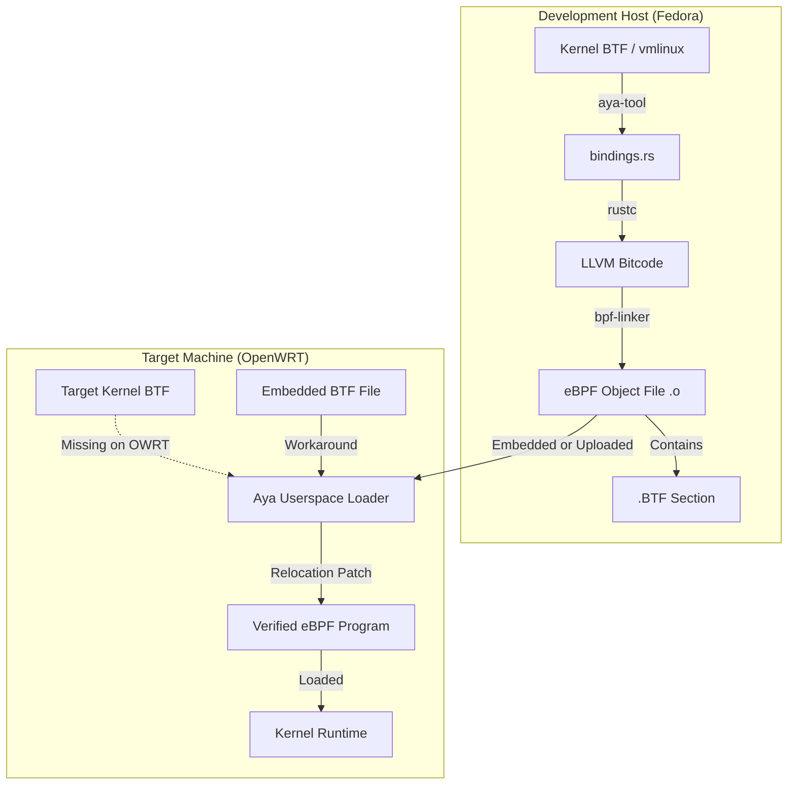
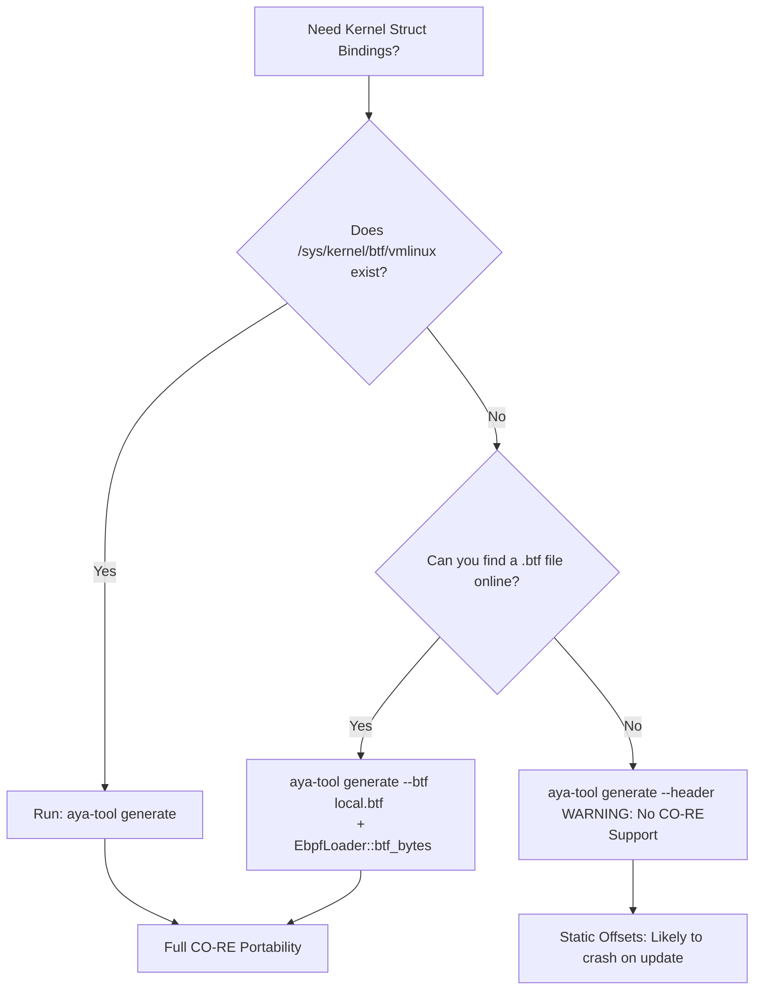

# aya-tool:

In order to build eBPF programs with Aya you need to co-ordinate between Rust toolchain's, LLVM/Clang for
C-Parsing and the kernel's BTF information. 


## Introduction 

### 1. BTF: **BPF Type Format** this is the magic sauce that makes modern eBPF programs portable. 
( its evolved to beat the frustration of programmers working with eBPF programs on different kernel
versions, crashes, failure to load ... issues) 

Historically, eBPF programs were hardcoded to the specific memory offsets of the kernel they were compiled 
on. If a kernel update moved a field in `struct task_struct` by even 4 bytes, the eBPF program would read 
the wrong data and be rejected by the verifier.

**BTF**: It's compact metadata format (about 100x smaller than DWARF debug info) that describes the data 
types used by the kernel.

* **Introspection:** It tells the eBPF loader exactly where fields are located in the current running kernel.

* **CO-RE (Compile Once – Run Everywhere):** By using BTF, the loader can "relocate" (adjust) the offsets 
in your eBPF bytecode at load time to match the host kernel

Aya being a pure rust eBPF framework integrates BTF deeply to provide CO-RE experience without the needing
the Clang/LLVM toolchains at runtime. 
I.E Aya handles BTF relocation in **pure Rust**. While other frameworks might shell out `libbtf` ( written
in C). Aya performs this heavy lifting by itself.

#### Components of Aya for BTF handling: 
- **`aya` (Userspace crate):** 
    Its the main crate used to load eBPF programs. 
    It contains a BTF parser that reads `/sys/kernel/btf/vmlinux` to understand the host kernel's layout.

- **`bpf-linker`:** 
  A specialized linker for eBPF. It takes the LLVM bitcode generated by `rustc` and emits an ELF file 
  containing the necessary BTF sections.

- **`aya-tool` / `aya-gen`:** 
    Tools used to generate Rust structures from kernel BTF. 
    Instead of manually writing `struct task_struct`, you tell Aya to "look at the kernel" and generate a
    Rust-compatible version for you.

- `aya-tool` : generates bindings for data types ( structs, enums,  unions ). 
  In eBPF programs we cannot call "normal" kernel functions directly like we would in standard *C* or *Rust*
  programs, We are restricted to a specific list of **BPF Helpers** and **Kfuncs** 

#### Aya Program Flow: How it Handles BTF

Lifecycle of an Aya program with BTF involves 3 main stages: **Generation**, **Linking**, and **Loading**.


- Step A: Development (aya-tool)

You use `aya-tool` to generate Rust bindings. It reads the BTF info from your current kernel and creates a 
`bindings.rs` file. This ensures your Rust code matches the kernel's ABI.

```bash
# Example command to generate bindings for a specific kernel struct
aya-tool generate task_struct > src/vmlinux.rs

```

- Step B: Compilation (bpf-linker)

When you run `cargo xtask build-ebpf`, the `bpf-linker` is invoked. 
It performs a crucial task: **preserving debug symbols**. 
It ensures the resulting `.o` file has a `.BTF` section that describes every `struct` your program uses.

- Step C: Loading (The "Magic" Moment)

When your userspace Rust app calls `Ebpf::load_file()`, the following happens:

1. **Parse Host BTF:** Aya reads the host kernel’s BTF (usually at `/sys/kernel/btf/vmlinux`).
2. **Match Offsets:** Aya looks at your compiled eBPF bytecode. 
   If your code tries to read `task->pid`, Aya checks the host BTF to see where `pid` is located on *this*# aya-tool:

In order to build eBPF programs with Aya you need to co-ordinate between Rust toolchain's, LLVM/Clang for
C-Parsing and the kernel's BTF information. 


## Introduction 

### 1. BTF: **BPF Type Format** this is the magic sauce that makes modern eBPF programs portable. 
( its evolved to beat the frustration of programmers working with eBPF programs on different kernel
versions, crashes, failure to load ... issues) 

Historically, eBPF programs were hardcoded to the specific memory offsets of the kernel they were compiled 
on. If a kernel update moved a field in `struct task_struct` by even 4 bytes, the eBPF program would read 
the wrong data and be rejected by the verifier.

**BTF**: It's compact metadata format (about 100x smaller than DWARF debug info) that describes the data 
types used by the kernel.

* **Introspection:** It tells the eBPF loader exactly where fields are located in the current running kernel.

* **CO-RE (Compile Once – Run Everywhere):** By using BTF, the loader can "relocate" (adjust) the offsets 
in your eBPF bytecode at load time to match the host kernel

Aya being a pure rust eBPF framework integrates BTF deeply to provide CO-RE experience without the needing
the Clang/LLVM toolchains at runtime. 
I.E Aya handles BTF relocation in **pure Rust**. While other frameworks might shell out `libbtf` ( written
in C). Aya performs this heavy lifting by itself.

#### Components of Aya for BTF handling: 
- **`aya` (Userspace crate):** 
    Its the main crate used to load eBPF programs. 
    It contains a BTF parser that reads `/sys/kernel/btf/vmlinux` to understand the host kernel's layout.

- **`bpf-linker`:** 
  A specialized linker for eBPF. It takes the LLVM bitcode generated by `rustc` and emits an ELF file 
  containing the necessary BTF sections.

- **`aya-tool` / `aya-gen`:** 
    Tools used to generate Rust structures from kernel BTF. 
    Instead of manually writing `struct task_struct`, you tell Aya to "look at the kernel" and generate a
    Rust-compatible version for you.

- `aya-tool` : generates bindings for data types ( structs, enums,  unions ). 
  In eBPF programs we cannot call "normal" kernel functions directly like we would in standard *C* or *Rust*
  programs, We are restricted to a specific list of **BPF Helpers** and **Kfuncs** 

#### Aya Program Flow: How it Handles BTF

Lifecycle of an Aya program with BTF involves 3 main stages: **Generation**, **Linking**, and **Loading**.



- Step A: Development (aya-tool)

You use `aya-tool` to generate Rust bindings. It reads the BTF info from your current kernel and creates a 
`bindings.rs` file. This ensures your Rust code matches the kernel's ABI.

```bash
# Example command to generate bindings for a specific kernel struct
aya-tool generate task_struct > src/vmlinux.rs

```

- Step B: Compilation (bpf-linker)

When you run `cargo xtask build-ebpf`, the `bpf-linker` is invoked. 
It performs a crucial task: **preserving debug symbols**. 
It ensures the resulting `.o` file has a `.BTF` section that describes every `struct` your program uses.

- Step C: Loading (The "Magic" Moment)

When your userspace Rust app calls `Ebpf::load_file()`, the following happens:

1. **Parse Host BTF:** Aya reads the host kernel’s BTF (usually at `/sys/kernel/btf/vmlinux`).
2. **Match Offsets:** Aya looks at your compiled eBPF bytecode. 
   If your code tries to read `task->pid`, Aya checks the host BTF to see where `pid` is located on *this* 
   specific kernel.
3. **Relocation:** Aya patches the bytecode on the fly, updating the instruction offsets before sending the 
   program to the kernel verifier.

- Typical Loading Code

```rust
use aya::{Ebpf, Btf};

// Aya automatically attempts to load BTF from /sys/kernel/btf/vmlinux
let mut bpf = Ebpf::load_file("ebpf_program.o")?; 

```

NOTE: on 1619: OWRT and Yocto both have `#CONFIG_DEBUG_INFO_BTF is not set` But running with `RUST_LOG=deug`
we can see the below:
```text
# RUST_LOG=debug ./ping-drop-musl
[2024-11-07T04:28:51Z DEBUG aya::bpf] BPF Feature Detection: Features {
        bpf_name: true,
        bpf_probe_read_kernel: true,
        bpf_perf_link: false,
        bpf_global_data: true,
        bpf_cookie: false,
        cpumap_prog_id: true,
        devmap_prog_id: true,
        btf: Some(
            BtfFeatures {
                btf_func: true,
                btf_func_global: true,
                btf_datasec: true,
                btf_datasec_zero: false,
                btf_float: false,
                btf_decl_tag: false,
                btf_type_tag: false,
                btf_enum64: false,
            },
        ),
    }
[2024-11-07T04:28:51Z DEBUG aya_obj::btf::btf] changing FUNC memcpy linkage to BTF_FUNC_STATIC
[2024-11-07T04:28:51Z DEBUG aya_obj::btf::btf] changing FUNC memmove linkage to BTF_FUNC_STATIC
[2024-11-07T04:28:51Z DEBUG aya_obj::btf::btf] changing FUNC memset linkage to BTF_FUNC_STATIC
[2024-11-07T04:28:51Z DEBUG aya_obj::btf::btf] changing FUNC memcmp linkage to BTF_FUNC_STATIC
[2024-11-07T04:28:51Z DEBUG aya_obj::btf::btf] [DATASEC] .rodata: fixup size to 67
[2024-11-07T04:28:51Z DEBUG aya_obj::btf::btf] [DATASEC] .rodata: VAR AYA_LOG_LEVEL: fixup offset 66
[2024-11-07T04:28:51Z DEBUG aya_obj::btf::btf] [DATASEC] maps: fixup size to 56
[2024-11-07T04:28:51Z DEBUG aya_obj::btf::btf] [DATASEC] maps: VAR BLOCKLIST: fixup offset 0
[2024-11-07T04:28:51Z DEBUG aya_obj::btf::btf] [DATASEC] maps: VAR AYA_LOGS: fixup offset 28
[2024-11-07T04:28:51Z DEBUG aya_obj::relocation] relocating map by section index 6, kind Rodata at in3
[2024-11-07T04:28:51Z DEBUG aya_obj::relocation] relocating map by section index 6, kind Rodata at in3
[2024-11-07T04:28:51Z DEBUG aya_obj::relocation] relocating map by section index 6, kind Rodata at in3
[2024-11-07T04:28:51Z DEBUG aya_obj::relocation] relocating map by symbol index Some(21), kind Maps a3
[2024-11-07T04:28:51Z DEBUG aya_obj::relocation] relocating map by section index 6, kind Rodata at in3
[2024-11-07T04:28:51Z DEBUG aya_obj::relocation] relocating map by section index 6, kind Rodata at in3
[2024-11-07T04:28:51Z DEBUG aya_obj::relocation] relocating map by section index 6, kind Rodata at in3
[2024-11-07T04:28:51Z DEBUG aya_obj::relocation] relocating map by symbol index Some(19), kind Maps a3
[2024-11-07T04:28:51Z DEBUG aya_obj::relocation] relocating map by section index 6, kind Rodata at in3
[2024-11-07T04:28:51Z DEBUG aya_obj::relocation] relocating map by section index 6, kind Rodata at in3
[2024-11-07T04:28:51Z DEBUG aya_obj::relocation] relocating program `ping_drop` function `ping_drop` 6
[2024-11-07T04:28:51Z DEBUG aya_obj::relocation] finished relocating program `ping_drop` function `pi`
Waiting for Ctrl-C...
[2024-11-07T04:28:51Z INFO  ping_drop] SRC: 192.168.88.72, PROTO: 17, LEN: 64, ACTION: 2

```

# TODO: 
This probing shows that `btf_func: true` probably because `CONFIG_BPF_SYSCALL` in kernel includes the logic
to handle *BTF* even if the kernel doesn't ship with the data `/sys/kernel/btf/vmlinux`, This requires
further checking if Aya opens the ELF file and reads the .BTF section generated by the host  (fedrora), this
since it cannot verify misusing kernel structs, a test can be designed to use a struct that missmatches
between host and the target. 

- Other way to detect from user-space runtime:
You can check if your program is running in this "blind" mode by checking the result of `Btf::from_sys_fs()`
in your userspace code:

```rust 
use aya::Btf;

match Btf::from_sys_fs() {
    Ok(_) => println!("Full CO-RE support enabled."),
    Err(_) => println!("Warning: Kernel BTF missing. Running in non-portable mode."),
}
```
Cross building `my_printk` and running on OWRT with kernel 5.1 the log is as below 
```bash 
OWRT# RUST_LOG=debug ./my_printk_musl
Warning: Kernel BTF missing. Running in non-portable mode.
[DEBUG aya::bpf] BPF Feature Detection: Features {
        bpf_name: true,
        bpf_probe_read_kernel: true,
        bpf_perf_link: false,
        bpf_global_data: true,
        bpf_cookie: false,
        cpumap_prog_id: true,
        devmap_prog_id: true,
        btf: Some(
            BtfFeatures {
                btf_func: true,
                btf_func_global: true,
                btf_datasec: true,
                btf_datasec_zero: false,
                btf_float: false,
                btf_decl_tag: false,
                btf_type_tag: false,
                btf_enum64: false,
            },
        ),
    }
[DEBUG aya_obj::btf::btf] changing FUNC memcpy linkage to BTF_FUNC_STATIC
[DEBUG aya_obj::btf::btf] changing FUNC memmove linkage to BTF_FUNC_STATIC
[DEBUG aya_obj::btf::btf] changing FUNC memset linkage to BTF_FUNC_STATIC
[DEBUG aya_obj::btf::btf] changing FUNC memcmp linkage to BTF_FUNC_STATIC
[DEBUG aya_obj::btf::btf] [DATASEC] .rodata: fixup size to 36
[DEBUG aya_obj::btf::btf] [DATASEC] .rodata: VAR AYA_LOG_LEVEL: fixup offset 35
[DEBUG aya_obj::btf::btf] [DATASEC] license: fixup size to 13
[DEBUG aya_obj::btf::btf] [DATASEC] license: VAR LICENSE: fixup offset 0
[DEBUG aya_obj::btf::btf] [DATASEC] maps: fixup size to 28
[DEBUG aya_obj::btf::btf] [DATASEC] maps: VAR AYA_LOGS: fixup offset 0
[DEBUG aya_obj::relocation] relocating map by section index 6, kind Rodata at insn 52 in section 3
[DEBUG aya_obj::relocation] relocating map by section index 6, kind Rodata at insn 101 in section 3
[DEBUG aya_obj::relocation] relocating map by symbol index Some(17), kind Maps at insn 65 in section 3
[DEBUG aya_obj::relocation] relocating map by section index 6, kind Rodata at insn 152 in section 3
[DEBUG aya_obj::relocation] relocating map by section index 6, kind Rodata at insn 186 in section 3
[DEBUG aya_obj::relocation] relocating program `my_printk` function `my_printk` size 399
[DEBUG aya_obj::relocation] relocating call to callee address 0x120 in section 2 (relocation) at inst6
[DEBUG aya_obj::relocation] callee is `memset`
[DEBUG aya_obj::relocation] linked function `memset` at instruction 399
[DEBUG aya_obj::relocation] relocating program `my_printk` function `memset` size 8
[DEBUG aya_obj::relocation] finished relocating program `my_printk` function `memset`
[DEBUG aya_obj::relocation] callee `memset` is at ins 399, 372 from current instruction 26
[DEBUG aya_obj::relocation] relocating call to callee address 0x0 in section 2 (relocation) at instru0
[DEBUG aya_obj::relocation] callee is `memcpy`
[DEBUG aya_obj::relocation] linked function `memcpy` at instruction 407
[DEBUG aya_obj::relocation] relocating program `my_printk` function `memcpy` size 11
[DEBUG aya_obj::relocation] finished relocating program `my_printk` function `memcpy`
[DEBUG aya_obj::relocation] callee `memcpy` is at ins 407, 36 from current instruction 370
[DEBUG aya_obj::relocation] finished relocating program `my_printk` function `my_printk`
Waiting for Ctrl-C...
....
```
From the above log:
- Userspace sysa "Warning kernel BTF missing .. running in non-portable mode" as `/sys/kernel/btf/vmlinux`
  is missing.  ( as with the kernel config is not generated )

- Kernel probing:  `btf: Some(BtfFeatures { btf_func: true, ... })`
  This tells OWRT kernel (5.1) has the ability to use `BTF` (the engine), but it doesn't have the vmlinux 
  database (the map). 
  Aya sees this and realizes: "I can't translate kernel offsets, but I CAN still use BTF for the internal 
  plumbing of the program itself."

- The "Fixups" (Aya's Internal Housekeeping):
  From the above console log: we see
  ```text 
  [DEBUG aya_obj::btf::btf] [DATASEC] .rodata: fixup size to 36
  [DEBUG aya_obj::btf::btf] [DATASEC] maps: VAR AYA_LOG_LEVEL: fixup offset 35
  ```
  This is Aya using the Program BTF (the metadata you compiled into your Rust code). 
  Even without the kernel's help, Aya is:
  1. Sizing the data: It sees your .rodata needs 36 bytes.
  2. Locating Variables: It finds exactly where your AYA_LOG_LEVEL is sitting so it can change your log 
     level on the fly before the program starts.

- The Library Linker ( Rust magic ):
  ```bash 
  [DEBUG aya_obj::relocation] callee is `memset`
  [DEBUG aya_obj::relocation] linked function `memset` at instruction 399
  ```
  This is a "hidden" benefit of Aya. 
  In standard `C` `eBPF`, you often have to manually include headers or write your own memory functions. 
  Because you are using Rust, the compiler inserted calls to standard functions like `memset` and `memcpy`.
  Since `eBPF` doesn't have "Shared Libraries" (.so files), **Aya acts as a static linker at runtime**.
  1. Aya found the `memset` implementation in your ELF file.
  2. It physically appended it to your `my_printk` program.
  3. It recalculated the jump addresses so that when your code calls memset, it jumps to the new location at
     instruction 399.

Note: Its important to note that program `my_printk` is **Running in non-portable mode** since if we ever
tried to read a kernel struct ( like `task_struct->pid`) the compiler would have used the offset from the
build host systems kernel ( In my case Fedora kernel)
=> On a BTF kernel: Aya would see the missing `vmlinx` compare the Host system that was built(fedora) offset
to the OWRT offset and fix it. 
=> On OWRT: Aya can not do that, It just crossed its fingers and sends the fedora's offsets to the kernel. 

Back to `aya-tool`
------------------


### Where do function "bindings come from"?

Instead of generating with `aya-tool` Aya provides functions through the `aya-ebpf` crate. 

- **BPF Helpers** : These are stable functions provided by the kernel, 
  Example: `bpf_get_current_task`, `bpf_probe_read_kernel` 
  Aya already has this mapped for you in `aya_ebpf::helpers`

- **KFuncs**: These are newer, more flexible functions ( like `bpf_obj_new`). Aya handles these via specific
  macros and imports, but they aren't generated by `aya-tool`

### aya-tool is not about generating signature for any kernel function:

Generally when we write **kprobe** or **uprobe** you dont need a binding for the function you are probing,
but we generally only care about the arguments that are passed to this functions.
And Arguments are generally passed in *registers* you use the `ctx.arg(n)` helpers:

Example:

```rust 
#[kprobe]
pub fn my_probe(ctx: KProbeContext) -> u32 {
    // You don't need a binding for the function 'do_sys_open'
    // You just read its first argument (the filename pointer)
    let filename_ptr: *const c_char = ctx.arg(0).ok_or(0u32)?;
    // ...
}
```

### what `aya-tool` does:

- It's useful if a function argument is a complex **struct pointer**.

Ex: if you probe a function that takes `struct path *`, you use `aya-tool` to generate the `path` struct
binding so you can actually read the data inside that pointer. 

- To keep your program lean and your compile times faster, you should not just dump the entire kernel's
  type history into your project, and `aya-tool` helps in effectively to get exactly what you need. 


- A list of all helper functions are available at docs.rs:
https://docs.rs/aya-ebpf/latest/aya_ebpf/helpers/index.html

---

## Installation usage of `aya-tool`:


### Install required packages:
- Step A:

Install the LLVM suite and `libelf`. These are required to parse kernel BTF and link the eBPF bytecode.


```bash
# Ubuntu / Debian
sudo apt update
sudo apt install clang llvm libclang-dev libelf-dev bpftool

# Fedora
sudo dnf install clang llvm-devel elfutils-libelf-devel bpftool
```

- Step B: Rust toolchain:
```bash
# Install stable and nightly
rustup install stable
rustup toolchain install nightly --component rust-src

# Install the specialized eBPF linker and project generator
cargo install bpf-linker
cargo install cargo-generate

```
Install supporting target for cross building. Also install musl toolchain if looking for CO-RE.

- Step C: **Aya-Tool**

Install the tool used to generate the kernel bindings.

```bash
cargo install --git https://github.com/aya-rs/aya -- aya-tool

```

### Setting up Environment Paths

If you receive "command not found" or "libclang not found" errors, you must verify your environment variables.

| Variable | Purpose | Typical Path |
| --- | --- | --- |
| **`PATH`** | Ensures `cargo`, `clang`, and `aya-tool` are executable. | `~/.cargo/bin` |
| **`LIBCLANG_PATH`** | Tells `bindgen` where the Clang shared library lives. | `/usr/lib/llvm-14/lib` |

**Add these to your `~/.bashrc` or `~/.zshrc`:**

```bash
# Ensure Cargo binaries are available
export PATH=$PATH:$HOME/.cargo/bin

# Help bindgen find libclang (adjust version number as needed)
export LIBCLANG_PATH=$(llvm-config --libdir)

```

We can also use `xtask` script that automates the `aya-tool` generation if you dont waht to have to remember
the flags.

## How to use `aya-tool`

### 1. Generating Focused Bindings

The `task_struct` is one of the largest structures in the kernel. 
If you only need a few fields, you can tell `aya-tool` to focus. 
However, `aya-tool` will automatically pull in any dependencies (child structs) that `task_struct` requires
to be valid Rust code.

Run this to generate the file inside your project:

```bash
# Run from your project root
aya-tool generate task_struct > ./my-project-ebpf/src/bindings.rs

```

### 2. Integrating into your eBPF Code

Once you have `bindings.rs`, you need to tell Rust it exists. 
In your `my-project-ebpf/src/main.rs`, add the module declaration:

```rust
#![no_std]
#![no_main]

mod bindings; // Import the generated file
use bindings::task_struct;
use aya_ebpf::helpers::bpf_get_current_task;

// ... inside your probe function
let task_addr = unsafe { bpf_get_current_task() };
if task_addr == 0 {
    return Err(1);
}
let task = unsafe { &*(task_addr as *const task_struct) };

// Now you can access fields with CO-RE safety!
let tgid = task.tgid; 

```

---

### 3. The "Pro" Workflow: Automating with `xtask`

Instead of running `aya-tool` manually every time you change environments, you can add it to your
`xtask/src/codegen.rs` (if using the standard Aya template). This ensures that anyone who clones your repo 
can build it immediately.

A typical `codegen` task looks like this:

1. It looks for the `vmlinux` BTF file on the host.
2. It calls the `aya-gen` library (the engine behind `aya-tool`).
3. It writes the `.rs` file directly into your `ebpf` source folder.

### 4. Avoiding "Bloat" with Field Trimming

If your `bindings.rs` is so large it's slowing down your IDE or compiler, you can use the 
`--additional-derives` flag or manually edit the file. 

However, the best way to handle this in Aya is often to create a "local" slimmed-down version of the 
struct and use the `#[aya_ebpf::macros::btf_reloc]` attribute (if you are on a very recent version of Aya),
which tells the loader: "I know this struct isn't the full kernel one, just find the fields that match by 
name."

---

### Comparison: Manual Structs vs. `aya-tool`

| Feature | Manual Definition | `aya-tool` (BTF) |
| --- | --- | --- |
| **Effort** | High (must copy C headers) | Low (automatic) |
| **Correctness** | Error-prone (easy to miss padding) | 100% accurate to host kernel |
| **Portability** | Fails if kernel fields move | **CO-RE** (relocates at load time) |
| **Maintenance** | Brittle | Robust |

## Automate `aya-tool`:

To automate binding generation, you don't need to call the `aya-tool` binary.
Instead, you can use the `aya-tool` **library** directly inside your `xtask` binary.

This is the "pro" way of doing things: it makes your project self-contained. 
Anyone who clones your repo only needs `cargo` to regenerate the bindings.

### 1. Update `xtask/Cargo.toml`

First, add `aya-tool` as a dependency to your `xtask` crate. 
We use the git version to ensure compatibility with the latest Aya features.

```toml
[dependencies]
# ... other dependencies like clap or anyhow
aya-tool = { git = "https://github.com/aya-rs/aya", branch = "main" }
anyhow = "1.0"

```

### 2. Create `xtask/src/codegen.rs`

Create a new file to house the generation logic. 
This script reads the `BTF` from your host and writes a Rust file directly into your eBPF crate.

```rust
use aya_tool::generate::InputFile;
use std::{fs::File, io::Write, path::PathBuf};

pub fn generate() -> anyhow::Result<()> {
    // 1. Define where the generated file should go
    let dir = PathBuf::from("my-project-ebpf/src");
    
    // 2. Define which kernel structures you want to "bind"
    // For your specific projects, we include the common ones:
    let names = vec![
        "ethhdr",                // For XDP
        "iphdr",                 // For XDP
        "task_struct",           // For Kprobes
        "trace_event_raw_sched_process_exec" // For Tracepoints
    ];

    // 3. Use the aya-tool library to generate the code
    // It reads /sys/kernel/btf/vmlinux by default
    let bindings = aya_tool::generate(
        InputFile::Btf(PathBuf::from("/sys/kernel/btf/vmlinux")),
        &names,
        &[], // Additional headers (usually empty for BTF)
    )?;

    // 4. Write it to disk
    let mut out = File::create(dir.join("bindings.rs"))?;
    write!(out, "{}\n", bindings)?;
    
    println!("Successfully generated bindings in {:?}", dir.join("bindings.rs"));
    Ok(())
}

```

### 3. Register the Command in `xtask/src/main.rs`

Now, hook this function into your `xtask` command-line interface so you can run it via `cargo`.

```rust
mod codegen;

// Assuming you use a simple match on arguments
fn main() -> anyhow::Result<()> {
    let args: Vec<String> = std::env::args().collect();
    let command = args.get(1).map(|s| s.as_str());

    match command {
        Some("codegen") => codegen::generate()?,
        Some("build-ebpf") => { /* your existing build logic */ },
        _ => println!("Usage: cargo xtask <codegen|build-ebpf>"),
    }

    Ok(())
}

```

---

### How the Workflow Changes

Now, instead of remembering complex `aya-tool` flags, your workflow becomes:

1. **Modify:** Add a new struct name to the `names` list in `codegen.rs`.
2. **Generate:** Run `cargo xtask codegen`.
3. **Use:** Import the new types in your eBPF code:
```rust
mod bindings;
use bindings::task_struct;

```

### Why this is better for your OpenWRT/yocto,  aarch64 setup with missing BTF files:

#### Approch 1:
Since your target machine (OpenWRT/yocto) lacks the `vmlinux` file, you must generate these bindings on your 
**Fedora host** where the file *does* exist. 
By putting this in `xtask`, you ensure that the bindings are always generated using the same logic every 
time you cross-compile for your aarch64 target.

##### 1. The Ultimate `xtask` Automation Script

This script does three things:

1. **Detection:** Checks if you are building for the host or a specific target.
2. **Codegen:** Uses `aya-tool` as a library to generate `bindings.rs`.
3. **BTF Sourcing:** If building for OpenWRT, it can point to a local `.btf` file instead of `/sys`.

```rust
// xtask/src/codegen.rs
use aya_tool::generate::InputFile;
use std::{fs, path::PathBuf};

pub fn generate() -> anyhow::Result<()> {
    let ebpf_src = PathBuf::from("my-project-ebpf/src");
    
    // 1. Choose your BTF source
    // On Fedora (Host): /sys/kernel/btf/vmlinux
    // On OpenWRT (Target): A local .btf file you downloaded for that kernel
    let btf_path = if std::path::Path::new("/sys/kernel/btf/vmlinux").exists() {
        PathBuf::from("/sys/kernel/btf/vmlinux")
    } else {
        // Fallback to a cached BTF file for your OpenWRT version
        PathBuf::from("btf_cache/aarch64_5.5.btf")
    };

    let structs = vec!["task_struct", "ethhdr", "iphdr"];

    // 2. Generate the Rust code
    let bindings = aya_tool::generate(
        InputFile::Btf(btf_path),
        &structs,
        &[], // No extra C headers needed if using BTF
    )?;

    // 3. Save to the eBPF crate
    fs::write(ebpf_src.join("bindings.rs"), bindings)?;
    
    Ok(())
}

```

---

##### 2. Loading with "Remote BTF" on OpenWRT

To make your binary truly portable on your **5.5.x OpenWRT** box, you need to update your userspace `main.rs`. Instead of letting Aya fail to find the BTF, you **embed** the correct BTF for that specific kernel inside your binary.

```rust
// my-project/src/main.rs
use aya::{Btf, EbpfLoader, Endianness};

fn main() -> anyhow::Result<()> {
    // Include the BTF file for your OpenWRT kernel at compile time
    let btf_data = include_bytes!("../btf_cache/aarch64_5.5.btf");
    let btf = Btf::parse(btf_data, Endianness::default())?;

    let mut loader = EbpfLoader::new();
    
    // MAGIC STEP: Tell Aya to use this BTF for relocations 
    // because /sys/kernel/btf/vmlinux is missing!
    let mut bpf = loader
        .btf(Some(&btf)) 
        .load_file("my_program.o")?;

    // ... rest of your code
    Ok(())
}

```

---

##### 3. Comparison of Workflows

| Method | Where BTF comes from | Best For... |
| --- | --- | --- |
| **Standard** | `/sys/kernel/btf/vmlinux` | Ubuntu/Fedora/Debian (Desktop/Server) |
| **Manual** | `aya-tool` CLI | Quick prototypes |
| **Automated `xtask**` | Library call in Rust | CI/CD and Team projects |
| **Embedded BTF** | `include_bytes!` | **OpenWRT / Embedded** (No `/sys/kernel/btf/vmlinux`) |

##### Final Summary of your Setup

1. **Cross-Build on Fedora:** Your `xtask` runs and generates `bindings.rs` using your host's BTF.
2. **Relocation Intelligence:** You embed a small `.btf` file for the OpenWRT kernel into your Rust binary.
3. **Execution on OpenWRT:** When `EbpfLoader` runs, it sees the embedded BTF, matches your Fedora-compiled 
   offsets to the OpenWRT kernel offsets, and **patches the bytecode on the fly**.

This turns your "non-portable" printk into a **fully CO-RE compatible** tool that will work even if 
OpenWRT's `task_struct` changes in a future update.

#### Approach 2: 

`aya-tool` comes with the option to feed Headers and this can be useful while handling missing btf file/

```text 
$ ~/.cargo/bin/aya-tool generate --help
Generate Rust bindings to Kernel types using bpftool

Usage: aya-tool generate [OPTIONS] [NAMES]... [-- <BINDGEN_ARGS>...]

Arguments:
  [NAMES]...          
  [BINDGEN_ARGS]...   

Options:
      --btf <BTF>        [default: /sys/kernel/btf/vmlinux]
      --header <HEADER>   
  -h, --help             Print help 
```

This is the "Legacy" fallback mode of `aya-tool`. 
While BTF is the modern, preferred way, the `--header` option exists specifically for situations where you 
don't have a `vmlinux` file but *do* have the C source code (headers) for the kernel you are targeting.


##### 1. How the `--header` option works

When you use `--header`, `aya-tool` stops acting as a BTF parser and starts acting as a wrapper for 
`bindgen`. 
It internally creates a small C file that `#include`s your headers, parses them using `libclang`, and then 
converts the C definitions into Rust.

**The Command:**

```bash
# Example: Generating task_struct from local kernel headers instead of BTF
aya-tool generate --header /path/to/linux/include/linux/sched.h task_struct > bindings.rs

```

##### 2. Can it handle a missing BTF file?

**Yes, but with a major catch: You lose CO-RE.**

| Feature | Using `--btf` | Using `--header` |
| --- | --- | --- |
| **Data Source** | `/sys/kernel/btf/vmlinux` | `.h` files (Kernel Headers) |
| **Portability** | **High (CO-RE)**. Relocations are enabled. | **Low (Static)**. Offsets are hardcoded. |
| **Setup** | Needs `CONFIG_DEBUG_INFO_BTF`. | Needs the `linux-headers` package installed. |
| **Targeting** | Works on any kernel with BTF. | Must build specifically for the *exact* target headers. |

##### 3. The "Header Hell" Problem

Using `--header` for complex kernel types like `task_struct` is notoriously difficult. 
Kernel headers are highly interdependent. 
If you just point to `sched.h`, it will likely fail because it can't find `types.h`, `list.h`, etc.

To make it work, you usually have to provide the include paths to `aya-tool` so it can pass them to the underlying compiler:

```bash
aya-tool generate --header /usr/src/linux-headers-$(uname -r)/include/linux/sched.h task_struct \
  -- -I/usr/src/linux-headers-$(uname -r)/include \
     -I/usr/src/linux-headers-$(uname -r)/arch/arm64/include

```

##### 4. Recommendation for your OpenWRT (5.x) setup

Since your OpenWRT kernel lacks the `vmlinux` file, you have two choices for getting `task_struct`:

1. **The Header Path (Hard):** 
   Find the exact kernel headers used to build your OpenWRT image, install them on your Fedora host, and 
   use `--header`. This is brittle and painful to set up.

2. **The BTFHub Path (Easy/Better):** 
   Even if your kernel doesn't *ship* with BTF, someone has likely generated a BTF file for it. 
   You can download a 5.5-aarch64 `.btf` file from a project like **BTFHub** and use it with the `--btf` flag:

```bash
# Use a "remote" BTF file to generate bindings for your specific kernel
aya-tool generate --btf ./openwrt_5.5_aarch64.btf task_struct > bindings.rs

```
**This is the winner** because it still gives you a Rust-friendly structure but uses the precise offsets of 
that specific kernel version.

---
##### Summary

The `--header` option is a **static fallback**. Use it if you are dealing with a custom out-of-tree kernel 
module that has no BTF, but for standard kernel types on OpenWRT, stick to the `--btf` flag combined with a 
downloaded `.btf` file from the web. 
   specific kernel.
3. **Relocation:** Aya patches the bytecode on the fly, updating the instruction offsets before sending the 
   program to the kernel verifier.

- Typical Loading Code

```rust
use aya::{Ebpf, Btf};

// Aya automatically attempts to load BTF from /sys/kernel/btf/vmlinux
let mut bpf = Ebpf::load_file("ebpf_program.o")?; 

```

NOTE: on 1619: OWRT and Yocto both have `#CONFIG_DEBUG_INFO_BTF is not set` But running with `RUST_LOG=deug`
we can see the below:
```text
# RUST_LOG=debug ./ping-drop-musl
[2024-11-07T04:28:51Z DEBUG aya::bpf] BPF Feature Detection: Features {
        bpf_name: true,
        bpf_probe_read_kernel: true,
        bpf_perf_link: false,
        bpf_global_data: true,
        bpf_cookie: false,
        cpumap_prog_id: true,
        devmap_prog_id: true,
        btf: Some(
            BtfFeatures {
                btf_func: true,
                btf_func_global: true,
                btf_datasec: true,
                btf_datasec_zero: false,
                btf_float: false,
                btf_decl_tag: false,
                btf_type_tag: false,
                btf_enum64: false,
            },
        ),
    }
[2024-11-07T04:28:51Z DEBUG aya_obj::btf::btf] changing FUNC memcpy linkage to BTF_FUNC_STATIC
[2024-11-07T04:28:51Z DEBUG aya_obj::btf::btf] changing FUNC memmove linkage to BTF_FUNC_STATIC
[2024-11-07T04:28:51Z DEBUG aya_obj::btf::btf] changing FUNC memset linkage to BTF_FUNC_STATIC
[2024-11-07T04:28:51Z DEBUG aya_obj::btf::btf] changing FUNC memcmp linkage to BTF_FUNC_STATIC
[2024-11-07T04:28:51Z DEBUG aya_obj::btf::btf] [DATASEC] .rodata: fixup size to 67
[2024-11-07T04:28:51Z DEBUG aya_obj::btf::btf] [DATASEC] .rodata: VAR AYA_LOG_LEVEL: fixup offset 66
[2024-11-07T04:28:51Z DEBUG aya_obj::btf::btf] [DATASEC] maps: fixup size to 56
[2024-11-07T04:28:51Z DEBUG aya_obj::btf::btf] [DATASEC] maps: VAR BLOCKLIST: fixup offset 0
[2024-11-07T04:28:51Z DEBUG aya_obj::btf::btf] [DATASEC] maps: VAR AYA_LOGS: fixup offset 28
[2024-11-07T04:28:51Z DEBUG aya_obj::relocation] relocating map by section index 6, kind Rodata at in3
[2024-11-07T04:28:51Z DEBUG aya_obj::relocation] relocating map by section index 6, kind Rodata at in3
[2024-11-07T04:28:51Z DEBUG aya_obj::relocation] relocating map by section index 6, kind Rodata at in3
[2024-11-07T04:28:51Z DEBUG aya_obj::relocation] relocating map by symbol index Some(21), kind Maps a3
[2024-11-07T04:28:51Z DEBUG aya_obj::relocation] relocating map by section index 6, kind Rodata at in3
[2024-11-07T04:28:51Z DEBUG aya_obj::relocation] relocating map by section index 6, kind Rodata at in3
[2024-11-07T04:28:51Z DEBUG aya_obj::relocation] relocating map by section index 6, kind Rodata at in3
[2024-11-07T04:28:51Z DEBUG aya_obj::relocation] relocating map by symbol index Some(19), kind Maps a3
[2024-11-07T04:28:51Z DEBUG aya_obj::relocation] relocating map by section index 6, kind Rodata at in3
[2024-11-07T04:28:51Z DEBUG aya_obj::relocation] relocating map by section index 6, kind Rodata at in3
[2024-11-07T04:28:51Z DEBUG aya_obj::relocation] relocating program `ping_drop` function `ping_drop` 6
[2024-11-07T04:28:51Z DEBUG aya_obj::relocation] finished relocating program `ping_drop` function `pi`
Waiting for Ctrl-C...
[2024-11-07T04:28:51Z INFO  ping_drop] SRC: 192.168.88.72, PROTO: 17, LEN: 64, ACTION: 2

```

# TODO: 
This probing shows that `btf_func: true` probably because `CONFIG_BPF_SYSCALL` in kernel includes the logic
to handle *BTF* even if the kernel doesn't ship with the data `/sys/kernel/btf/vmlinux`, This requires
further checking if Aya opens the ELF file and reads the .BTF section generated by the host  (fedrora), this
since it cannot verify misusing kernel structs, a test can be designed to use a struct that missmatches
between host and the target. 

- Other way to detect from user-space runtime:
You can check if your program is running in this "blind" mode by checking the result of `Btf::from_sys_fs()`
in your userspace code:

```rust 
use aya::Btf;

match Btf::from_sys_fs() {
    Ok(_) => println!("Full CO-RE support enabled."),
    Err(_) => println!("Warning: Kernel BTF missing. Running in non-portable mode."),
}
```
Cross building `my_printk` and running on OWRT with kernel 5.1 the log is as below 
```bash 
OWRT# RUST_LOG=debug ./my_printk_musl
Warning: Kernel BTF missing. Running in non-portable mode.
[DEBUG aya::bpf] BPF Feature Detection: Features {
        bpf_name: true,
        bpf_probe_read_kernel: true,
        bpf_perf_link: false,
        bpf_global_data: true,
        bpf_cookie: false,
        cpumap_prog_id: true,
        devmap_prog_id: true,
        btf: Some(
            BtfFeatures {
                btf_func: true,
                btf_func_global: true,
                btf_datasec: true,
                btf_datasec_zero: false,
                btf_float: false,
                btf_decl_tag: false,
                btf_type_tag: false,
                btf_enum64: false,
            },
        ),
    }
[DEBUG aya_obj::btf::btf] changing FUNC memcpy linkage to BTF_FUNC_STATIC
[DEBUG aya_obj::btf::btf] changing FUNC memmove linkage to BTF_FUNC_STATIC
[DEBUG aya_obj::btf::btf] changing FUNC memset linkage to BTF_FUNC_STATIC
[DEBUG aya_obj::btf::btf] changing FUNC memcmp linkage to BTF_FUNC_STATIC
[DEBUG aya_obj::btf::btf] [DATASEC] .rodata: fixup size to 36
[DEBUG aya_obj::btf::btf] [DATASEC] .rodata: VAR AYA_LOG_LEVEL: fixup offset 35
[DEBUG aya_obj::btf::btf] [DATASEC] license: fixup size to 13
[DEBUG aya_obj::btf::btf] [DATASEC] license: VAR LICENSE: fixup offset 0
[DEBUG aya_obj::btf::btf] [DATASEC] maps: fixup size to 28
[DEBUG aya_obj::btf::btf] [DATASEC] maps: VAR AYA_LOGS: fixup offset 0
[DEBUG aya_obj::relocation] relocating map by section index 6, kind Rodata at insn 52 in section 3
[DEBUG aya_obj::relocation] relocating map by section index 6, kind Rodata at insn 101 in section 3
[DEBUG aya_obj::relocation] relocating map by symbol index Some(17), kind Maps at insn 65 in section 3
[DEBUG aya_obj::relocation] relocating map by section index 6, kind Rodata at insn 152 in section 3
[DEBUG aya_obj::relocation] relocating map by section index 6, kind Rodata at insn 186 in section 3
[DEBUG aya_obj::relocation] relocating program `my_printk` function `my_printk` size 399
[DEBUG aya_obj::relocation] relocating call to callee address 0x120 in section 2 (relocation) at inst6
[DEBUG aya_obj::relocation] callee is `memset`
[DEBUG aya_obj::relocation] linked function `memset` at instruction 399
[DEBUG aya_obj::relocation] relocating program `my_printk` function `memset` size 8
[DEBUG aya_obj::relocation] finished relocating program `my_printk` function `memset`
[DEBUG aya_obj::relocation] callee `memset` is at ins 399, 372 from current instruction 26
[DEBUG aya_obj::relocation] relocating call to callee address 0x0 in section 2 (relocation) at instru0
[DEBUG aya_obj::relocation] callee is `memcpy`
[DEBUG aya_obj::relocation] linked function `memcpy` at instruction 407
[DEBUG aya_obj::relocation] relocating program `my_printk` function `memcpy` size 11
[DEBUG aya_obj::relocation] finished relocating program `my_printk` function `memcpy`
[DEBUG aya_obj::relocation] callee `memcpy` is at ins 407, 36 from current instruction 370
[DEBUG aya_obj::relocation] finished relocating program `my_printk` function `my_printk`
Waiting for Ctrl-C...
....
```
From the above log:
- Userspace sysa "Warning kernel BTF missing .. running in non-portable mode" as `/sys/kernel/btf/vmlinux`
  is missing.  ( as with the kernel config is not generated )

- Kernel probing:  `btf: Some(BtfFeatures { btf_func: true, ... })`
  This tells OWRT kernel (5.1) has the ability to use `BTF` (the engine), but it doesn't have the vmlinux 
  database (the map). 
  Aya sees this and realizes: "I can't translate kernel offsets, but I CAN still use BTF for the internal 
  plumbing of the program itself."

- The "Fixups" (Aya's Internal Housekeeping):
  From the above console log: we see
  ```text 
  [DEBUG aya_obj::btf::btf] [DATASEC] .rodata: fixup size to 36
  [DEBUG aya_obj::btf::btf] [DATASEC] maps: VAR AYA_LOG_LEVEL: fixup offset 35
  ```
  This is Aya using the Program BTF (the metadata you compiled into your Rust code). 
  Even without the kernel's help, Aya is:
  1. Sizing the data: It sees your .rodata needs 36 bytes.
  2. Locating Variables: It finds exactly where your AYA_LOG_LEVEL is sitting so it can change your log 
     level on the fly before the program starts.

- The Library Linker ( Rust magic ):
  ```bash 
  [DEBUG aya_obj::relocation] callee is `memset`
  [DEBUG aya_obj::relocation] linked function `memset` at instruction 399
  ```
  This is a "hidden" benefit of Aya. 
  In standard `C` `eBPF`, you often have to manually include headers or write your own memory functions. 
  Because you are using Rust, the compiler inserted calls to standard functions like `memset` and `memcpy`.
  Since `eBPF` doesn't have "Shared Libraries" (.so files), **Aya acts as a static linker at runtime**.
  1. Aya found the `memset` implementation in your ELF file.
  2. It physically appended it to your `my_printk` program.
  3. It recalculated the jump addresses so that when your code calls memset, it jumps to the new location at
     instruction 399.

Note: Its important to note that program `my_printk` is **Running in non-portable mode** since if we ever
tried to read a kernel struct ( like `task_struct->pid`) the compiler would have used the offset from the
build host systems kernel ( In my case Fedora kernel)
=> On a BTF kernel: Aya would see the missing `vmlinx` compare the Host system that was built(fedora) offset
to the OWRT offset and fix it. 
=> On OWRT: Aya can not do that, It just crossed its fingers and sends the fedora's offsets to the kernel. 

Back to `aya-tool`
------------------


### Where do function "bindings come from"?

Instead of generating with `aya-tool` Aya provides functions through the `aya-ebpf` crate. 

- **BPF Helpers** : These are stable functions provided by the kernel, 
  Example: `bpf_get_current_task`, `bpf_probe_read_kernel` 
  Aya already has this mapped for you in `aya_ebpf::helpers`

- **KFuncs**: These are newer, more flexible functions ( like `bpf_obj_new`). Aya handles these via specific
  macros and imports, but they aren't generated by `aya-tool`

### aya-tool is not about generating signature for any kernel function:

Generally when we write **kprobe** or **uprobe** you dont need a binding for the function you are probing,
but we generally only care about the arguments that are passed to this functions.
And Arguments are generally passed in *registers* you use the `ctx.arg(n)` helpers:

Example:

```rust 
#[kprobe]
pub fn my_probe(ctx: KProbeContext) -> u32 {
    // You don't need a binding for the function 'do_sys_open'
    // You just read its first argument (the filename pointer)
    let filename_ptr: *const c_char = ctx.arg(0).ok_or(0u32)?;
    // ...
}
```

### what `aya-tool` does:

- It's useful if a function argument is a complex **struct pointer**.

Ex: if you probe a function that takes `struct path *`, you use `aya-tool` to generate the `path` struct
binding so you can actually read the data inside that pointer. 

- To keep your program lean and your compile times faster, you should not just dump the entire kernel's
  type history into your project, and `aya-tool` helps in effectively to get exactly what you need. 


- A list of all helper functions are available at docs.rs:
https://docs.rs/aya-ebpf/latest/aya_ebpf/helpers/index.html

---

## Installation usage of `aya-tool`:


### Install required packages:
- Step A:

Install the LLVM suite and `libelf`. These are required to parse kernel BTF and link the eBPF bytecode.


```bash
# Ubuntu / Debian
sudo apt update
sudo apt install clang llvm libclang-dev libelf-dev bpftool

# Fedora
sudo dnf install clang llvm-devel elfutils-libelf-devel bpftool
```

- Step B: Rust toolchain:
```bash
# Install stable and nightly
rustup install stable
rustup toolchain install nightly --component rust-src

# Install the specialized eBPF linker and project generator
cargo install bpf-linker
cargo install cargo-generate

```
Install supporting target for cross building. Also install musl toolchain if looking for CO-RE.

- Step C: **Aya-Tool**

Install the tool used to generate the kernel bindings.

```bash
cargo install --git https://github.com/aya-rs/aya -- aya-tool

```

### Setting up Environment Paths

If you receive "command not found" or "libclang not found" errors, you must verify your environment variables.

| Variable | Purpose | Typical Path |
| --- | --- | --- |
| **`PATH`** | Ensures `cargo`, `clang`, and `aya-tool` are executable. | `~/.cargo/bin` |
| **`LIBCLANG_PATH`** | Tells `bindgen` where the Clang shared library lives. | `/usr/lib/llvm-14/lib` |

**Add these to your `~/.bashrc` or `~/.zshrc`:**

```bash
# Ensure Cargo binaries are available
export PATH=$PATH:$HOME/.cargo/bin

# Help bindgen find libclang (adjust version number as needed)
export LIBCLANG_PATH=$(llvm-config --libdir)

```

We can also use `xtask` script that automates the `aya-tool` generation if you dont waht to have to remember
the flags.

## How to use `aya-tool`

### 1. Generating Focused Bindings

The `task_struct` is one of the largest structures in the kernel. 
If you only need a few fields, you can tell `aya-tool` to focus. 
However, `aya-tool` will automatically pull in any dependencies (child structs) that `task_struct` requires
to be valid Rust code.

Run this to generate the file inside your project:

```bash
# Run from your project root
aya-tool generate task_struct > ./my-project-ebpf/src/bindings.rs

```

### 2. Integrating into your eBPF Code

Once you have `bindings.rs`, you need to tell Rust it exists. 
In your `my-project-ebpf/src/main.rs`, add the module declaration:

```rust
#![no_std]
#![no_main]

mod bindings; // Import the generated file
use bindings::task_struct;
use aya_ebpf::helpers::bpf_get_current_task;

// ... inside your probe function
let task_addr = unsafe { bpf_get_current_task() };
if task_addr == 0 {
    return Err(1);
}
let task = unsafe { &*(task_addr as *const task_struct) };

// Now you can access fields with CO-RE safety!
let tgid = task.tgid; 

```

---

### 3. The "Pro" Workflow: Automating with `xtask`

Instead of running `aya-tool` manually every time you change environments, you can add it to your
`xtask/src/codegen.rs` (if using the standard Aya template). This ensures that anyone who clones your repo 
can build it immediately.

A typical `codegen` task looks like this:

1. It looks for the `vmlinux` BTF file on the host.
2. It calls the `aya-gen` library (the engine behind `aya-tool`).
3. It writes the `.rs` file directly into your `ebpf` source folder.

### 4. Avoiding "Bloat" with Field Trimming

If your `bindings.rs` is so large it's slowing down your IDE or compiler, you can use the 
`--additional-derives` flag or manually edit the file. 

However, the best way to handle this in Aya is often to create a "local" slimmed-down version of the 
struct and use the `#[aya_ebpf::macros::btf_reloc]` attribute (if you are on a very recent version of Aya),
which tells the loader: "I know this struct isn't the full kernel one, just find the fields that match by 
name."

---

### Comparison: Manual Structs vs. `aya-tool`

| Feature | Manual Definition | `aya-tool` (BTF) |
| --- | --- | --- |
| **Effort** | High (must copy C headers) | Low (automatic) |
| **Correctness** | Error-prone (easy to miss padding) | 100% accurate to host kernel |
| **Portability** | Fails if kernel fields move | **CO-RE** (relocates at load time) |
| **Maintenance** | Brittle | Robust |

## Automate `aya-tool`:

To automate binding generation, you don't need to call the `aya-tool` binary.
Instead, you can use the `aya-tool` **library** directly inside your `xtask` binary.

This is the "pro" way of doing things: it makes your project self-contained. 
Anyone who clones your repo only needs `cargo` to regenerate the bindings.

### 1. Update `xtask/Cargo.toml`

First, add `aya-tool` as a dependency to your `xtask` crate. 
We use the git version to ensure compatibility with the latest Aya features.

```toml
[dependencies]
# ... other dependencies like clap or anyhow
aya-tool = { git = "https://github.com/aya-rs/aya", branch = "main" }
anyhow = "1.0"

```

### 2. Create `xtask/src/codegen.rs`

Create a new file to house the generation logic. 
This script reads the `BTF` from your host and writes a Rust file directly into your eBPF crate.

```rust
use aya_tool::generate::InputFile;
use std::{fs::File, io::Write, path::PathBuf};

pub fn generate() -> anyhow::Result<()> {
    // 1. Define where the generated file should go
    let dir = PathBuf::from("my-project-ebpf/src");
    
    // 2. Define which kernel structures you want to "bind"
    // For your specific projects, we include the common ones:
    let names = vec![
        "ethhdr",                // For XDP
        "iphdr",                 // For XDP
        "task_struct",           // For Kprobes
        "trace_event_raw_sched_process_exec" // For Tracepoints
    ];

    // 3. Use the aya-tool library to generate the code
    // It reads /sys/kernel/btf/vmlinux by default
    let bindings = aya_tool::generate(
        InputFile::Btf(PathBuf::from("/sys/kernel/btf/vmlinux")),
        &names,
        &[], // Additional headers (usually empty for BTF)
    )?;

    // 4. Write it to disk
    let mut out = File::create(dir.join("bindings.rs"))?;
    write!(out, "{}\n", bindings)?;
    
    println!("Successfully generated bindings in {:?}", dir.join("bindings.rs"));
    Ok(())
}

```

### 3. Register the Command in `xtask/src/main.rs`

Now, hook this function into your `xtask` command-line interface so you can run it via `cargo`.

```rust
mod codegen;

// Assuming you use a simple match on arguments
fn main() -> anyhow::Result<()> {
    let args: Vec<String> = std::env::args().collect();
    let command = args.get(1).map(|s| s.as_str());

    match command {
        Some("codegen") => codegen::generate()?,
        Some("build-ebpf") => { /* your existing build logic */ },
        _ => println!("Usage: cargo xtask <codegen|build-ebpf>"),
    }

    Ok(())
}

```

---

### How the Workflow Changes

Now, instead of remembering complex `aya-tool` flags, your workflow becomes:

1. **Modify:** Add a new struct name to the `names` list in `codegen.rs`.
2. **Generate:** Run `cargo xtask codegen`.
3. **Use:** Import the new types in your eBPF code:
```rust
mod bindings;
use bindings::task_struct;

```

### Why this is better for your OpenWRT/yocto,  aarch64 setup with missing BTF files:

#### Approch 1:
Since your target machine (OpenWRT/yocto) lacks the `vmlinux` file, you must generate these bindings on your 
**Fedora host** where the file *does* exist. 
By putting this in `xtask`, you ensure that the bindings are always generated using the same logic every 
time you cross-compile for your aarch64 target.

##### 1. The Ultimate `xtask` Automation Script

This script does three things:

1. **Detection:** Checks if you are building for the host or a specific target.
2. **Codegen:** Uses `aya-tool` as a library to generate `bindings.rs`.
3. **BTF Sourcing:** If building for OpenWRT, it can point to a local `.btf` file instead of `/sys`.

```rust
// xtask/src/codegen.rs
use aya_tool::generate::InputFile;
use std::{fs, path::PathBuf};

pub fn generate() -> anyhow::Result<()> {
    let ebpf_src = PathBuf::from("my-project-ebpf/src");
    
    // 1. Choose your BTF source
    // On Fedora (Host): /sys/kernel/btf/vmlinux
    // On OpenWRT (Target): A local .btf file you downloaded for that kernel
    let btf_path = if std::path::Path::new("/sys/kernel/btf/vmlinux").exists() {
        PathBuf::from("/sys/kernel/btf/vmlinux")
    } else {
        // Fallback to a cached BTF file for your OpenWRT version
        PathBuf::from("btf_cache/aarch64_5.5.btf")
    };

    let structs = vec!["task_struct", "ethhdr", "iphdr"];

    // 2. Generate the Rust code
    let bindings = aya_tool::generate(
        InputFile::Btf(btf_path),
        &structs,
        &[], // No extra C headers needed if using BTF
    )?;

    // 3. Save to the eBPF crate
    fs::write(ebpf_src.join("bindings.rs"), bindings)?;
    
    Ok(())
}

```

---

##### 2. Loading with "Remote BTF" on OpenWRT

To make your binary truly portable on your **5.5.x OpenWRT** box, you need to update your userspace `main.rs`. Instead of letting Aya fail to find the BTF, you **embed** the correct BTF for that specific kernel inside your binary.

```rust
// my-project/src/main.rs
use aya::{Btf, EbpfLoader, Endianness};

fn main() -> anyhow::Result<()> {
    // Include the BTF file for your OpenWRT kernel at compile time
    let btf_data = include_bytes!("../btf_cache/aarch64_5.5.btf");
    let btf = Btf::parse(btf_data, Endianness::default())?;

    let mut loader = EbpfLoader::new();
    
    // MAGIC STEP: Tell Aya to use this BTF for relocations 
    // because /sys/kernel/btf/vmlinux is missing!
    let mut bpf = loader
        .btf(Some(&btf)) 
        .load_file("my_program.o")?;

    // ... rest of your code
    Ok(())
}

```

---

##### 3. Comparison of Workflows

| Method | Where BTF comes from | Best For... |
| --- | --- | --- |
| **Standard** | `/sys/kernel/btf/vmlinux` | Ubuntu/Fedora/Debian (Desktop/Server) |
| **Manual** | `aya-tool` CLI | Quick prototypes |
| **Automated `xtask**` | Library call in Rust | CI/CD and Team projects |
| **Embedded BTF** | `include_bytes!` | **OpenWRT / Embedded** (No `/sys/kernel/btf/vmlinux`) |

##### Final Summary of your Setup

1. **Cross-Build on Fedora:** Your `xtask` runs and generates `bindings.rs` using your host's BTF.
2. **Relocation Intelligence:** You embed a small `.btf` file for the OpenWRT kernel into your Rust binary.
3. **Execution on OpenWRT:** When `EbpfLoader` runs, it sees the embedded BTF, matches your Fedora-compiled 
   offsets to the OpenWRT kernel offsets, and **patches the bytecode on the fly**.

This turns your "non-portable" printk into a **fully CO-RE compatible** tool that will work even if 
OpenWRT's `task_struct` changes in a future update.

#### Approach 2: 

`aya-tool` comes with the option to feed Headers and this can be useful while handling missing btf file/

```text 
$ ~/.cargo/bin/aya-tool generate --help
Generate Rust bindings to Kernel types using bpftool

Usage: aya-tool generate [OPTIONS] [NAMES]... [-- <BINDGEN_ARGS>...]

Arguments:
  [NAMES]...          
  [BINDGEN_ARGS]...   

Options:
      --btf <BTF>        [default: /sys/kernel/btf/vmlinux]
      --header <HEADER>   
  -h, --help             Print help 
```

This is the "Legacy" fallback mode of `aya-tool`. 
While BTF is the modern, preferred way, the `--header` option exists specifically for situations where you 
don't have a `vmlinux` file but *do* have the C source code (headers) for the kernel you are targeting.


##### 1. How the `--header` option works

When you use `--header`, `aya-tool` stops acting as a BTF parser and starts acting as a wrapper for 
`bindgen`. 
It internally creates a small C file that `#include`s your headers, parses them using `libclang`, and then 
converts the C definitions into Rust.

**The Command:**

```bash
# Example: Generating task_struct from local kernel headers instead of BTF
aya-tool generate --header /path/to/linux/include/linux/sched.h task_struct > bindings.rs

```

##### 2. Can it handle a missing BTF file?

**Yes, but with a major catch: You lose CO-RE.**

| Feature | Using `--btf` | Using `--header` |
| --- | --- | --- |
| **Data Source** | `/sys/kernel/btf/vmlinux` | `.h` files (Kernel Headers) |
| **Portability** | **High (CO-RE)**. Relocations are enabled. | **Low (Static)**. Offsets are hardcoded. |
| **Setup** | Needs `CONFIG_DEBUG_INFO_BTF`. | Needs the `linux-headers` package installed. |
| **Targeting** | Works on any kernel with BTF. | Must build specifically for the *exact* target headers. |

##### 3. The "Header Hell" Problem

Using `--header` for complex kernel types like `task_struct` is notoriously difficult. 
Kernel headers are highly interdependent. 
If you just point to `sched.h`, it will likely fail because it can't find `types.h`, `list.h`, etc.

To make it work, you usually have to provide the include paths to `aya-tool` so it can pass them to the underlying compiler:

```bash
aya-tool generate --header /usr/src/linux-headers-$(uname -r)/include/linux/sched.h task_struct \
  -- -I/usr/src/linux-headers-$(uname -r)/include \
     -I/usr/src/linux-headers-$(uname -r)/arch/arm64/include

```

##### 4. Recommendation for your OpenWRT (5.x) setup

Since your OpenWRT kernel lacks the `vmlinux` file, you have two choices for getting `task_struct`:

1. **The Header Path (Hard):** 
   Find the exact kernel headers used to build your OpenWRT image, install them on your Fedora host, and 
   use `--header`. This is brittle and painful to set up.

2. **The BTFHub Path (Easy/Better):** 
   Even if your kernel doesn't *ship* with BTF, someone has likely generated a BTF file for it. 
   You can download a 5.5-aarch64 `.btf` file from a project like **BTFHub** and use it with the `--btf` flag:

```bash
# Use a "remote" BTF file to generate bindings for your specific kernel
aya-tool generate --btf ./openwrt_5.5_aarch64.btf task_struct > bindings.rs

```
**This is the winner** because it still gives you a Rust-friendly structure but uses the precise offsets of 
that specific kernel version.

---
##### Summary

T a 
he `--header` option is a **static fallback**. Use it if you are dealing with a custom out-of-tree kernel 
module that has no BTF, but for standard kernel types on OpenWRT, stick to the `--btf` flag combined with a 
downloaded `.btf` file from the web.


##### Troubleshooting Flowchart:


---------------------------------------------------------------------------

# `bpftool` vs `aya-tool`

While `aya-tool` and `bpftool` both interact with BPF Type Format (BTF) data, they serve different roles in 
the eBPF ecosystem. 

`aya-tool` is specifically a **bridge** between the kernel's BTF data and the Rust lang, whereas `bpftool`
is a **comprehensive management tool** for the kernel's BPF subsystem.

### Comparison Table: `aya-tool` vs. `bpftool`

| Feature / Operation | `aya-tool` | `bpftool` |
| --- | --- | --- |
| **Primary Language** | Rust | C |
| **Generate C Headers** | ❌ No | ✅ Yes (`format c`) |
| **Generate Rust Bindings** | ✅ Yes (`generate`) | ❌ No (Requires `bindgen`) |
| **Target Specific Structs** | ✅ Yes (by name) | ✅ Yes (by ID or full dump) |
| **List Running Programs** | ❌ No | ✅ Yes (`prog list`) |
| **Inspect BPF Maps** | ❌ No | ✅ Yes (`map dump`) |
| **Pin/Load Programs** | ❌ No | ✅ Yes (`prog load`) |
| **Visual/DOT Output** | ❌ No | ✅ Yes (`visual`) |
| **JSON Support** | ❌ No | ✅ Yes (`--json`) |
| **CO-RE Compatibility** | ✅ Yes (via `aya`) | ✅ Yes (via `libbpf`) |

---

### What `aya-tool` CAN do

* **Rust Type Generation:** 
    It automates the complex process of running `bpftool` to get C code and then running `bindgen` to get 
    Rust code. It wraps these into one command.

NOTE: `bindgen` : 
    Generates Rust bindings from C/C++ headers. 

* **Direct Naming:** 
    You can ask for `task_struct` by name directly, and it resolves the dependencies for you.

* **Build Integration:** 
    It is often used inside a project's `xtask` or build script to regenerate bindings whenever the kernel 
    environment changes.

### What `aya-tool` CANNOT do

* **System Management:** 
    It cannot see which BPF programs are currently attached to your network interfaces or tracepoints.

* **Data Inspection:**
    It cannot "peek" into a BPF map to see what data is currently stored there while the program is running.

* **Native Loading:** 
    It does not load `.o` files into the kernel; that is the job of the `aya` library within your Rust 
    application code.

* **Debugging:** 
    It cannot disassemble `JIT`-compiled code to see the actual machine instructions running in your CPU.

### Summary of the Workflow

Typically, you use **`aya-tool`** once during development to create your `bindings.rs` file. 
You use **`bpftool`** constantly during development and production to debug, verify, and manage the programs 
you've built.

---------------------------------------------------------------------------------------

# `bpftool` and how to use along side aya development:

`bpftool` is essential for Aya development, since Aya does not provide a built-in CLI for inspecting the
kernel state. Instead it relies on using standard kernel tools.

## `bpftool` Short intro:

A powerful CLI utility for interacting with Linux BPF sybsystem. It facilitates a simple convenient
interface for `querying`, `manipulating`, and `debugging` BPF programs and Maps. 

`eBPF` programs can perform tasks like:
- Packet Filtering ( network observability )
- Tracing ( Ex: bpftrace and perf rely on BPF )
- Security ( Ex: XDP for denial of service protection )
- Performance analysis ( Ex: bpf-related progs for profiling )

All of these have generally two components:
- **BPF program** (bytecode that gets compiled & executed inside the kernel) which get triggered by events
  such as packet arrival, system call , or tracepoint.
- **BPF Maps**: Data structures that allow BPF kernel program to store and retrive information efficiently.

## `bpftool`  use cases:

* **Network observability:** 
    Inspect BPF programs used for advanced network tracing (ex: XDP, tc, or BPF-based packet capture tools).

* **Debugging and troubleshooting:**
    Investigate running BPF programs, tracepoints, and kernel events.

* **Program management:** 
    Load, unload, and modify BPF programs dynamically.

* **Map management:** 
    Query and modify BPF maps, which store data for programs.


### Basic Commands in `bpftool`:

- Show BPF Programs : list all loaded BPF programs in the kernel:

```bash
bpftool prog show
```
Displays all active BPF programs, including their IDs, types, and associated file descriptors.

- Show BPF Maps: To list all BPF maps:

```bash
bpftool map show
```
Displays details about all loaded BPF maps, such as map IDs, types, and sizes.

- Show BPF Object Files: view all available BPF object files (such as ELF files) by using:

```bash
bpftool obj show
```

- Show BPF Link: If you're working with BPF links (which are a way to link BPF programs to specific 
  network interfaces or tracepoints), you can use:

```bash
bpftool link show
```

### Inspecting BPF Programs

You can dive deeper into BPF programs and understand their structure using `bpftool` 

- List all programs/maps: 

```bash 
bpftool prog list ( or show)

bpf maps list 
```
First command shows: ID, Type, Name, and loaded time.
Second shows all maps that are created. 

- Dump BPF Program Details

    Get detailed info about a specific BPF program, use the program ID. For example, to inspect program 1:

```bash
bpftool prog dump xlated id 1
```

The command will display the translated BPF bytecode for the specified program.

- Dump BPF Program Type : To get the program type (e.g., XDP, tc, tracepoint), use the `type` flag:

```bash
bpftool prog show type xdp
```

This command filters the results and only shows BPF programs of type XDP.

- Check Links: To show active "attachments" ( eg: an XDP prog attached to eth0 ).

```bash 
bpftool link list
```

### Working with BPF Maps

BPF maps store data that is shared between user space and BPF programs. 
These maps can be queried and modified using `bpftool`.

- Display Map Contents:

You can display the contents of a BPF map using its ID. For example:

```bash
bpftool map dump id 123
```

This will display the key-value pairs stored in map `123`.

- Modify Map Entries: To insert, update, or remove entries in a BPF map, use the `bpftool map` commands 
  with the `update`, `delete`, or `lookup` subcommands. For example, to update an entry:

```bash
bpftool map update id 123 key 1 value 100
```

This updates the value associated with key `1` in map `123` to `100`.


### Troubleshooting with BPFTool

If you're encountering issues with BPF programs, `bpftool` can help you troubleshoot. Here are some 
troubleshooting steps:

- Trace a Program: 
    Use the `bpftool` `trace` command to trace program execution and diagnose issues:

```bash
bpftool prog trace id 1
```

This command traces the execution of the BPF program with ID 1.

- Get System Logs 
  Sometimes, system logs can provide insight into issues with BPF programs. 
  You can check the kernel log buffer for relevant messages:

```bash
dmesg | grep bpf
```

This will show any relevant BPF-related log messages.

### Advanced Features:

`bpftool` also includes advanced features for users who want to interact with BPF more deeply.

- Loading BPF Programs from ELF Files

You can load BPF programs from an ELF file, which is often used for more complex setups involving multiple 
programs.

```bash
bpftool prog load <path_to_elf> <map_paths>
```

- Attaching Programs to Interfaces (eBPF/XDP)
  For network-related BPF programs, such as XDP (Express Data Path), you can attach a prog to a network 
  interface.

```bash
bpftool net attach xdp id 1 dev eth0
```

This attaches the BPF program with ID 1 to the `eth0` network interface using XDP.

- Profiling with BPF

BPF allows for performance profiling using the `perf` tool, and `bpftool` can be used to interact with it.

```bash
bpftool perf trace
```

This command allows you to capture and display trace data from BPF-based performance profiling.

- Dumping : checking under the hood:
    * Dump Bytecode: `bpftool prog dump xlated id <ID` 
    This helps to check how the Rust code is actually translated into eBPF instructions.

    * Dump JIT compiled code: `bpftool prog dump jited id <ID>`
    See the actual x86_64/ARM machine code the kernel is executing. 

    * Read Map data: `bpdtool map dump id <ID>`
    If Rust prog is supposed to count packets, run this to see the live values in the map. 

- Feature probing: ( Check if the kernel is ready ):
    Useful when moving binary to an older kernel :
    * Probe features: `bpftool feature probe` <== Useful 
    List every eBPF helper/ map types supported by the current kernel.

### Common problem solving: ( Zombie eBPF programs):

While developing eBPF programs: If userspace Rust program crashes, the eBPF program might stay "pinned" or
attached to the kernel, and they can be removed or killed using `bpftool`

```bash 
# find the link ID 
bpftool link list 

# Detach it 
bpftool link detack id <ID>
```


## Using `bpftool` with Aya workflow :

In the Aya workflow, you usually write your code, run `cargo xtask run`, and... **nothing happens.** 
Instead, you get a wall of text from the kernel saying "Permission Denied" or "Invalid Argument." 

This is the **eBPF Verifier** rejecting your program.

Aya tries to print this log for you, it can sometimes be truncated or hard to read in a busy terminal. 
This is where `bpftool` becomes your best friend.

Scenario 1:  The "Null Dereference" Trap

Imagine you wrote an Aya program that looks up a value in a `HashMap`. 
In Rust, you might instinctively try to use the value immediately.

```rust
// ❌ Dangerous Aya Code
let val = MY_MAP.get(&key); 
let data = unsafe { *val }; // The Verifier hates this!

```

When you run this, Aya will fail to load the program. 
Here is how to use `bpftool` to find out exactly why.

### Step 1: Manual Load Attempt with Debug Logs

If your Aya application's output is messy, use `bpftool` to attempt a manual load of your compiled 
`.pfe` (ELF) file. 
The `-d` (debug) flag is the "magic" switch that forces the kernel to dump the **entire** verifier log.

```bash
# -d enables libbpf and verifier debug logs
sudo bpftool -d prog load target/bpfel-unknown-none/debug/myapp /sys/fs/bpf/myapp

```

### Step 2: Reading the Verifier Log

The output will look like a trace of a CPU execution. 
You are looking for the very end of the log where the "Instruction" and "Error" meet.

**The error might look like this:**

```text
10: (85) call bpf_map_lookup_elem#1
11: (71) r1 = *(u8 *)(r0 +0)
R0 invalid mem access 'map_value_or_null'

```

**How to interpret this `bpftool` output:**

1. **Instruction 10:** The kernel called the map lookup.
2. **Register State:** It notes that `R0` (the return value) is `map_value_or_null`.
3. **Instruction 11:** You tried to read from `R0` (dereference it).
4. **The Verdict:** The verifier stops you because if the key wasn't in the map, `R0` is NULL, and 
   dereferencing NULL would crash the kernel.

### Step 3: Correlating to Rust Line Numbers

`bpftool` can show you exactly which line of Rust code produced that failing instruction if you compiled 
with debug info.

```bash
# Dump the "xlated" (post-verifier) code with line numbers
sudo bpftool prog dump xlated name my_program linum

```

This will print the eBPF instructions with comments like `; /src/main.rs:42`, pointing you directly to the 
offending line in your Rust project.

---

### Comparison of Debugging Options

| Method | Best For... | Command |
| --- | --- | --- |
| **Aya Logs** | Quick checks during `cargo run`. | (Built-in to `aya-log`) |
| **bpftool -d** | When the program won't even load. | `bpftool -d prog load ...` |
| **bpftool xlated** | Seeing how Rust `match` or `if` was optimized. | `bpftool prog dump xlated` |
| **bpftool visual** | Complex logic/loops causing complexity errors. | `bpftool prog dump xlated visual` |

---

### Summary Checklist for Aya Debugging

1. **Compile** your Aya project (`cargo xtask build`).
2. **Locate** the `.pfe` or `.o` file in `target/`.
3. **Use `bpftool -d prog load**` to see the raw verifier log.
4. **Fix the Rust code** (usually by adding a `val.is_null()` check or an `if let Some()`).


## `bpftool` Inspect **Global Variables**:

In BCC you can use macros and string interpolation to pass variables from user-space to BPF:
In Aya we use **Global Variables**, These get compiled into a specific BPF Map called `.data` or `.rodata`.

When Rust code is not behaving as expected `bpftool` is the only way to verify your user-space app actually
wrote the correct value into these variables:

### 1. The Setup: Defining the Variable in Aya

In your eBPF code (the `myapp-ebpf` crate), you define a global variable like this:

```rust
#[no_mangle]
static FILTER_PID: volatile_unnamed::Volatile<u32> = volatile_unnamed::Volatile::new(0);

```

In your userspace code, you set this before loading:

```rust
let mut bpf = Bpf::load(include_bytes_aligned!(path))?;
let mut filter_pid = bpf.global_variable_mut::<u32>("FILTER_PID", true)?;
filter_pid.write(&1234); // Setting the PID to filter

```

---

### 2. The Problem: "Why isn't my filter working?"

If your program is running but not filtering correctly, you need to check what is *actually* inside the 
kernel's memory.

#### **Step A: Find the Global Variable Map**

Global variables are stored in internal maps. Use `bpftool` to find the one associated with your program.

```bash
sudo bpftool map list

```

Look for a map named something like `myapp.rodata` or `myapp.data`.
*Example ID: 42*

#### **Step B: Dump the Data Map**

Now, use the ID to see the hex dump of your variables.

```bash
sudo bpftool map dump id 42

```

**Output:**

```text
[{
        "key": 0,
        "value": {
            ".data": [
                "0xd2", "0x04", "0x00", "0x00"
            ]
        }
    }
]

```

*Note: `0xd2 0x04` in little-endian hex is `1234` in decimal. 
If you see `0x00 0x00`, you know your userspace Rust code failed to write the variable before loading!*

---

### 3. Comparing the Workflow: BCC vs. Aya

| Feature | BCC Style | Aya (Modern eBPF) Style |
| --- | --- | --- |
| **Mechanism** | Textual replacement in C strings. | Memory-mapped Global Variables. |
| **Inspection** | Hard (requires `bpf_trace_printk`). | Easy (use `bpftool map dump`). |
| **Type Safety** | None (String based). | Full (Rust types on both sides). |
| **Performance** | Slower (re-compiles every time). | Faster (compiled once, patched at load). |

---

### 4. Advanced: Modifying Globals Live

One "ninja" trick with `bpftool` is that you can actually change a global variable 
**while the program is running** without restarting your Rust app (as long as it's in `.data` and not `.rodata`).

```bash
# Update the value at key 0 in map ID 42 to PID 5678 (0x162E)
sudo bpftool map update id 42 key 0 0 0 0 value 0x2e 0x16 0x00 0x00

```

This is incredibly powerful for toggling debug logs or changing filter criteria on the fly.

---

### Summary Checklist for `bpftool` + Aya

1. **`bpftool prog list`**: Check if your Aya app successfully attached.
2. **`bpftool map list`**: Find the ID of your `.data` or `.rodata` maps.
3. **`bpftool map dump`**: Verify your configuration variables are correct.
4. **`bpftool btf dump`**: Check the memory alignment if the hex dump looks "shifted."


## High Performance Networking: with Aya and XDP:

When moving into high-performance networking with Aya and XDP, you are effectively shifting from 
"observing" the system to "owning" the data plane. 
At 10Gbps or 100Gbps, every nanosecond counts.

`bpftool` provides the visibility required to ensure your XDP program isn't just "running," but running 
efficiently on the right hardware layer.

### 1. Identifying the Attachment Mode

XDP can run in three modes. Before benchmarking, you must verify where your Aya program is actually hooked.

```bash
# List all network-attached BPF programs
sudo bpftool net show

```

**What to look for in the output:**

* **`xdpgeneric`**: 
    The "slow" path. Packets have already been converted to `skb` (socket buffers) by the kernel.

* **`xdpdrv` (Native)**: 
    The "fast" path. Your Aya code runs directly in the NIC driver before memory allocation.

* **`xdpoffload`**:
    The "lightspeed" path. 
    The program is running on the NIC's own processor (requires SmartNICs like Netronome or BlueField).

---

### 2. Measuring Execution Time (Micro-benchmarking)

By default, the kernel does not track how long each eBPF program takes because the measurement itself adds 
overhead. You must enable it globally first.

**Step A: Enable BPF Stats**

```bash
sudo sysctl -w net.core.bpf_stats_enabled=1

```

**Step B: Check the performance metrics**

```bash
sudo bpftool prog show id <YOUR_PROG_ID>

```

Look for these two fields in the output:

* **`run_cnt`**: 
    How many packets have hit your program.

* **`run_time_ns`**:
    The cumulative time spent in your program.

* **Calculation**: `run_time_ns / run_cnt` = **Average nanoseconds per packet.** 

  **Tip:** In high-performance XDP, if your average is above **20-30ns**, you may start dropping packets on 
  a 10Gbps link.

---

### 3. Debugging Hardware Offload

If you are trying to offload your Aya program to a SmartNIC, `bpftool` is your primary diagnostic tool. 
Hardware offload is extremely strict; if you use a helper function or map type the NIC doesn't support, it 
will fail.

**Check if offload is possible:**

```bash
# Probe the hardware capabilities of a specific interface (e.g., eth0)
sudo bpftool feature probe dev eth0

```

**Verify offloaded instructions:**
If a program is offloaded, `bpftool` can show you the native machine code running on the NIC:

```bash
sudo bpftool prog dump jited id <ID>

```

If this returns **NFP (Netronome)** or **Mellanox** specific assembly instead of x86, you have successfully 
offloaded your logic.

---

### 4. Real-time Monitoring with `bpftool prog profile`

Newer versions of `bpftool` (v5.1+) have a built-in profiler that uses hardware performance counters 
(L1 cache misses, instructions per cycle) to see exactly how your Rust code impacts the CPU.

```bash
# Profile your XDP program for 10 seconds
sudo bpftool prog profile id <ID> duration 10 cycles instructions l1d_misses

```

* **High `l1d_misses`?** Your Aya HashMap might be too large, causing cache thrashing.
* **Low `instructions` per cycle?** You might have too many branches (`if/else`) in your packet parsing.

---

### Summary Checklist for High-Performance XDP

| Goal | `bpftool` Command |
| --- | --- |
| **Verify Mode** | `bpftool net show` (Ensure it says `xdpdrv`) |
| **Check Latency** | `bpftool prog show` (Check `run_time_ns`) |
| **Hardware Check** | `bpftool feature probe dev <ifname>` |
| **CPU Impact** | `bpftool prog profile id <ID>` |

### Next Step

To truly achieve high performance in Rust/Aya, you often need to move away from standard `HashMap` and 
toward **Per-CPU Maps** to avoid CPU lock contention.

## Optimizing High performance data plane in Aya ( `HashMap` and `PerCpuHashMap`):

When optimizing a high-performance data plane in Aya, the choice between a standard `HashMap` and a 
`PerCpuHashMap` is often the difference between a bottleneck and a 100Gbps-ready application.

`bpftool` is the best way to visualize why this performance gap exists by letting you peer into the memory
layout of each.

### 1. The Performance Theory: Lock Contention

In a standard `HashMap`, multiple CPU cores share a single value for a given key. 
To prevent data corruption, you must use **Atomics** or a **Spinlock** (which Aya/eBPF supports since 
Kernel 5.1). 
At high packet rates, CPUs spend more time waiting for the lock than processing packets.

A `PerCpuHashMap` avoids this by giving every CPU core its own private "shard" of the map. 
No locks are needed because CPU 0 only ever touches its own version of the value.

### 2. Comparing Memory Layout with `bpftool`

Let's look at how the data is stored. Suppose your Aya program tracks packet counts using a `u64` value.

#### **Scenario A: Standard HashMap**

In a standard map, one key maps to exactly one value.

```bash
# Dump a standard HashMap (ID 10)
sudo bpftool map dump id 10

```

**Output:**

```json
{
    "key": 1,
    "value": 1500
}

```

*Total memory for this entry: 8 bytes (value size).*

#### **Scenario B: PerCpuHashMap**

In a Per-CPU map, one key maps to an **array of values**, where the index of the array corresponds to the CPU ID.

```bash
# Dump a Per-CPU HashMap (ID 11)
sudo bpftool map dump id 11

```

**Output:**

```json
{
    "key": 1,
    "values": [
        {"cpu": 0, "value": 400},
        {"cpu": 1, "value": 600},
        {"cpu": 2, "value": 200},
        {"cpu": 3, "value": 300}
    ]
}

```

*Total memory for this entry: 32 bytes (8 bytes × 4 CPUs).*

---

### 3. Using `bpftool` to Spot "Memory Bloat"

While `PerCpuHashMap` is faster, it is much hungrier for memory. 
You can use `bpftool` to see the total memory impact:

```bash
sudo bpftool map show id 11

```

Look for the **`memlock`** field.

* **HashMap:** 
    `memlock 167936B`

* **PerCpuHashMap:** 
    `memlock 1343488B` (on a 32-core system, this is ~8x larger for the same number of entries).

---

### 4. Comparison Summary

| Feature | Standard `HashMap` | `PerCpuHashMap` |
| --- | --- | --- |
| **Aya Type** | `HashMap` | `PerCpuHashMap` |
| **Locking** | Needs Spinlocks/Atomics | **Lock-free** (Natural) |
| **Performance** | Slower (High contention) | **Maximum** (Linear scaling) |
| **Memory** | Efficient | Expensive (Val × Num_CPUs) |
| **Userspace** | Single lookup | Must aggregate (sum) all CPU values |

---

### 5. Pro-Tip: Aggregating in Rust

When using `PerCpuHashMap`, your userspace Aya code won't get a single number. 
It gets a `PerCpuValues<T>`. You have to sum them up to get the "total" count:

```rust
let val = map.get(&key, 0)?;
let total: u64 = val.iter().sum(); // Summing values from all CPU cores

```

NOTE: 
BPF Ring Buffers are the highest-performance way to send metadata (like logs or sampled packets) from your 
Aya XDP program back to your userspace Rust app.

## BPF Ring Buffers

They are the highest-performance way to send metadata (like logs or sampled packets) from your Aya XDP 
program back to your user-space Rust app.

Before BPF Ring Buffers (introduced in Kernel 5.8), **Perf Buffers** (`PerfEventArray`) were used. 

While common, Perf Buffers had a major flaw for high-performance apps: they are **per-CPU**. 
If CPU 0's buffer was full, it would drop packets even if CPU 1's buffer was empty.

**BPF Ring Buffers** solve this by providing a single, shared, multi-producer memory area.

---

### 1. The Architectural Shift: Shared Memory

| Feature | Perf Buffer (Old) | Ring Buffer (New) |
| --- | --- | --- |
| **Structure** | Multiple buffers (one per CPU) | **Single shared buffer** |
| **Memory Efficiency** | Poor (Often over-allocated) | **High** (Dynamic sharing) |
| **Event Ordering** | Not guaranteed across CPUs | **Guaranteed** globally |
| **API Style** | Copy-based | **Zero-copy** (Reserve/Submit) |

---

### 2. Using `bpftool` to Monitor Ring Buffers

Because a Ring Buffer is just another map type (`BPF_MAP_TYPE_RINGBUF`), you can inspect it with standard 
`bpftool` commands.

#### **Check Capacity & Usage**

```bash
sudo bpftool map show name MY_RINGBUF

```

* **`max_entries`**: 
    For Ring Buffers, this isn't the "number of items," but the **total size in bytes** (must be power of 2).

* **`frozen`**: 
    Shows if the map has been made read-only.

#### **The "No-Copy" Verification**

In your Aya code, you use `RING_BUF.reserve()`. 
This gives you a pointer directly to the kernel's memory. 
To verify that your data is correctly formatted *before* your Rust app reads it, you can peek at the raw hex:

```bash
sudo bpftool map dump name MY_RINGBUF

```

---

### 3. High-Performance Optimization: Wakeup Strategies

In XDP, sending a "signal" to userspace for every single packet is expensive. 
`bpftool` can help you verify if your **wakeup strategy** is working.

In Aya, you can use flags when submitting:

* **`BPF_RB_NO_WAKEUP`**: 
    Put data in the buffer but don't tell userspace yet.

* **`BPF_RB_FORCE_WAKEUP`**: 
    Force an immediate interrupt/notification.

**How to verify with `bpftool`:**
    Run `bpftool prog show`. 
    If your `run_time_ns` is spiking but your userspace app is lagging, you likely have a 
    "Thunderous Herd" problem where too many wakeups are killing your CPU performance.

---

### 4. Implementation Snippet (Aya)

**Kernel Side (`myapp-ebpf`):**

```rust
#[map]
static EVENTS: RingBuf = RingBuf::with_byte_size(1 << 20, 0); // 1MB buffer

// Inside your XDP/Kprobe function:
if let Some(mut entry) = EVENTS.reserve::<MyEvent>(0) {
    let e = unsafe { &mut *entry.as_mut_ptr() };
    e.pid = bpf_get_current_pid_tgid() as u32;
    entry.submit(BPF_RB_NO_WAKEUP); // Don't wake userspace every time
}

```

**Userspace Side (`myapp`):**

```rust
let mut ring_buf = RingBuf::try_from(bpf.map_mut("EVENTS").unwrap())?;
loop {
    if let Some(event) = ring_buf.next() {
        // Process event...
    }
}

```

---

### Summary Checklist

1. **Is the Kernel 5.8+?** Ring Buffers won't work on older kernels.
2. **Is the size a power of 2?** `1024`, `4096`, etc.
3. **Check `bpftool map show**`: Is the memory allocation (`memlock`) what you expected?


##  "Cheat Sheet" of all these bpftool commands into one categorized reference:

Useful for inspection of programs, maps, performance, and ring buffers, 
Helps in bridging gap between Rust development and kernel's execution state:

### The Aya Developer's `bpftool` Cheat Sheet:

#### 1. Program Management (Discovery & Cleanup)

| Command | Purpose |
| --- | --- |
| `sudo bpftool prog list` | List all loaded programs (find your Aya IDs/Names). |
| `sudo bpftool prog show id <ID>` | Show detailed info: memory use, attached maps, and `btf_id`. |
| `sudo bpftool net show` | See all network attachments (XDP/TC) and their modes. |
| `sudo bpftool link detach id <ID>` | **Emergency:** Force detach a program if your Rust app crashed. |

#### 2. Debugging & The Verifier

| Command | Purpose |
| --- | --- |
| `sudo bpftool -d prog load <ELF> <PATH>` | **The Verifier Debugger:** Load your `.pfe` file with full logs. |
| `sudo bpftool prog dump xlated id <ID> linum` | See BPF instructions mapped to your Rust source lines. |
| `sudo bpftool prog dump xlated id <ID> visual > v.dot` | Generate a flowchart of your program logic. |
| `sudo bpftool prog tracelog` | View the kernel trace pipe (where `aya_log` or `bpf_printk` goes). |

#### 3. Map Inspection (The "State" of your App)

| Command | Purpose |
| --- | --- |
| `sudo bpftool map list` | List all maps. Look for `.data` and `.rodata` for global variables. |
| `sudo bpftool map dump id <ID>` | Dump all keys and values (great for verifying `HashMap` counts). |
| `sudo bpftool map lookup id <ID> key hex <HEX>` | Look up a specific entry using hex-encoded keys. |
| `sudo bpftool map update id <ID> key <K> value <V>` | Manually change a global variable or map entry while running. |

#### 4. High-Performance & XDP

| Command | Purpose |
| --- | --- |
| `sudo sysctl -w net.core.bpf_stats_enabled=1` | **Required** before checking performance metrics. |
| `sudo bpftool prog show id <ID>` | Check `run_time_ns` and `run_cnt` to calculate avg latency. |
| `sudo bpftool feature probe dev <IFNAME>` | See which helpers/maps are supported by your hardware NIC. |
| `sudo bpftool prog profile id <ID> duration 5` | Profile CPU cycles and instructions per packet. |

---

### Integrating `bpftool` with Aya: A Real Use-Case

When you are developing, your terminal workflow should ideally look like this:

1. **Build:** `cargo xtask build`
2. **Verify Logic:** If loading fails, use `bpftool -d prog load ...` to read the verifier log.
3. **Monitor:** Use `bpftool map dump` in a separate watch window:
```bash
watch -n 1 "sudo bpftool map dump name MY_STATS_MAP"

```


4. **Visualize:** If your `match` statements are getting complex, use the visualizer:
```bash
sudo bpftool prog dump xlated name my_prog visual | dot -Tpng > logic.png

```
---

####  Final Thought

For a person coming from **BCC** and **bpftrace**, is used to the tool doing the "heavy lifting" for you. 
In **Aya**, you are the architect. `bpftool` is your ruler and level—it ensures that what you built in Rust 
actually stands up inside the kernel.
